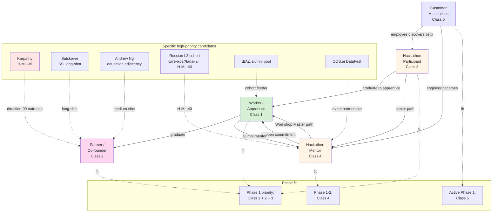

# Diagram 05 — ML/AI engineer × Jetix 5-class relationship graph

**Cross-class flow:** Hackathon Participant → Apprentice → Worker → Partner = primary substrate funnel. Customer employees → Hackathon Participant = secondary discovery channel.

**Cross-link:** doc 08 entire + vision/03 / 04 / 08 + strategic notes.
