# Diagram 06 — 9 mental models + key thinkers

```mermaid
%%{init: {'theme':'base', 'themeVariables': {'primaryTextColor':'#000000','textColor':'#000000','lineColor':'#333333','primaryBorderColor':'#333333','primaryColor':'#fafafa','noteTextColor':'#000000','noteBkgColor':'#fff8d5','edgeLabelBackground':'#ffffff'}}}%%
graph TB
    subgraph "Pedagogy + Software 2.0 paradigm"
        K[Karpathy<br/>Software 2.0<br/>LLM-as-OS<br/>nanoGPT pedagogy]
    end

    subgraph "Scale + Compute First"
        SU[Sutton<br/>Bitter Lesson<br/>scale > priors]
        SUT[Sutskever<br/>OpenAI scale<br/>superalignment]
    end

    subgraph "World Models + Energy-based"
        LC[LeCun<br/>JEPA<br/>World Models<br/>open-source ML]
    end

    subgraph "Theory + Foundations"
        H[Hinton<br/>backprop<br/>capsule + forward-forward]
        SC[Schmidhuber<br/>Compression<br/>curiosity LSTM]
        G[Goodfellow<br/>GANs<br/>adversarial]
    end

    subgraph "Education + Applied Democratisation"
        N[Andrew Ng<br/>AI for Everyone<br/>Coursera ML]
    end

    subgraph "Safety + Governance"
        B[Bengio<br/>Mila<br/>safety<br/>UN-AI governance]
    end

    K -.philosophical alignment.-> R12[R12 anti-extraction<br/>+ substrate democratisation]
    SU -.philosophical alignment.-> R12
    LC -.philosophical alignment.-> R12
    N -.philosophical alignment.-> R12
    B -.governance alignment.-> R12

    K -.education layer.-> ED[Jetix Education Layer]
    N -.education layer.-> ED

    SUT -.AGI timeline anchor.-> ETH[Jetix Ethereum architecture<br/>timing]
    LC -.world models analog.-> FPF[FPF U.System holonic]
    SC -.compression-progress analog.-> PA[Pillar A Strategic Reflection]
    G -.adversarial cell pattern.-> BR[Brigadier critic role]
    H -.iteration discipline.-> AB[B.5.2 Abductive Loop]

    style K fill:#ffd6f0
    style SU fill:#fff4e6
    style N fill:#fff4e6
    style R12 fill:#d6f0d6
    style ED fill:#d6f0d6
```

**Convergence pattern:** Karpathy + Sutton + LeCun + Ng converge on substrate-democratisation philosophy = strong philosophical alignment with R12 anti-extraction thesis.

**Cross-link:** doc 02 §2 + Pattern 2 (cross-cutting synthesis) + H-ML-5 / H-ML-28.
