# Diagram 07 — Research stream cross-integration

```mermaid
graph TB
    subgraph "THIS RESEARCH (2026-05-18 evening)"
        ML[research/ml-ai-engineers/<br/>21 tools + 7 workflow steps + 5 classes + 45 H + universal pattern]
    end

    subgraph "Existing research streams"
        D09[deepening-2026-05-18/09<br/>Karpathy single-person]
        D12[deepening-2026-05-18/12<br/>NASA SE × FPF aerospace]
        D04[deepening-2026-05-18/04<br/>Engelbart H-LAM/T]
        D05[deepening-2026-05-18/05<br/>Cunningham × Karpathy lineage]
        HK[hackathon-deep-2026-05-18/<br/>engineer-masterskaya + Harari info-flow]
        HR[harari-jetix-lens-2026-05-18/<br/>Workshop = 4 Cs school]
        AD[adjacent-ideas-2026-05-17/<br/>intelligence amplification]
    end

    subgraph "Voice anchors"
        T8[text_008+009 2026-05-18 evening<br/>3000 миллиардеров / Master Workshop]
    end

    subgraph "Strategic notes (batch-3 parallel run)"
        S1[JETIX-AS-HACKATHON-PLATFORM]
        S2[JETIX-EDUCATION-LAYER-SYSTEM-THINKING]
        S3[JETIX-OUTREACH-SYSTEM-SCALABLE]
        S4[JETIX-RECURSIVE-SELF-DEVELOPMENT-ENGINE]
        S5[JETIX-SYSTEM-MERGER-PROTOCOL-FPF]
    end

    subgraph "Foundation + Constitutional anchors"
        R12[R12 LOCK 2026-05-12]
        H8[H8 Trust Infrastructure]
        ETH[Ethereum architecture 2026-05-18]
        FPF[FPF Constitutional Spec]
        VF[VISION-FUNDAMENTAL v1.0]
        F1[Foundation Architecture v1.0 LOCK]
    end

    ML -->|extends NOT duplicates| D09
    ML -->|universal-pattern triangulation| D12
    ML -->|universal-pattern triangulation| D04
    ML -->|Pattern Language teaching ML| D05
    ML -->|engineer-masterskaya substrate| HK
    ML -->|Workshop = 4 Cs school| HR
    ML -->|cross-link| AD
    ML -->|anchor| T8
    ML -.cross-link.-> S1
    ML -.cross-link.-> S2
    ML -.cross-link.-> S3
    ML -.cross-link.-> S4
    ML -.cross-link.-> S5
    ML -.preserved read-only.-> R12
    ML -.preserved read-only.-> H8
    ML -.preserved read-only.-> ETH
    ML -.preserved read-only.-> FPF
    ML -.preserved read-only.-> VF
    ML -.preserved read-only.-> F1

    style ML fill:#ffd6f0
    style T8 fill:#fff4e6
    style R12 fill:#e6e6ff
    style F1 fill:#e6e6ff
```

**Pattern:** Этот research stream = bridge node connecting voice anchor (text_008+009) с existing research streams + strategic batch-3 notes + Foundation/constitutional anchors. No duplication; extensive cross-link.

**Cross-link:** doc 98 §13 cross-stream integration map.
