# Diagram 08 — Hypothesis bank (45 H) × category × priority

```mermaid
%%{init: {'theme':'base', 'themeVariables': {'primaryTextColor':'#000000','textColor':'#000000','lineColor':'#333333','primaryBorderColor':'#333333','primaryColor':'#fafafa','noteTextColor':'#000000','noteBkgColor':'#fff8d5','edgeLabelBackground':'#ffffff'}}}%%
graph TB
    subgraph "Industry (H-ML-1..10)"
        I1[H-ML-1 Education gap]
        I3[H-ML-3 RU subculture]
        I5[H-ML-5 OS × R12 alignment]
        I7[H-ML-7 Production gap]
        I10[H-ML-10 Hackathon native]
    end

    subgraph "Tool (H-ML-11..25)"
        T13[H-ML-13 Optuna brigadier]
        T17[H-ML-17 Grafana Part 8 POC]
        T22[H-ML-22 Sovereign-AI offer]
    end

    subgraph "Methodology (H-ML-26..35)"
        M26[H-ML-26 Universal pattern]
        M27[H-ML-27 NASA×ML×Workshop]
        M29[H-ML-29 Abductive trainable]
        M30[H-ML-30 Compound learning value-prop]
        M35[H-ML-35 Maintenance retainer]
    end

    subgraph "Jetix integration (H-ML-36..45)"
        J36[H-ML-36 Workshop career destination]
        J37[H-ML-37 FPF 5× onboarding]
        J39[H-ML-39 Karpathy direct outreach]
        J40[H-ML-40 RU L2 telegram]
        J41[H-ML-41 Sovereign-AI RU+EU bias]
        J43[H-ML-43 Cross-disciplinary moat]
        J45[H-ML-45 O-29 inventory candidate]
    end

    subgraph "Priority for testing (Ruslan ack)"
        P1[P1 next 30d:<br/>J39 Karpathy + J40 RU L2 + J36 Workshop planning]
        P2[P2 next 60-90d:<br/>I10+J38 ML hackathon + J41 sovereign-AI + Pattern 4 curriculum]
        P3[P3 surface only:<br/>T13 HPO brigadier + T17 Grafana POC + J45 O-29 + M35 retainer]
    end

    I1 -.related.-> J36
    I5 -.related.-> J41
    I7 -.related.-> M35
    I10 -.related.-> J36
    M26 -.subsumes.-> M27
    J39 -.priority.-> P1
    J40 -.priority.-> P1
    J36 -.priority.-> P1
    I10 -.priority.-> P2
    J38_ref[H-ML-38] -.priority.-> P2
    J41 -.priority.-> P2
    M26 -.priority.-> P2
    T13 -.priority.-> P3
    T17 -.priority.-> P3
    J45 -.priority.-> P3
    M35 -.priority.-> P3

    style P1 fill:#ffd6f0
    style P2 fill:#fff4e6
    style P3 fill:#e6e6ff
```

**Reading:** 45 H surfaced; sample of high-leverage shown. Full list in doc 09. Ruslan reviews + selects subset для testing. NONE auto-promoted.

**Cross-link:** doc 09 entire + doc 99 §6 open questions.
