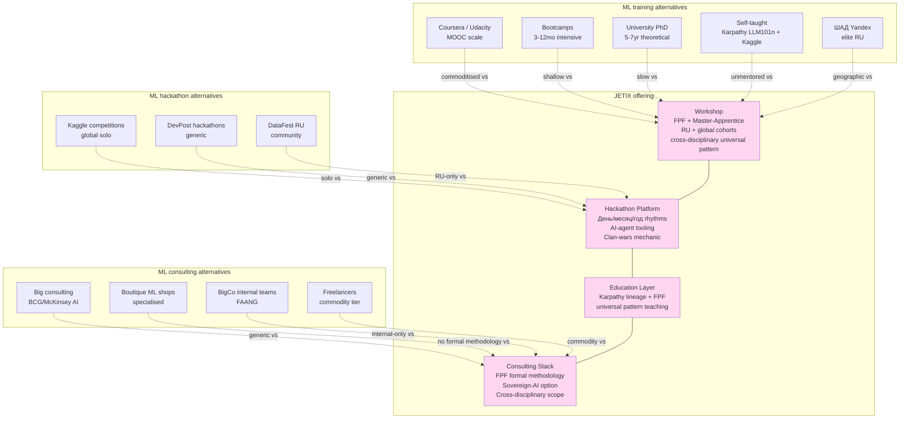

# Diagram 09 — Jetix vs ML industry positioning

**Differentiators (Pattern 5 + 6 + 8 + 9 + 10 + 11 + 12):**
1. FPF formal methodology (Pattern 5) — unique
2. Russian-speaking primary + global secondary (Pattern 6)
3. Master-Apprentice mentor model (Pattern 8)
4. R12 anti-extraction substrate ownership (Pattern 9)
5. Production gap focus (Pattern 10)
6. Education compounded gratitude loop (Pattern 11)
7. Cross-disciplinary universal pattern (Pattern 12)

**Cross-link:** doc 98 §14 + doc 08 + JETIX-EDUCATION-LAYER / JETIX-AS-HACKATHON-PLATFORM strategic notes.
