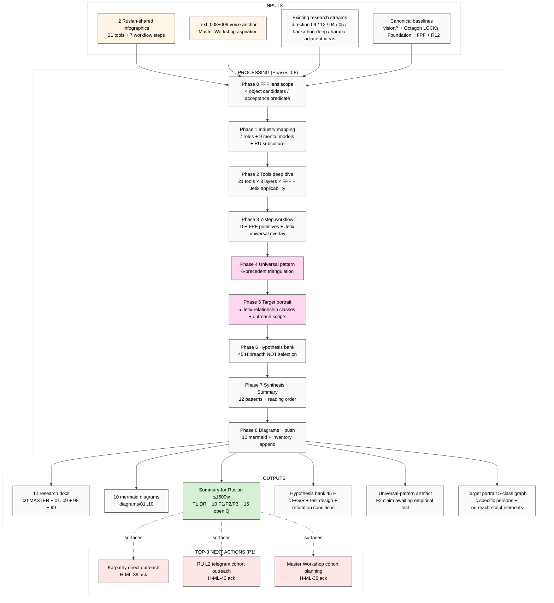

# Diagram 10 — Master TL;DR (research at-a-glance)

**Reading time recommendation:**
- 3 min: §0 TL;DR of doc 99
- 10 min: full doc 99 SUMMARY
- 30 min: 99 + 01 + 98
- 90 min: + 02 + 07 + 08
- 3 h: all 12 docs + 10 diagrams

**Status:** AWAITING-RUSLAN-REVIEW. 15 open questions for ack в doc 99 §6.

**Cross-link:** all phase docs + 99-SUMMARY-FOR-RUSLAN as entry point.
