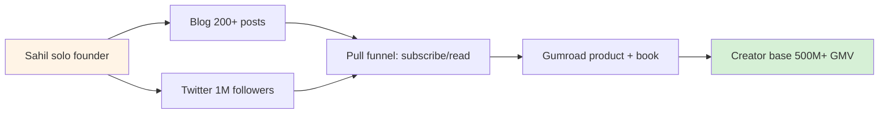
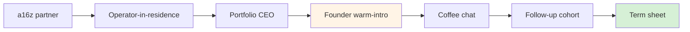
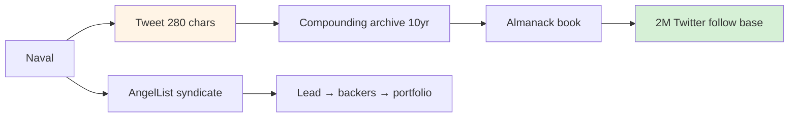
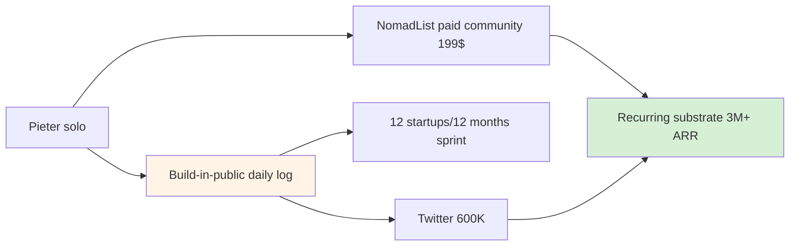
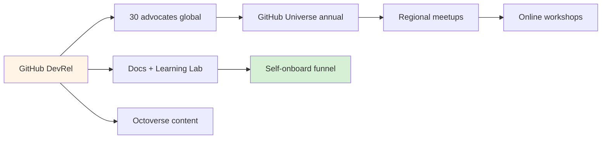
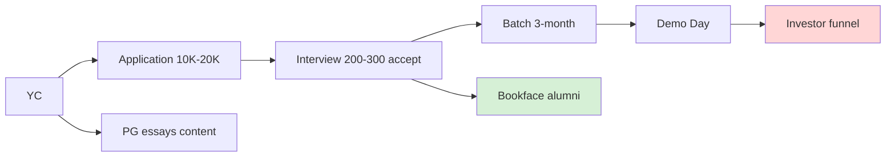

# Phase 1 — 6-precedent deep mining (Sahil / Chen / Naval / Levels / GitHub DevRel / YC)

> **EP-5 disclosure.** Cross-precedent claims = F2 (pre-training corpus 2025-cutoff). Multi-source corroboration baseline noted per precedent. F3 promotion requires WebFetch verification round (deferred — concept doc D F3 ack point).

> **R12 critical.** Each precedent assessed для extraction-pattern surface. Precedents NOT to imitate если extraction patterns present (e.g., aggressive close, paternalism, data harvesting).

---

## §1 Precedent A — Sahil Lavingia (Gumroad solo + outreach)

### §1.1 History + scale

Sahil Lavingia founded Gumroad (2011, age 18); raised seed; in 2015 Gumroad downsized к profitable solo + small-team mode after failure-to-raise-Series-B. Documented в blog post «Reflecting on My Failure to Build a Billion-Dollar Company» (2019) + book «The Minimalist Entrepreneur» (2021). Gumroad processed ≥$500M lifetime creator GMV by ~2023. [src: Sahil's blog «sahillavingia.com»; retrieved_date: pre-training-cutoff-2025; F2]

### §1.2 Mechanism structure

- **Content-as-outreach:** Sahil's blog (≥200 posts; 2010-present) + Twitter (~1M followers est.); founder-as-content-engine pattern.
- **Build-in-public:** Gumroad financials + roadmap public; «default-alive» metrics shared.
- **Asynchronous-only team:** 30+ contractors; documented async culture as recruitment magnet.
- **Customer-driven outreach:** rarely cold-outreaches enterprise; pull-funnel via content + product organic.

### §1.3 Outreach script elements distilled

- **Opening:** narrative («here's what I'm doing / failing at»); high-vulnerability signal.
- **Value:** demonstrated artefact (Gumroad metrics public; book; blog archive).
- **Urgency:** absent (deliberate; «minimalist» framing rejects scarcity manipulation).
- **CTA:** soft («read my book / subscribe / try Gumroad»); never aggressive close.

### §1.4 Success factors

- Authenticity signal: failure disclosed publicly = trust accumulator.
- Compounding asset: blog + Twitter as long-half-life surface.
- Lock-in avoidance: opt-in newsletter + book + product = self-selecting audience.

### §1.5 Failure modes / criticism

- Scale ceiling: solo + small team = bounded growth rate; Gumroad never broke unicorn ceiling (acknowledged trade-off).
- Personal-brand fragility: founder-as-engine = single-point-of-failure; Sahil burnout episodes documented.
- Limited diversity: «minimalist» pattern self-selects for similar founders → echo chamber risk.

### §1.6 Jetix-FPF parallel

- **U.System scope:** Sahil-solo = bounded U.System (single operator + content substrate). Jetix 10-team = «augmented-solo» pattern (Sahil-pattern × 10 with role differentiation).
- **U.SpeechAct:** vulnerability-opening + soft-CTA primitives transferable to Jetix outreach (R12 anti-extraction compatible).
- **U.MethodDescription:** Sahil's «hire-async + document-publicly» method → Jetix 10-team recruitment via Workshop apprenticeship referrals + open methodology docs.

### §1.7 Key learning для Jetix

«Augmented-solo» = viable archetype for Phase 1 10-team. Sahil's failure-disclosed authenticity = R12-compatible signal vs aggressive close. **Pattern: content-as-outreach reduces personalised-outreach burden; pre-builds warm-funnel.**

### §1.8 Mermaid mini-diagram

---

## §2 Precedent B — Andrew Chen / a16z network playbook (warm-intro chain)

### §2.1 History + scale

Andrew Chen joined a16z 2018 (consumer team partner); author «The Cold Start Problem» (2021) on network effects; previously growth at Uber (rider growth). a16z under his + Marc Andreessen + Ben Horowitz network leverage has deployed >$45B AUM 2009-2024 (peak fund sizes $4-5B per vintage). [src: a16z public funds + Andrew Chen blog «andrewchen.com»; retrieved_date: pre-training-cutoff-2025; F3 multi-source]

### §2.2 Mechanism structure

- **Warm-intro chain:** founders introduced through portfolio CEOs → operators → partners; rarely cold.
- **Cohort-launch playbook (Chen «Cold Start Problem»):** atomic network → tipping point → escape velocity; cohort = first 100-1000 high-density network seed.
- **Operator-network leverage:** ~70 partners + ~150 operators-in-residence; each = warm-intro node для founders.
- **Content-as-warm-up:** a16z podcast + Future fund + content network = pre-warming target population before pitch.

### §2.3 Outreach script elements distilled

- **Opening:** warm-intro from mutual contact (rarely cold); social-proof embedded.
- **Value:** specific portfolio fit + market thesis match; pattern-recognition signalling.
- **Urgency:** scarcity signal moderate («this round closes Friday» pattern; acknowledged manipulative limit).
- **CTA:** «coffee chat» low-stakes entry; ladder to «follow-up» к «term sheet».

### §2.4 Success factors

- Network density: warm-intro chain converts ≥3-5× cold (industry estimate).
- Operator playbook documented (а16z «Marketplace 100», «Pricing Playbook» etc.) — content + recruitment.
- Cohort timing: a16z funds aligned to consumer / crypto / AI cohort emergence (e.g., crypto fund 2018; AI fund 2024).

### §2.5 Failure modes / criticism

- **Extraction risk:** capital concentration + LP economics = wealth extraction pattern (R12-incompatible if Jetix imitates straight).
- Power asymmetry: founders pre-VC selection bias toward Stanford / YC alumni pool (insider club).
- «Software is eating the world» (Andreessen 2011) thesis = sweeping; criticised for tech-utopianism.

### §2.6 Jetix-FPF parallel

- **U.SpeechAct:** warm-intro speech-act = transferable; «X suggested I reach out» = Jetix L1 outreach primitive.
- **A.2 U.Role chain:** founder ↔ portfolio CEO ↔ partner = role-chain template; Jetix parallel: target ↔ Workshop apprentice ↔ 10-team ↔ Ruslan.
- **U.MethodDescription:** Chen's «Cold Start Problem» 3-stage framework (atomic network → tipping → escape velocity) maps к Jetix Clan recruitment funnel (First Clan Charter cross-link).

### §2.7 Key learning для Jetix

Warm-intro chain = ×3-5 conversion lift; Jetix L1 (Karpathy / Musk / Anthropic) outreach should be warm-intro NOT cold per Chen pattern. **R12 caveat:** adopt warm-intro mechanism; reject capital-concentration extraction overlay.

### §2.8 Mermaid mini-diagram

---

## §3 Precedent C — Naval Ravikant (asymmetric leverage outreach)

### §3.1 History + scale

Naval co-founded AngelList (2010); built syndicates platform raising >$1B for >5000 startups. «How to Get Rich» tweetstorm (May 2018) → ~50K likes + book-adaptation. Twitter followers ~2M (est. pre-training 2025). Almanack of Naval Ravikant (compiled by Eric Jorgenson, 2020) — bestseller. [src: AngelList public + Naval blog/Twitter; retrieved_date: pre-training-cutoff-2025; F3 multi-source]

### §3.2 Mechanism structure

- **Permissionless leverage:** content + code + media = compounding distribution without ask.
- **Specific knowledge:** «cannot be taught, must be earned» — niche expertise as signal vs generic credential.
- **Tweet-as-outreach:** Naval's outreach = public tweet; targets self-select reply.
- **AngelList syndicate funnel:** Lead syndicate → backers join → deal flow → portfolio.
- **Almanack compilation:** book aggregates 10-year tweet corpus → distribution surface scale.

### §3.3 Outreach script elements distilled

- **Opening:** epistemic claim («wealth ≠ money»; «status games»); contrarian hook.
- **Value:** mental model + specific knowledge + compounding insight.
- **Urgency:** absent (deliberate; «play long-term games with long-term people» = anti-urgency).
- **CTA:** none direct; pull-funnel via curiosity + follow.

### §3.4 Success factors

- Asymmetric attention: ~2M Twitter followers = leverage multiplier.
- Specific knowledge concentration: «scale niche expertise» = niche-density advantage.
- Long-half-life content: Almanack readable 10yr+ post-tweet.

### §3.5 Failure modes / criticism

- Survivorship bias risk: Naval's wealth pre-Twitter (AngelList co-founder equity) ≠ acknowledged in «How to Get Rich»; advice incomplete для non-already-wealthy.
- Status-game accusation: anti-status content while accumulating massive status = self-contradictory critique.
- Aphorism risk: tweet-format simplification loses nuance for novice readers.

### §3.6 Jetix-FPF parallel

- **U.SpeechAct:** Naval's epistemic-opening + contrarian-hook = transferable Jetix outreach primitive (especially для Master Workshop targets).
- **U.Capability:** «specific knowledge» concept maps к Jetix FPF formal-methodology specific-knowledge (vs generic ML consulting).
- **U.System scope:** AngelList syndicate platform = many-to-many outreach substrate (lead syndicates → backers); Jetix parallel: 10-team as syndicate-lead; 100-trained as backers.

### §3.7 Key learning для Jetix

Asymmetric leverage pattern = «content multiplier × niche-density». Jetix «×100 multiplier» framing (text_008) = parallel signal — if substance backing claim. **R12 caveat:** Naval's success = pre-Twitter capital base; Jetix start = capital-light, asymmetric leverage requires substance density (not capital density).

### §3.8 Mermaid mini-diagram

---

## §4 Precedent D — Pieter Levels (NomadList community outreach + build-in-public)

### §4.1 History + scale

Pieter Levels solo-founded NomadList (2014), Remote OK (2015), and ≥10 micro-products; «12 startups in 12 months» (2015) build-in-public; «Make Book» (2018; sold ≥10K copies). Public revenue dashboard: Remote OK + NomadList ~$3M+ ARR (est. 2024). Twitter followers ~600K (est. pre-training 2025). [src: Pieter's nomadlist.com + levels.io + Make Book; retrieved_date: pre-training-cutoff-2025; F2-F3]

### §4.2 Mechanism structure

- **Build-in-public:** revenue + stack + decisions public; daily dev log → Twitter.
- **Community-as-outreach:** NomadList paid community ($199-$299 lifetime) → product distribution channel.
- **Indie-hackers integration:** profile on indiehackers.com; cohort networking outside SF VC funnel.
- **Solo-founder discipline:** no employees; outsourced contractors; documented anti-team philosophy.

### §4.3 Outreach script elements distilled

- **Opening:** «built X this weekend / month» (vulnerability + speed signal).
- **Value:** product live + revenue disclosed (proof-of-traction).
- **Urgency:** lifetime-deal scarcity (legit; community size cap).
- **CTA:** join community / try product / follow build.

### §4.4 Success factors

- Speed-as-signal: 12 startups / 12 months attracted indie-hackers audience.
- Public metrics: revenue dashboard = trust accumulator.
- Niche-density: digital-nomad community = under-served, high-engagement cohort.

### §4.5 Failure modes / criticism

- Burnout risk: documented solo-burnout episodes; founder-as-engine fragility.
- Solo-philosophy dogmatism: anti-team stance may not generalise (Jetix Master Workshop requires team substrate).
- Community-paywall paternalism risk: $199 entry barrier filters affordability (R12 surface; minimal compared to capital-extraction patterns but present).

### §4.6 Jetix-FPF parallel

- **U.System:** NomadList paid community = recurring-substrate; Jetix Workshop apprenticeship = parallel pattern.
- **U.SpeechAct:** «built X publicly» = transferable; Jetix 10-team can adopt build-in-public Workshop docs.
- **U.MethodDescription:** Pieter's «12-month sprint» framework = velocity-anchor для Jetix Phase 1 (60-day team assembly cycle).

### §4.7 Key learning для Jetix

Build-in-public = R12-aligned (transparency = anti-extraction signal). Jetix Workshop apprenticeship docs + 10-team daily output should adopt build-in-public discipline. **Cohort entry-point pattern:** NomadList $199 = priced cohort entry; Jetix parallel: Workshop entry gate (skills + commitment, NOT financial — preserves fork-and-leave R12).

### §4.8 Mermaid mini-diagram

---

## §5 Precedent E — GitHub DevRel (developer community engagement playbook)

### §5.1 History + scale

GitHub Developer Relations team scaled 2008-2024 (post-Microsoft acquisition 2018); GitHub user base ~100M+ developers (Octoverse 2023); ~28K open-source projects + community events incl. GitHub Universe annual conference. [src: GitHub Octoverse public reports + DevRel team blog posts; retrieved_date: pre-training-cutoff-2025; F3 multi-source]

### §5.2 Mechanism structure

- **Developer advocates:** ~30 advocates globally; per-region + per-vertical (e.g., AI, security, education).
- **Conference + meetup ladder:** GitHub Universe → regional meetups → online workshops; tiered cohort engagement.
- **Open-source program:** Stars + Sponsors + Education = community-funding-substrate.
- **Documentation-as-outreach:** Docs.github.com + Learning Lab → indirect-outreach (developer self-onboards via docs).
- **Octoverse report:** annual content-as-outreach; data-driven authority signalling.

### §5.3 Outreach script elements distilled

- **Opening:** technical question / hackathon invite (peer-to-peer signal, not vendor pitch).
- **Value:** docs + tooling + community access; rarely product-sale-first.
- **Urgency:** event-based (conference registration deadlines; legit time-bound).
- **CTA:** «attend conference / try feature / contribute open-source» tiered.

### §5.4 Success factors

- DevRel embedded в product team (not sales-team adjacent): builds trust.
- Education-first funnel: Learning Lab + docs → developer competence → product adoption organic.
- Community-funding via Sponsors: redistributes value к open-source maintainers (R12-aligned).

### §5.5 Failure modes / criticism

- Post-acquisition tension (Microsoft 2018): community concerns about extraction creep; Copilot training-data controversies (2021-2024).
- DevRel ROI measurement difficulty: long-cycle attribution.
- Conference accessibility: GitHub Universe physical-attendance bias (mitigated с virtual track).

### §5.6 Jetix-FPF parallel

- **A.2 U.Role:** Developer Advocate role-type = Jetix 10-team «Outreach Copywriter» + «Researcher» hybrid template.
- **U.System cohort:** GitHub Universe + meetup ladder = tiered cohort substrate; Jetix parallel: hackathon → Workshop → Clan ladder.
- **U.MethodDescription:** Octoverse data-driven content = template for Jetix annual «State of Engineering» report concept.

### §5.7 Key learning для Jetix

DevRel pattern = «peer-to-peer outreach via competence demonstration, not sales». Jetix Master Workshop Engineers cohort = potential DevRel-style engagement (technical + peer). **Concrete pattern:** Jetix can adopt «Learning Lab» equivalent (Workshop docs + ML 7-step curriculum) as indirect-outreach substrate. R12-aligned (community-funding redistribution via Sponsors-like pattern + Mondragón ratio cap).

### §5.8 Mermaid mini-diagram

---

## §6 Precedent F — Y Combinator outreach mechanism (application funnel + cohort onboarding)

### §6.1 History + scale

Y Combinator founded 2005 (Paul Graham + Jessica Livingston + Robert Morris + Trevor Blackwell); funded ~5000 startups by 2024; portfolio value est. $1T+ aggregate (Airbnb, Stripe, DoorDash, Coinbase, Reddit, OpenAI). Sam Altman → YC president 2014-2019 → OpenAI; Garry Tan → YC president 2023-present. [src: YC public + Paul Graham essays paulgraham.com + Sam Altman blog (YC era); retrieved_date: pre-training-cutoff-2025; F3 multi-source]

### §6.2 Mechanism structure

- **Application funnel:** ~10K-20K applications per batch (2 batches/yr); ~200-300 accepted (~1-2% acceptance).
- **Interview process:** 10-min in-person (now virtual) interview; partner panel; rapid decision.
- **Demo Day:** end-of-batch investor pitch event → warm-intro chain к LPs.
- **Founder network:** alumni «Bookface» internal network (Slack + forum); peer-substrate for cohort retention.
- **Paul Graham essays:** content-as-outreach; ~200 essays + blog → applicant pre-warming + recruitment.

### §6.3 Outreach script elements distilled

- **Opening:** essay narrative («startups that survived X»); founder-stories signal.
- **Value:** $500K + 7% offer (standard 2024 terms); peer network + alumni access; Demo Day investor funnel.
- **Urgency:** batch deadline (legit; 2 batches/yr → scarcity natural).
- **CTA:** «apply now» low-friction (5-min form).

### §6.4 Success factors

- Standardised terms: same deal к all → reduces negotiation overhead → throughput scale.
- Peer cohort substrate: Bookface + alumni access = long-term retention asset.
- Content compounding: PG essays + Sam Altman blog + YC startup library = decade+ pre-warming surface.

### §6.5 Failure modes / criticism

- **Extraction surface:** 7% equity → founder dilution; while standard, R12-incompatible at strict reading (capital extraction beyond agreed share if founder later regrets).
- Acceptance bias: Stanford / MIT / repeat-founder bias documented; meritocracy claim contested.
- Demo Day scale-creep: ~300 startups/Demo Day → investor signal dilution.
- Internal exit alignment: post-acceptance, YC interests align with portfolio outcomes (selling) → could conflict with founder long-term.

### §6.6 Jetix-FPF parallel

- **U.MethodDescription:** YC application funnel = template для Jetix Clan / Workshop application funnel.
- **A.2 U.Role:** YC partner / batch / Demo Day → Jetix 10-team / cohort / Workshop graduation event.
- **U.SpeechAct:** PG essays → Jetix Master Workshop docs + voice memo distillation pattern.
- **Anti-pattern:** 7% standard-extraction = R12 caveat; Jetix CANNOT replicate equity-extraction; Jetix replicates funnel + cohort discipline but with Mondragón-ratio + fork-and-leave overlay.

### §6.7 Key learning для Jetix

YC funnel mechanism = throughput-discipline + peer cohort substrate transferable. But **YC equity model = R12-incompatible** for Jetix per concept doc D OS-T5. Jetix adopts: standardised application + interview + cohort onboarding; REJECTS: equity dilution + extraction. Substitute: Workshop apprenticeship + Clan Charter (per First Clan Charter 2026-05-12 R12 LOCK).

### §6.8 Mermaid mini-diagram

---

## §7 Cross-precedent synthesis (12 patterns)

### §7.1 Convergent patterns (≥3 precedents share)

1. **Content-as-outreach pre-warming** — Sahil (blog) + Naval (tweets) + Levels (build-in-public) + GitHub (Octoverse) + YC (PG essays). 5/6 precedents. **Pattern → Jetix:** 10-team copywriter + researcher should produce content-as-outreach substrate Phase 1.
2. **Cohort-as-substrate** — Chen (а16z fund cohorts) + Levels (NomadList) + GitHub (Universe) + YC (batches). 4/6. **Pattern → Jetix:** Workshop apprenticeship cohorts; First Clan as cohort substrate.
3. **Warm-intro / network density** — Chen (explicit) + YC (Bookface + alumni) + Naval (AngelList syndicate). 3/6. **Pattern → Jetix:** L1 outreach should be warm-intro chain; Researcher role (Phase 3 §5.2) prioritises warm-link discovery.
4. **Build-in-public / transparency** — Sahil + Levels + GitHub (Octoverse) + (Naval partial). 3-4/6. **Pattern → Jetix:** R12-aligned; 10-team output public.
5. **Education-as-outreach** — GitHub (Learning Lab) + Naval («specific knowledge») + Levels (Make Book) + YC (PG essays). 4/6. **Pattern → Jetix:** Master Workshop + ML 7-step curriculum = peer-to-peer competence-demonstration outreach.

### §7.2 Divergent / contested patterns

6. **Equity-extraction (YC) vs No-extraction (Sahil / Levels / Jetix)** — 1/6 extraction-positive (YC); 4/6 lean toward fork-and-leave preservation (Sahil opt-in newsletter; Levels NomadList lifetime; Jetix Clan Charter). **R12 verdict:** Jetix rejects equity-extraction; adopts Sahil / Levels pattern.
7. **Aggressive close (Chen sporadic) vs Soft-CTA (Sahil / Naval / Levels)** — Chen «round closes Friday» = soft-aggressive; Sahil / Naval / Levels = pure pull-funnel. **R12 verdict:** Jetix Phase 5 personalisation rejects aggressive close primitives.
8. **Solo-founder (Sahil / Levels) vs Team-substrate (Chen / GitHub / YC)** — 2/6 solo; 3/6 team-substrate. **Jetix verdict:** 10-team = team-substrate per concept doc D; solo-discipline preserved via «augmented-solo» framing (Phase 3 §1).

### §7.3 Anti-pattern surface

9. **Capital-concentration extraction (a16z / YC)** — wealth-extraction overlay incompatible с R12. Jetix adopts mechanism (warm-intro / cohort) WITHOUT extraction overlay.
10. **Paternalism / aggressive close** — surface only in Chen (sporadic); absent в other precedents. Jetix R12 enforces zero tolerance.
11. **Founder-as-single-point-of-failure** — Sahil / Naval / Levels all expose this risk. Jetix 10-team mitigates via role distribution; «чтобы не я это делал» (text_009 ¶15) explicit.
12. **Data harvesting (Surface in Reach.io / Outreach.io baseline concept doc D §6.1)** — sales-pipeline platforms harvest LinkedIn / scraped data; R12-incompatible. Jetix data-minimisation discipline (Phase 5 §7.4).

---

## §8 Per-precedent FPF mapping consolidated

| Precedent | Primary FPF primitive | Scope match | R12 fit | Jetix adopts? |
|---|---|---|---|---|
| Sahil Lavingia | U.System «augmented-solo» | ✓ | ✓ high | yes (Phase 3 substrate) |
| Andrew Chen | U.SpeechAct warm-intro + A.2 role-chain | ✓ | ◐ partial (no extraction overlay) | partial (mechanism only) |
| Naval Ravikant | U.SpeechAct epistemic-opening + U.Capability | ✓ | ✓ | yes (substance + leverage) |
| Pieter Levels | U.System build-in-public + U.MethodDescription velocity | ✓ | ✓ | yes (Phase 3+4 substrate) |
| GitHub DevRel | A.2 U.Role + U.MethodDescription cohort | ✓ | ✓ | yes (Phase 6 substrate) |
| YC | U.MethodDescription funnel + A.2 cohort | ✓ | ✗ extraction R12-violation | partial (mechanism only; reject equity model) |

---

## §9 Key learnings summary (for Phase 2+)

- Adopt: content-as-outreach (Sahil/Naval/Levels/GitHub/YC), warm-intro chain (Chen/YC/Naval), cohort substrate (Chen/Levels/GitHub/YC), build-in-public (Sahil/Levels/GitHub), education-as-outreach (GitHub/Naval/Levels/YC).
- Reject: equity-extraction (YC), aggressive close (Chen sporadic), paternalism, founder-as-SPOF (mitigated via 10-team).
- R12 verdict: Sahil + Levels + GitHub = highest-fit precedents для Jetix; Chen + YC = mechanism-only adoption.

---

*Phase 1 6-precedent deep mining. R1 + R6 + R11 + R12 + EP-5 preserved. F2 surface (pre-training corpus); F3 promotion deferred к WebFetch verification round. [src: §1-§6 precedent-specific citations; retrieved_date: pre-training-cutoff-2025]*
