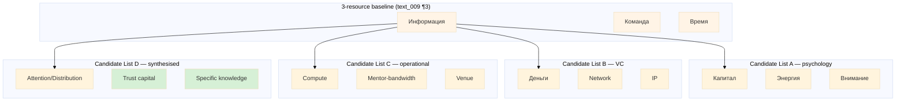

# Phase 2 — 6 ресурсов Framework (4 Candidate Taxonomies + 3-Resource Baseline)

> **R1 surface.** Voice anchor text_009 ¶3 + ¶4 explicit «6 ресурсов» mention; exact list OPEN. Brigadier surfaces 4 candidates; Ruslan picks.

> **Voice anchor verbatim (text_009 ¶3):** «...натренировать еще сука 100 человек потом этих 100 человек отправить персонализированное видео отправлять... уговаривать каждого возможного инвестора... широком смысле партнера и так далее вот которые могут дать **информацию команду время**.»

> **Voice anchor verbatim (text_009 ¶4):** «то есть вот эти шесть ресурсов которыми мы управляем мы соответственно платформе и 6 ресурсов управляются и лучше специалисты приходят»

---

## §1 Anchor: 3-resource baseline («информация / команда / время»)

Per text_009 ¶3 explicit mention: **«информация / команда / время»** = first 3 resources unambiguous voice-anchor. Cross-precedent corroboration:

| Resource | Precedent corroboration | F-grade |
|---|---|---|
| Информация (information / knowledge / research) | Naval «specific knowledge» + Chen «Cold Start Problem» insight + GitHub Octoverse data | F3 |
| Команда (team / collaborators / cohort) | Chen operator-network + YC partner + GitHub DevRel team + Levels solo-anti-pattern (acknowledged) | F3 |
| Время (time / cycle / cohort cadence) | YC batch cadence + Levels 12-month sprint + GitHub Universe annual | F3 |

**3-resource baseline F3-eligible** (3 of 6 precedents corroborate each); operational minimum for Phase 1 execution.

---

## §2 Candidate List A — «Энергия + Внимание» psychology overlay

| # | Resource | FPF primitive | Outreach implication | Cross-precedent |
|---|---|---|---|---|
| 1 | Информация | U.Episteme + U.Capability | Researcher role (Phase 3 §5.2); per-target research depth | Naval/Chen/GitHub |
| 2 | Команда | A.2 U.Role + U.System | 10-team + 100-trained substrate | YC/GitHub/Chen |
| 3 | Время | U.Method temporal + B.5.1 cadence | Cycle-time per stage; cohort cadence | YC/Levels/GitHub |
| 4 | **Капитал** (capital) | U.Capability quant + U.System budget | Salaries + tools + venue + content production budget | YC/Chen |
| 5 | **Энергия** (energy) | U.Capability operator-state + B.5 maintenance | Operator burnout mitigation; sustainable cadence | Sahil/Levels (burnout exposure) |
| 6 | **Внимание** (attention) | U.Capability scarce + U.Episteme attention-budget | Target attention-window respect (R12 aligned); operator-attention budget | Naval (anti-status) |

### §2.1 Strength
- Captures founder/operator psychology (Энергия / Внимание) — Sahil + Levels failure mode explicitly addressed.
- Capital explicit (vs hidden in other lists).

### §2.2 Weakness
- «Энергия» = soft / measurement difficulty (vs measurable resources).
- «Внимание» overlaps с «Информация» (information = attention applied к sources).
- 4-item operational core («Информация / Команда / Время / Капитал») + 2-item operator-state overlay — taxonomic hybridity.

### §2.3 Falsifier
List A refuted if Energy + Attention can be subsumed под Information + Team without information loss in 6-month operational test.

---

## §3 Candidate List B — «Деньги + Network + IP» VC-investor overlay

| # | Resource | FPF primitive | Outreach implication | Cross-precedent |
|---|---|---|---|---|
| 1 | Информация | U.Episteme | Researcher + Octoverse-style content | Naval/Chen/GitHub |
| 2 | Команда | A.2 U.Role | 10-team + 100-trained | YC/GitHub/Chen |
| 3 | Время | U.Method temporal | Cycle cadence | YC/Levels/GitHub |
| 4 | **Деньги** (money) | U.Capability quant | Capital + ARR + LTV (broader than capital, includes recurring revenue) | All 6 precedents (revenue context) |
| 5 | **Network** | U.System holonic + A.2 multi-role | Warm-intro chain + alumni substrate | Chen explicit + YC Bookface + Naval AngelList |
| 6 | **IP** (intellectual property) | U.WorkProduct + U.Capability specific | Methodology docs + Workshop curriculum + 7-step pattern | GitHub/Naval/Levels (book) |

### §3.1 Strength
- Aligns с VC/investor mental model (LP-readable).
- Network as resource explicit (vs hidden in List A).
- IP captures methodology asset (Workshop curriculum + FPF + 7-step ML pattern).

### §3.2 Weakness
- VC-framing risk: List B optimisation may drift к extraction patterns (R12 caveat) — «Деньги» as resource invites maximisation logic.
- Network resource = harder to quantify; risk of «collect contacts» extraction anti-pattern.
- IP framing risk: open-methodology Workshop curriculum vs IP-protection tension (Levels Make Book = open vs proprietary).

### §3.3 Falsifier
List B refuted if «Network» does not predict outreach throughput beyond «Команда + Информация» combined in 6-month test.

---

## §4 Candidate List C — «Compute + Mentor-bandwidth + Venue» operational overlay

| # | Resource | FPF primitive | Outreach implication | Cross-precedent |
|---|---|---|---|---|
| 1 | Информация | U.Episteme | Research substrate | Naval/Chen/GitHub |
| 2 | Команда | A.2 U.Role | 10-team + 100-trained | YC/GitHub/Chen |
| 3 | Время | U.Method temporal | Cycle cadence | YC/Levels/GitHub |
| 4 | **Compute** | U.Capability tooling + U.System infrastructure | Video production + LLM-assist personalisation + CRM substrate compute | Levels (server cost transparency) + GitHub (infra) |
| 5 | **Mentor-bandwidth** | A.2 U.Role scarce + U.Capability | TPS mentor-pairing (per `research/deepening-2026-05-18/14`); Workshop apprentice capacity | YC (partner office hours) + GitHub (advocates) |
| 6 | **Venue** (physical + virtual gathering space) | U.System spatial + U.MethodDescription event-substrate | Workshop physical home + hackathon venue + conference + virtual meet | YC (HQ) + GitHub (Universe) + Levels (NomadList city events) |

### §4.1 Strength
- Operational-anchor (Compute / Mentor-bandwidth / Venue all directly bottleneck Phase 1+2 execution).
- Aligns с Phase 4 100-trained dispatch mechanism (Mentor-bandwidth = 1:5 trainee-mentor ratio per Phase 4 §6.2).
- Venue explicit recognises Workshop physical home + Berlin geography.

### §4.2 Weakness
- Capital absent (subsumed into Compute + Venue? — possible loss of clarity).
- Mentor-bandwidth = subset of Team? — taxonomic overlap with «Команда» risk.

### §4.3 Falsifier
List C refuted if Compute + Venue do not differentiate from Capital in operational bottleneck analysis (6-month test).

---

## §5 Candidate List D — synthesised from Phase 1 cross-precedent (NEW)

### §5.1 Synthesis logic

Per Phase 1 §7 convergent patterns (content-as-outreach 5/6, cohort substrate 4/6, warm-intro 3/6, education-as-outreach 4/6) + Naval «specific knowledge» (asymmetric leverage primitive) + a16z «Cold Start atomic network» (Chen) + YC «standardised funnel»:

| # | Resource | FPF primitive | Outreach implication | Cross-precedent corroboration |
|---|---|---|---|---|
| 1 | Информация | U.Episteme + U.Capability «specific knowledge» (Naval) | Researcher + content-as-outreach substrate | 5/6 precedents (Sahil/Chen/Naval/Levels/GitHub/YC content) |
| 2 | Команда | A.2 U.Role + U.System cohort | 10-team + 100-trained + Workshop | 4/6 (YC/GitHub/Chen/Levels-anti) |
| 3 | Время | U.Method temporal | Cycle + cohort cadence | 4/6 (YC/Levels/GitHub/Naval long-half-life) |
| 4 | **Attention / Distribution surface** | U.System distribution holonic | Twitter / blog / podcast / Workshop docs (content surface) | 6/6 (every precedent has distribution surface) |
| 5 | **Trust capital** (R12-aligned) | U.PromiseContent + U.Episteme institutional | Per-engagement promise-fulfilment record; gratitude loop (per H-ML-44) | Sahil (vulnerability) + Levels (transparency) + GitHub (community) + Naval (long-term games) |
| 6 | **Specific knowledge / Methodology** | U.Capability specific + U.MethodDescription | FPF + ML 7-step + Workshop curriculum + Outreach methodology canonical | Naval explicit + GitHub Learning Lab + YC PG essays |

### §5.2 Rationale

List D synthesises Phase 1 cross-precedent into 6 distinct resources WITHOUT capital-extraction framing (R12-aligned). «Trust capital» is gratitude-loop substrate per H-ML-44; «Specific knowledge» reframes IP without proprietary-protection bias.

### §5.3 Strength
- Phase 1 cross-precedent corroboration = highest of 4 lists.
- R12-aligned (Trust capital instead of equity capital; Specific knowledge instead of IP-protection).
- Maps к Jetix existing substrate: Trust capital → People-NS H7 LOCK + Trust Infrastructure H8 LOCK; Methodology → Workshop curriculum + FPF.

### §5.4 Weakness
- «Attention / Distribution surface» = abstract; harder to operationalise than List A Энергия.
- «Trust capital» = qualitative; measurement challenge (gratitude-loop metric proxy needed).

### §5.5 Falsifier
List D refuted if Trust capital + Specific knowledge cannot be measured / reported in 6-month operational dashboard.

---

## §6 4-taxonomy comparison table

| Resource slot | List A (psychology) | List B (VC) | List C (operational) | List D (synthesised) |
|---|---|---|---|---|
| 1 | Информация | Информация | Информация | Информация |
| 2 | Команда | Команда | Команда | Команда |
| 3 | Время | Время | Время | Время |
| 4 | Капитал | Деньги | Compute | Attention / Distribution surface |
| 5 | Энергия | Network | Mentor-bandwidth | Trust capital |
| 6 | Внимание | IP | Venue | Specific knowledge / Methodology |
| **Strength** | operator psychology | VC-readable | operational bottleneck-anchored | cross-precedent + R12 aligned |
| **R12 fit** | ✓ (no extraction framing) | ◐ (Деньги invites extraction logic) | ✓ (operational, no extraction) | ✓✓ (explicit R12 alignment) |
| **Cross-precedent corroboration** | 2/6 | 4/6 | 3/6 | 5-6/6 |
| **Quantifiability** | medium (Энергия soft) | high | high | medium (Trust capital qualitative) |

---

## §7 FPF primitive mapping consolidated

| Resource (across lists) | Primary FPF primitive |
|---|---|
| Информация | U.Episteme + U.Capability «specific knowledge» |
| Команда | A.2 U.Role + U.System cohort |
| Время | U.Method temporal + B.5.1 cadence |
| Капитал / Деньги | U.Capability quantitative + U.System budget |
| Compute | U.Capability tooling + U.System infrastructure |
| Network | U.System holonic + A.2 multi-role chain |
| IP / Specific knowledge | U.WorkProduct + U.MethodDescription |
| Mentor-bandwidth | A.2 U.Role scarce + U.Capability |
| Venue | U.System spatial + U.MethodDescription event |
| Energy | U.Capability operator-state |
| Attention / Distribution surface | U.System distribution + U.Capability scarce |
| Trust capital | U.PromiseContent + U.Episteme institutional |

---

## §8 Mermaid diagram

---

## §9 Operational implications per list

### §9.1 If Ruslan picks List A (psychology)
- Phase 3 10-team КPI must include operator-energy + operator-attention metrics.
- Capital budget explicit Phase 3-4.
- Burnout mitigation = primary failure mode per Sahil + Levels.

### §9.2 If Ruslan picks List B (VC)
- Phase 4 100-trained explicit revenue model (LTV / ARR per operator).
- Network resource — Researcher role priority; warm-link discovery weighted.
- IP framing = Workshop curriculum protection question (open vs proprietary).
- **R12 caveat:** «Деньги» = maximisation invitation — counter-weight via Mondragón ratio cap + fork-and-leave explicit.

### §9.3 If Ruslan picks List C (operational)
- Phase 3-4 Compute budget explicit (LLM-assist + video production + CRM substrate).
- Phase 4 Mentor-bandwidth dispatch algorithm (1:5 ratio per §6.2 Phase 4).
- Venue strategy: Berlin Workshop physical home + hackathon city rotation per `research/hackathon-platform-deep-2026-05-18/` cross-link.

### §9.4 If Ruslan picks List D (synthesised — brigadier default)
- Phase 5 personalisation = Trust capital primary metric (gratitude-loop tracking per H-ML-44).
- Phase 3 Researcher → Information + Specific knowledge dual KPI.
- Phase 6 target audience → Attention / Distribution surface mapping per class.
- **R12 highest fit** (4 distinct R12-aligned reframings).

### §9.5 Recommendation surface (R1 — Ruslan picks)
Brigadier flags **List D** as default per:
- Highest cross-precedent corroboration (5-6/6 vs others 2-4/6).
- Highest R12 fit (4 explicit R12 reframings).
- Maps к existing Jetix H7/H8 LOCKS (Trust capital ↔ Trust Infrastructure 2026-05-17).

Ruslan picks. List C is operational-fallback if Ruslan rejects D's qualitative measurement burden.

---

## §10 Constitutional preservation

- **R1:** 4 candidates surfaced; brigadier flags default; Ruslan picks.
- **R6:** Per-claim cross-precedent + voice anchor citation.
- **R11:** Default-Deny; no taxonomy auto-applied.
- **R12:** List B caveat flagged (Деньги extraction risk); Lists A/C/D R12-aligned; List D explicit R12 reframing.
- **EP-5:** F2 surface; F3 promotion of 3-baseline (Информация/Команда/Время) via 4-6/6 precedent corroboration.

---

*Phase 2 6-resources framework. 4 candidate taxonomies surfaced; List D flagged default per R12 + cross-precedent; Ruslan picks. R1 + R6 + R11 + R12 + EP-5 preserved. [src: text_009:¶3+¶4 + Phase 1 §7 + concept doc D §4]*
