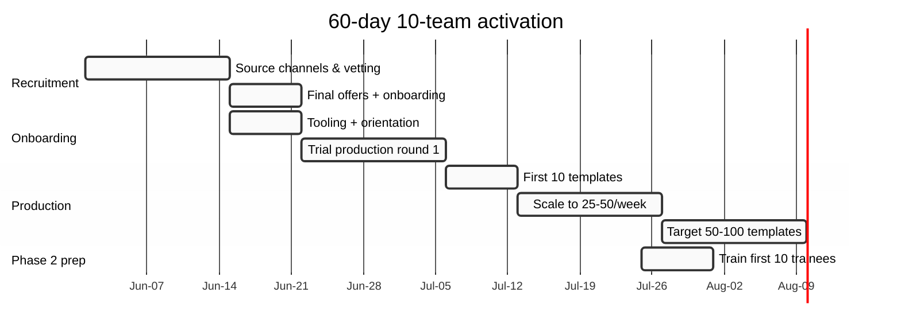
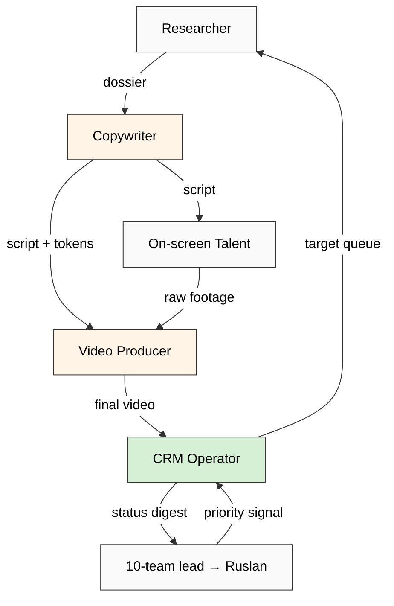

# Phase 3 — 10-Person Video Team Operationalised

> **R1 surface.** Concept doc D §3.1 baseline composition (2+2+2+2+2 = 10) extended to deep operational spec. Recruitment pipeline + per-role deep + 60-day Gantt + R12 compensation discipline.

> **Sahil augmented-solo + Levels velocity + GitHub DevRel role template** synthesised per Phase 1.

---

## §1 Team composition (concept doc D §3.1 verbatim baseline)

5 role-types × 2 operators each = 10:

| Role-type | Count | Phase 1 KPI proxy |
|---|---|---|
| Video Producer | 2 | videos/week × quality score |
| Outreach Copywriter | 2 | scripts/week × response rate per class |
| On-screen Talent | 2 | recordings/week × approval rate |
| Researcher | 2 | targets researched/week × warm-link discovery rate |
| CRM Operator | 2 | CRM updates/day × pipeline coverage |

**Aggregate output target Phase 1:** 50-100 outreach video templates across 6 target classes within 60-day window.

---

## §2 Recruitment pipeline

### §2.1 Source channels (priority-ranked)

| Tier | Channel | Strength | R12 caveat |
|---|---|---|---|
| T1 | Workshop apprenticeship referrals (Jetix Workshop existing cohort) | Pre-vetted skill + culture fit + trust capital | Must NOT extract apprentice labour; per Workshop Concept 2026-04-30 fork-and-leave preserved |
| T1 | First Clan Charter referrals (Clan members) | Highest trust + R12-LOCK-aligned | Per Charter (R12 LOCKED 2026-05-12) — voluntary referrals only |
| T2 | RU L2 telegram community (per H-ML-40) | Sovereign-AI + RU language + accessible | Researcher-led discovery; R12: no scraping |
| T2 | Personal CRM «interesting people» tier | Existing relationship substrate | Per crm/_schema/strategy-hooks.yaml; voice-pipeline DRAFT discipline |
| T3 | Freelancer platforms (Upwork / Toptal / Contra) | Throughput + skill verification | Vet for R12 alignment in interview |
| T3 | Hackathon participant funnel (per `research/hackathon-platform-deep-2026-05-18/`) | Demonstrated competence | First hackathon Q3 2026 → potential T2 recruit |

### §2.2 Vetting criteria per role

**Universal vetting bar:**
- Demonstrated prior content production (portfolio mandatory).
- R12 alignment in interview (probe for extraction patterns / aggressive close history).
- FPF curiosity / methodology orientation (NOT requirement; preference).
- Russian + English (Russian primary content language per text_008 sovereign framing).
- Async culture compatibility (Sahil/Levels pattern transferable).

**Role-specific:**
- Video Producer: editing portfolio (DaVinci / Premiere / Final Cut) + ≥3 prior published works.
- Copywriter: long-form + short-form portfolio + outreach script sample.
- On-screen Talent: video presence demo + voice clarity (Russian / English).
- Researcher: cite chain capability + investigative pattern + LinkedIn / Twitter / OSINT discipline.
- CRM Operator: prior CRM tool experience (Notion / Salesforce / HubSpot / Pipedrive); markdown + YAML literacy preferred.

### §2.3 Compensation model (R12-critical)

Per Pillar C Tier 2 R12 + RUSLAN-LAYER R12-programmable Option D Hybrid (acked 2026-05-18):

**Surface 3 candidate compensation models (Ruslan picks):**

**Model α — Mondragón ratio salary + variable**
- Fixed monthly salary (per role-type): €2K-€4K base (Berlin-anchored; RU operator parity).
- Variable: ≤30% of base; tied к role KPI (videos/week / response rate / etc.).
- Mondragón cap: highest-paid (e.g., Ruslan or 10-team lead) ≤6× lowest (per First Clan Charter LOCK 2026-05-12 §11).
- Fork-and-leave: 30-day notice; no clawback; exit-tokens preserved (per R12 Ethereum overlay 2026-05-18).

**Model β — Equity + salary blend**
- Lower base (€1K-€2K) + Jetix Token / Clan governance equity stake.
- **R12 caveat:** equity = potential lock-in pressure → fork-and-leave compromised. Reject unless Clan Charter explicit fork-with-equity preserved.

**Model γ — Project-rate contract**
- Per-deliverable invoice; no salary; contractor classification.
- Strength: lowest commitment from both sides; clean fork-and-leave.
- Weakness: no team-cohesion substrate; pre-empts 10-team identity formation.

**Brigadier recommendation surface (R1):** Model α with explicit Mondragón ratio + exit-tokens. Cross-link к First Clan Charter R12 LOCK + h8 Ethereum substrate Option A ack.

### §2.4 Onboarding 30-60-90 days

| Day window | Phase | Output |
|---|---|---|
| Day 1-7 | Orientation | Read FPF master + R12 LOCK + Outreach Methodology canonical (Workshop docs); pair-shadow with 10-team lead |
| Day 8-30 | Trial production | Per-role first deliverable (1 video / 1 script / 1 research dossier / 1 CRM batch); mentor review |
| Day 31-60 | Independent production with peer review | 5-10 deliverables; weekly retros |
| Day 61-90 | Cohort integration | Mentor next recruit (TPS pattern); KPI dashboard contribution |

---

## §3 Per-role deep operationalisation

### §3.1 Role: Video Producer (×2) — «production + editing»

**Daily workflow:**
1. AM (9-12): edit pipeline — yesterday's recordings → drafts (DaVinci / Premiere preferred).
2. PM (13-17): polish + thumbnails + delivery to CRM Operator for distribution.
3. EOD: hand-off review с Copywriter for next-day script.

**Tools:**
- DaVinci Resolve (open-source default — R12-aligned).
- Adobe Premiere (proprietary fallback).
- Frame.io / Vimeo Review for client / mentor markup (R12: data-minimisation — no scraped audience data).
- Asset library (b-roll / typography / Jetix brand kit) — `swarm/wiki/assets/` substrate.

**KPIs:**
- Videos delivered/week: 5-10 templates (Phase 1) / 15-20 personalised (Phase 2 with 100-trained dispatch).
- Quality score: peer-review rubric (production / audio / branding / pacing); ≥4.0/5.0 threshold.
- Iteration velocity: median draft → final ≤ 2 cycles.

**Failure modes:**
- Bottleneck: producer = single-point-of-failure for daily delivery. Mitigation: 2 producers с cross-coverage; SOP doc.
- Quality drift: scale → template-flatten. Mitigation: monthly quality audit by 10-team lead + Ruslan spot-check.
- Tool lock-in: proprietary Premiere creates dependency. Mitigation: DaVinci as default.

**Cross-role handoffs:**
- Receives: script (from Copywriter) + raw footage (from On-screen Talent) + research brief (from Researcher).
- Delivers: final video + thumbnail + metadata к CRM Operator.

### §3.2 Role: Outreach Copywriter (×2) — «script + personalization»

**Daily workflow:**
1. AM: review research dossier (from Researcher) for next target batch.
2. Mid-day: draft scripts per target-class template + personalisation variables.
3. PM: review + revision with mentor / peer; finalise.
4. EOD: deliver script + personalisation tokens к Video Producer + On-screen Talent.

**Tools:**
- Drafting environment: VS Code + markdown / Notion / Obsidian (Jetix wiki-native preferred).
- LLM-assist: Claude / GPT via Workshop methodology — per Phase 5 §1; **R12: data minimisation, no extracted target data в prompts**.
- CRM integration: `crm/_scripts/crm` CLI + Notion view.
- Target research substrate: Researcher dossier + voice-pipeline transcripts (consented only).
- Style guide: Jetix Outreach Script Canonical (in production; cross-link к concept doc D §7).

**KPIs:**
- Scripts/week: 10-20 templates Phase 1 / 30-60 personalised Phase 2.
- Response rate per script-class: tracked via CRM (T1 5%+ / T2 1-3% / T3 0.1-1% per Phase 6 §8.3).
- Personalisation depth score: peer rubric (research-anchoring / authenticity / R12-compliance).

**Failure modes:**
- LLM-signature detection by target → trust loss 20%+ (per H-OUT-24). Mitigation: human-craft final review mandatory.
- Aggressive close drift: extraction pattern. Mitigation: per-batch R12 audit + style-guide enforcement.
- Personalisation theatrical: surface depth without substance. Mitigation: research-anchored claim discipline.

**Cross-role handoffs:**
- Receives: Researcher dossier + Phase 2 6-resources framework signal (per target).
- Delivers: script к Video Producer + On-screen Talent + CRM Operator.

### §3.3 Role: On-screen Talent (×2) — «recording»

**Daily workflow:**
1. AM: review script + personalisation tokens for the day's targets.
2. Mid-day: record session (studio or remote setup; teleprompter-assist).
3. PM: review takes; flag re-takes; deliver to Video Producer.

**Tools:**
- Camera kit: Sony A7 / Canon R6 mirrorless; ≥4K; lighting kit (key + fill + back).
- Audio: Rode VideoMic / Shotgun + portable recorder backup.
- Teleprompter: ParrotTeleprompter (iPad) or hardware.
- Recording studio: dedicated Berlin space (Workshop physical home) OR remote setup per operator.
- Style guide: Jetix on-screen brand identity (in production).

**KPIs:**
- Recordings/week: 30-60 takes Phase 1 (allowing 50% revision) / 100-200 Phase 2.
- Approval rate: ≥75% takes pass first review (Video Producer threshold).
- Cultural register: Russian-primary, English overlay; tone-match per target-class.

**Failure modes:**
- On-screen burnout: high-frequency recording = fatigue surface. Mitigation: 2 talents с rotation; rest cadence.
- Authenticity drift: scripted-tone vs natural-tone tension. Mitigation: improv allowance + final script editorial freedom.
- Equipment failure: single-point-of-failure recording. Mitigation: backup camera + audio recorder.

**Cross-role handoffs:**
- Receives: finalised script (from Copywriter); style cue (from Video Producer).
- Delivers: raw footage к Video Producer; re-take requests back к Copywriter.

### §3.4 Role: Researcher (×2) — «target identification + warm-link discovery»

**Daily workflow:**
1. AM: pull next target batch from CRM «to-research» queue.
2. Mid-day: dossier compilation per target — public data only (LinkedIn / Twitter / blog / GitHub / podcasts / papers); flag warm-link candidates.
3. PM: deliver dossier к Copywriter; update CRM с status «researched».

**Tools:**
- CRM substrate: `crm/_scripts/crm` CLI + Notion view + voice-pipeline DRAFT discipline.
- Public research: LinkedIn (no scraping — manual only per R12), Twitter, blog archives, GitHub, podcast indices, academic papers.
- Warm-link discovery: CRM relationship graph + Workshop alumni + First Clan Charter network.
- **R12 critical:** NO scraping (LinkedIn ToS violation + R12 extraction); NO paid-data brokers (R12 extraction); ONLY public + consented data.

**KPIs:**
- Targets researched/week: 15-25 (Phase 1) / 30-50 (Phase 2).
- Warm-link discovery rate: ≥30% targets have ≥1 warm-link Berlin / RU / Workshop / Clan substrate.
- Dossier quality: peer review (research depth / R12-compliance / actionability for Copywriter).

**Failure modes:**
- Scraping temptation: ToS violation + R12 extraction. Mitigation: mandatory R12 audit per dossier; no automated scraping tools.
- Surface-only research (LinkedIn-bio-paste): low quality. Mitigation: minimum-depth rubric.
- Privacy drift: harvesting beyond consent. Mitigation: data-minimisation discipline + audit log.

**Cross-role handoffs:**
- Delivers: target dossier + warm-link map к Copywriter.
- Receives: target queue от CRM Operator; back-feedback from Copywriter on dossier quality.

### §3.5 Role: CRM Operator (×2) — «pipeline tracking + status + follow-up»

**Daily workflow:**
1. AM: review yesterday's outreach activity log; update CRM статусы (`crm/people/*.md` §11 history).
2. Mid-day: schedule follow-ups; surface stuck targets (`/crm-stuck` skill).
3. PM: weekly view generation (`crm/views/`); brief 10-team lead.

**Tools:**
- `crm/_scripts/crm` CLI (Python).
- 10 CRM skills (`/crm-add`, `/crm-show`, `/crm-list`, `/crm-search`, `/crm-touch`, `/crm-update`, `/crm-rebuild-index`, `/crm-dash`, `/crm-stuck`, `/crm-weekly`).
- Notion view (per filesystem-source-of-truth Global Rule 4; Notion = view-only).
- Toggl integration (voice-pipeline cross-link).
- Voice-pipeline DRAFT discipline (R12 + voice-pipeline DRAFT-only enforcement per Pillar C Tier 2).

**KPIs:**
- CRM updates/day: 30-50 records touched.
- Pipeline coverage: ≥95% active targets have current status (no stale > 14d per Global Rule).
- Stuck-detection: zero «active» records >14d without flag.
- Voice-pipeline integration: DRAFT entries promoted к prod only by Ruslan (per Pillar C Tier 2 RUSLAN-LAYER).

**Failure modes:**
- CRM drift (records out-of-sync with reality): undermines whole pipeline. Mitigation: weekly `/crm-rebuild-index` + audit.
- Voice-pipeline overwrite (DRAFT → prod auto): R12 violation + paternalism. Mitigation: hard-coded DRAFT-only discipline.
- Notion-filesystem divergence: Global Rule 4 violation. Mitigation: filesystem = source-of-truth invariant.

**Cross-role handoffs:**
- Delivers: target queue к Researcher; status reports к 10-team lead; weekly digest к Ruslan.
- Receives: dossier complete (Researcher), video delivered (Producer), script-personalised metadata (Copywriter).

---

## §4 Team output baseline

**Phase 1 (Day 1-60):**
- Templates: 50-100 outreach video templates across 6 target classes.
- Per-class distribution: T1 critical (L1 + Master Workshop) = 5-10 deep + custom; T2 high (миллиардеры / Платформы) = 15-25 each; T3 medium (миллионеры / Разрабы) = broadcast-mode templates.
- Quality predicate: ≥75% templates pass peer review on first cycle; ≥90% R12-compliant audit.

**Per-week velocity estimate:**
- Week 1-2: setup; 0 deliverables.
- Week 3-4: 10 deliverables/week.
- Week 5-8: 15-25 deliverables/week stable cadence.

**Phase 2 transition (Day 61-90):**
- 10-team trains first 10-trainees (Phase 4 §6 onboarding to 100-trained cohort).
- Output throughput: 30-50 personalised videos/week (10-team × 3-5 personalised + trainees in supervised mode).

---

## §5 60-day activation Gantt

---

## §6 RACI handoff diagram

---

## §7 Risks + mitigations cross-cutting

| Risk | Probability | Impact | Mitigation |
|---|---|---|---|
| Recruitment fails 60d window | medium | high | T1+T2 sources parallel; partial-team start if needed |
| R12 violation (scraping / extraction) | medium | high | Vetting bar + mandatory R12 audit per deliverable |
| Mondragón cap violation (compensation drift) | low-med | high | Programmable enforcement Option D Hybrid acked |
| Burnout (Sahil/Levels pattern) | medium | medium | 2 operators per role + rest cadence |
| Quality drift at scale | high (long-term) | medium | Monthly audit + Ruslan spot-check |
| Tool / LLM lock-in | medium | medium | Open-source default (DaVinci) |
| Voice-pipeline DRAFT overwrite | low | high | Hard-coded discipline; no auto-promotion |
| Cross-role handoff failure | medium | medium | RACI doc + weekly retro |

---

## §8 Constitutional preservation

- **R1:** Brigadier surfaces recruitment + compensation candidates; Ruslan picks.
- **R6:** Per-claim cross-precedent (Sahil/Levels/GitHub DevRel/YC) + concept doc D + CRM canonical.
- **R11:** No team hired here; Phase 1 activation requires Ruslan ack + AWAITING-APPROVAL packet for recruitment.
- **R12:** Compensation Model α (Mondragón cap) + scraping prohibition + voice-pipeline DRAFT discipline + fork-and-leave preservation.
- **EP-5:** F2 surface; F3 candidate если post-60d retrospective corroborates.

---

*Phase 3 10-person video team operationalised. 5 roles × deep spec + recruitment + compensation 3-candidates + 60-day Gantt + RACI. R1 + R6 + R11 + R12 + EP-5 preserved. [src: concept doc D §3.1 + Phase 1 §1-§7 + crm/README.md + First Clan Charter R12 LOCK 2026-05-12]*
