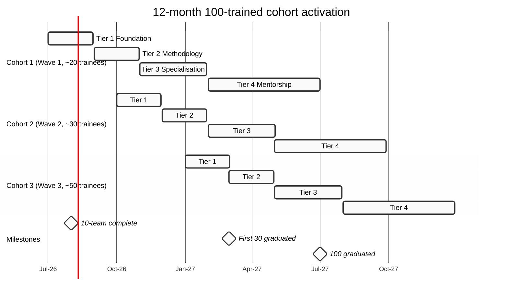
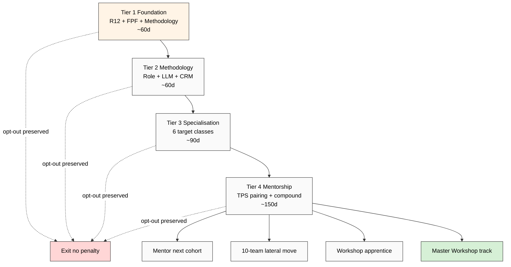

# Phase 4 — 100-Trained Cohort Operationalised

> **R1 surface.** Concept doc D §3.2 baseline (100 trained operators by Q4 2026) extended to deep operational spec. 4-tier curriculum + dispatch + quality control + 12-month Gantt + R12 + paternalism mitigation.

> **TPS mentor-pairing pattern** (per `research/deepening-2026-05-18/14`) load-bearing для 100-trained cohort training. **Education Layer 4-tier curriculum reference** (concept doc E cross-link).

> **Critical R12 + AP-6 surface:** training opt-in voluntary; NOT mandatory curriculum imposition. Trainee dissent preservation throughout.

---

## §1 Aspirational target + scale

Per concept doc D §3.2 + §3.3:
- Q4 2026 target: 100 operators trained.
- Per-operator throughput: ~30 personalised engagements/month.
- Aggregate Phase 2 (Q1 2027 onward): 100 × 30 × 12 = 36,000 personalised engagements/year.
- Subset → cohort entry funnel (response × qualification × conversion).

**OS-T2 falsifier:** trained < 30 operators within 12 months → pattern scaling failed.

---

## §2 4-tier training curriculum

Cross-reference: Education Layer concept doc E §3 «4-tier» curriculum (Foundation / Methodology / Specialization / Mentorship). Adapted для Outreach-specific:

### §2.1 Tier 1 — Foundation (Months 1-2 per cohort)

**Outreach principles + FPF discipline basics + R12 enforcement.**

Curriculum:
- Module 1.1: Jetix Outreach Methodology canonical read (concept doc D + Phase 1-7 deep research).
- Module 1.2: FPF lens basics (per `00-JETIX-FPF-MASTER-2026-05-17.md`) — U.SpeechAct, A.2 U.Role, U.PromiseContent.
- Module 1.3: R12 anti-extraction principles (per Pillar C Tier 2 rule 12 + First Clan Charter R12 LOCK).
- Module 1.4: Provenance discipline (per Foundation Part 6a F-G-R schema; per-claim [src: ...]).
- Module 1.5: 6 target audience class typology (per Phase 6).

**Assessment Tier 1:**
- Written R12 case-study (recognise extraction patterns; design data-minimisation alternative): pass ≥80% threshold.
- FPF lens application к 3 historical Jetix outreach examples: 2/3 correct mapping.
- Methodology recall: ≥75% short-answer test.

### §2.2 Tier 2 — Methodology (Months 3-4 per cohort)

**10→100→personalized pattern + per-role mastery.**

Curriculum:
- Module 2.1: 10-team role-types deep (per Phase 3) — each trainee selects 1 specialisation.
- Module 2.2: Per-role daily workflow shadowing с 10-team mentor (TPS pattern).
- Module 2.3: Cross-role handoff discipline (RACI doc from Phase 3 §6).
- Module 2.4: CRM substrate mastery (`crm/_scripts/crm` CLI + 10 skills + voice-pipeline DRAFT discipline).
- Module 2.5: LLM-assist + human craft discipline (per Phase 5 §1).

**Assessment Tier 2:**
- 5 trial deliverables under mentor review (per chosen role): ≥4/5 pass peer review.
- Cross-role handoff exercise: zero R12 violations.

### §2.3 Tier 3 — Specialisation (Months 5-7 per cohort)

**Target-class subject-matter expertise.**

Per trainee: select target-class specialisation:
- L1 / Master Workshop (research depth + L1 substrate; Workshop apprenticeship pre-req).
- Миллиардеры (×100 multiplier framing; per H-OUT-28).
- Миллионеры (broadcast-mode + Workshop apprenticeship offer).
- Разрабы / инженеры (ML 7-step + FPF + hackathon platform).
- Платформы (System Merger Protocol — Concept doc C overlap; B2B cycle).
- L2 RU community (Sovereign-AI offer; per H-ML-22 + H-ML-40).

Curriculum per specialisation:
- Module 3.1: Target-class deep research (substrate from Phase 6 §8.1).
- Module 3.2: Class-specific script template + variants.
- Module 3.3: Class-specific failure modes + R12 caveats.
- Module 3.4: Class-specific response handling (per Phase 5 §7.5).

**Assessment Tier 3:**
- Specialisation portfolio: 10 class-specific deliverables; mentor + 10-team lead review.
- Live target dispatch (supervised): 5 targets engaged under mentor review.

### §2.4 Tier 4 — Mentorship (Months 8-12 per cohort)

**Apprentice-master pairing (TPS pattern) + independent dispatch + mentor next cohort.**

Curriculum:
- Module 4.1: Master Workshop Engineers pattern study (per Thread 14).
- Module 4.2: TPS mentor-pairing discipline (per `research/deepening-2026-05-18/14`).
- Module 4.3: Quality predicate enforcement: «trainee can produce personalised outreach within ≤4h per target» (per concept doc D §3.2).
- Module 4.4: Mentor next cohort (1 mentor : 5 trainees ratio per Phase 4 §3 dispatch).
- Module 4.5: Compound learning artefact contribution (Workshop docs + outreach methodology refinement).

**Assessment Tier 4:**
- Mentor competence: 5 sub-trainees achieve Tier 1 + Tier 2 in their own arc.
- Compound learning contribution: ≥1 substrate-doc improvement per quarter (Workshop wiki).
- Independent dispatch: 30 targets/month sustained quality.

---

## §3 Dispatch mechanism

### §3.1 Per-trainee specialisation assignment

Per Tier 3 selection (above). **Voluntary opt-in.** Trainee picks specialisation; 10-team lead approves match (capacity + skill fit + cohort balance).

### §3.2 Trainee-mentor pairing algorithm

**TPS pattern (per `research/deepening-2026-05-18/14-tacit-explicit-tps-mechanism.md`):**
- 1 mentor : 5 trainees ratio (per H-OUT-17 hypothesis).
- Mentor = 10-team operator (Phase 3) OR senior 100-trained alumnus (Tier 4 graduate).
- Pairing window: Tier 2 onset; persists через Tier 3.
- Hand-off allowed if mismatch (no penalty).

**Quality predicate per pairing:** trainee can produce personalised outreach within ≤4h per target by end of Tier 3.

### §3.3 Quality gate

- Tier 1 → Tier 2: written assessment + R12 case-study pass.
- Tier 2 → Tier 3: 5 trial deliverables ≥4/5 pass peer review.
- Tier 3 → Tier 4: live dispatch 5-target supervised pass + 10 portfolio deliverables.
- Tier 4 graduation: 5 sub-trainees mentored + compound contribution.

**Trainee fails gate:**
- 1st fail: re-attempt с additional mentorship; no penalty.
- 2nd fail: re-assess pairing (mentor mismatch?); re-attempt.
- 3rd fail: voluntary exit OR re-direction к different role / specialisation; **no penalty, no clawback, no stigma** (per AP-6 dissent preservation + R12 fork-and-leave).

---

## §4 Per-trainee economics (R12-critical)

### §4.1 Time commitment

3 candidate models (Ruslan picks):

**Model α — Full-time (40h/week):**
- Salary: €2K-€3K base/month + variable; Mondragón cap enforced.
- Tier 1-2 = paid training; Tier 3-4 = paid productive dispatch.
- Strength: throughput + cohort cohesion.
- Weakness: high commitment from both sides; fork-and-leave higher friction.

**Model β — Part-time (15-20h/week):**
- Stipend: €600-€1K/month + per-deliverable variable.
- Tier 1-2 = stipend-only; Tier 3-4 = stipend + per-target output.
- Strength: accessibility (parents / students / part-time interest); fork-and-leave easier.
- Weakness: throughput lower; cohort identity weaker.

**Model γ — Project-contract:**
- Per-deliverable invoice; contractor classification.
- No training stipend; trainee invests own time in Tier 1-2.
- Strength: zero financial commitment from Jetix side.
- Weakness: Tier 1-2 inaccessibility for non-already-funded trainees → equity-of-access compromise (R12 caveat).

**Brigadier recommendation surface (R1):** Model β (part-time stipend) as default — best fork-and-leave + accessibility trade-off; Ruslan picks.

### §4.2 Compensation model (R12 enforcement)

Per Pillar C Tier 2 R12 + RUSLAN-LAYER R12-programmable Option D Hybrid (acked 2026-05-18):
- Mondragón cap: highest-paid ≤6× lowest (Charter LOCK 2026-05-12 §11).
- Fork-and-leave: 30-day notice; no clawback; exit-tokens preserved.
- No equity-only models (lock-in pressure risk).
- Transparency: comp structure public to all 100-trained cohort.

### §4.3 Fork-and-leave preservation

- Any trainee can exit at any tier с no penalty.
- Knowledge artefacts created during training = trainee retains co-ownership (cross-link: concept doc E «Education compounded value» H-ML-44).
- No NDA / non-compete (R12 LOCK).
- Re-entry permitted (cohort cycles re-open seasonally).

### §4.4 Career trajectory

Trainee → 10-team (lateral move если space) → Workshop apprentice → Master Workshop → Clan member.

**Critical:** trajectory = available NOT mandatory. AP-6 dissent preservation: trainee may diverge / exit / fork.

---

## §5 Quality control

### §5.1 Per-week output review

- 10-team mentor reviews trainee output (≥1 deliverable / week).
- Random sample audit: 10% trainee output / week reviewed by 10-team lead.
- Peer review pairs (trainee pairs swap for cross-review).

### §5.2 Sample personalised outreach audit

- Random sample × mentor review (target 3-5 per week).
- R12 audit: extraction patterns / aggressive close / paternalism flagged.
- Trust capital impact: post-engagement target feedback (consent-based) tracked.

### §5.3 Trainee feedback loop (AP-6 dissent preservation)

- Trainee can disagree с feedback in written response.
- Disagreement preserved in trainee record (NOT collapsed к consensus).
- Quarterly retro: trainee surfaces curriculum / mentor / dispatch concerns.
- Curriculum revisions tracked в Workshop wiki append-only.

### §5.4 Anti-pattern detection

| Anti-pattern | Detection signal | Mitigation |
|---|---|---|
| Extraction language («scarcity», «exclusive offer» false-urgency) | Style-guide lint + peer review | Re-train Module 1.3 R12; mandatory revision |
| Paternalism («you should...», «I know better») | Style-guide lint + trainee peer review | Re-train Module 4.1 Master Workshop pattern; revision |
| Aggressive close | CRM response-pattern analysis | Re-train Module 1.2 FPF SpeechAct discipline |
| Data harvesting | Researcher dossier audit | Re-train Module 1.3; per Phase 3 §3.4 R12 critical |
| LLM-signature without human craft | Final-review audit | Re-train Module 2.5 hybrid discipline |

---

## §6 Paternalism mitigation surface

**Explicit per concept doc E paternalism mitigation pattern:** training = opt-in voluntary; не mandatory curriculum imposition.

Mitigation tactics:
1. Curriculum modules = optional reading order (sequencing recommended NOT enforced).
2. Trainee can challenge any module content; AP-6 dissent preserved.
3. Mentor pairing = trainee choice with 10-team lead approval (not arbitrary assignment).
4. Specialisation = trainee picks (not assigned).
5. Exit at any tier preserved (R12 fork-and-leave).
6. Compound learning artefact = trainee co-author credit (not Workshop-only).

---

## §7 12-month activation Gantt

---

## §8 Curriculum mermaid

---

## §9 Risks + mitigations

| Risk | Probability | Impact | Mitigation |
|---|---|---|---|
| Cohort assembly fails Q4 2026 | medium | high | 3-wave staged plan (20+30+50); partial fallback acceptable |
| TPS pairing collapse (mentor capacity gap) | medium | high | Tier 4 graduates feed back as mentors (compounding) |
| Curriculum paternalism drift | medium | high | AP-6 dissent log + quarterly retro |
| R12 violation in compensation (Mondragón cap drift) | low | high | Programmable enforcement Option D Hybrid acked |
| Quality drift at scale | high (long-term) | medium | 10% sample audit + peer review pairs |
| Trainee fork-and-leave shock (>30% exit rate) | medium | medium | Re-entry permitted; cohort cycles re-open |
| Substance vs theatrical training | medium | high | Deliverable-anchored assessment (NOT theory-only tests) |
| Compounded gratitude loop fails (alumni don't refer) | medium | medium | Per H-ML-44 explicit; long-cycle attribution |

---

## §10 Cross-link к ML/AI 45-H bank + Workshop

- H-ML-44 «Education compounded value = gratitude loop substrate» — 100-trained cohort = gratitude-loop generation surface.
- H-ML-22 «Sovereign-AI consulting offer» — Tier 3 RU L2 specialisation = sovereign-AI outreach front.
- H-ML-36 «Master Workshop = ML engineer career destination» — 100-trained career trajectory М4 = Master Workshop track.
- `decisions/JETIX-WORKSHOP-CONCEPT-2026-04-30.md` — Workshop apprenticeship pattern = Tier 4 mentor substrate.

---

## §11 Constitutional preservation

- **R1:** Brigadier surfaces 3 economics models + curriculum structure; Ruslan picks.
- **R6:** Per-claim concept doc D + TPS deepening doc + Education Layer concept E + Workshop concept.
- **R11:** No cohort assembled here; Phase 4 activation requires Ruslan ack + AWAITING-APPROVAL packet.
- **R12:** Mondragón cap + fork-and-leave + no-NDA + opt-in voluntary curriculum + AP-6 dissent preservation. Programmable enforcement Option D Hybrid acked.
- **EP-5:** F2 surface; F3 candidate если Phase 4 §10 cross-link к H-ML-44 + H-ML-22 + H-ML-36 corroborates in operational test.

---

*Phase 4 100-trained cohort operationalised. 4-tier curriculum + TPS dispatch + 3 economics models + quality control + paternalism mitigation + 12-month Gantt. R1 + R6 + R11 + R12 + EP-5 preserved. [src: concept doc D §3.2 + deepening 14 TPS + concept doc E Education + Workshop concept 2026-04-30 + First Clan Charter R12 LOCK 2026-05-12]*
