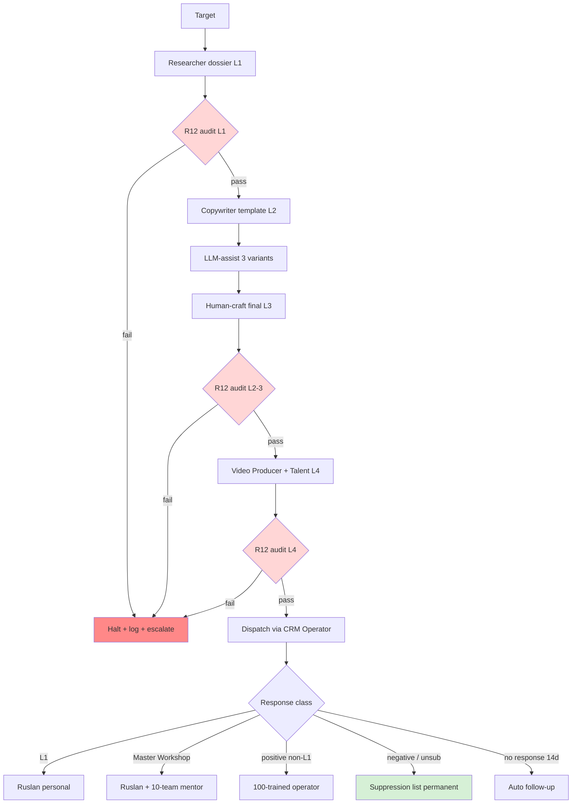

# Phase 5 — Personalised Outreach Mechanism (LLM-Assist + Human Craft Hybrid)

> **R12 CRITICAL.** Personalisation = highest extraction-risk surface of all phases. Per-stage R12 check explicit; data minimisation discipline foregrounded; OS-T5 falsifier preserved.

> **AP-6 dissent preserved.** Phil × critic: synthetic personalisation risk (target detects LLM signature → trust loss). Mitigation: mandatory human-craft final layer.

---

## §1 LLM-assisted personalisation vs Human craft — hybrid design

### §1.1 Hybrid principle

Per Phase 1 §7 cross-precedent + ML/AI Phase 7 H-ML-22 + H-ML-40 + concept doc D §3.3:

| Layer | What LLM does well | What human does well | Hybrid mode |
|---|---|---|---|
| Research compilation | Aggregate public sources at speed | Discriminate signal vs noise | LLM drafts dossier; human curates |
| Draft template generation | Speed + variant generation | Style match per target | LLM 3-5 variants; human picks + refines |
| Customisation tokens | Pattern-match warm hooks | Authenticity check | LLM proposes; human verifies |
| Final review | (cannot do — LLM-signature embedded) | Detect LLM signature; restore voice | Mandatory human pass |
| Relationship hooks | (cannot do — no relational memory) | Apply CRM relationship state | Human-only |
| Tone calibration | Mid-quality match | Cultural register + R12 check | Human dominant |

**Time saving estimate (per H-OUT-20):** LLM-assist saves 70% time; human-craft adds back 30% effort for authenticity restoration.

### §1.2 Phil critic dissent (preserved per AP-6)

**Critic position (NOT averaged):** synthetic personalisation = epistemic violation regardless of detection. Even if LLM-signature undetected, content lacks promise-content (U.PromiseContent FPF primitive) because LLM cannot make commitments — only human can. Therefore LLM should be ZERO in final delivered text; only as research assistant.

**Counter-position:** practical throughput requires LLM-draft layer; human-craft final = sufficient promise-content recovery if discipline enforced.

**Brigadier-preserved both positions:** Ruslan picks operator policy. Phase 5 design assumes hybrid with mandatory human-craft final; phil-critic minority position logged.

### §1.3 Authenticity test design

Per H-OUT-24 (LLM-signature detection by target reduces trust 20%+):
- Test design: A/B blind test — full-LLM vs LLM-assist+human-craft vs full-human.
- Acceptance: hybrid response rate ≥ 80% of full-human within ±5% tolerance.
- Refutation: hybrid response rate <60% of full-human → reject hybrid; fall back к full-human (lower throughput accepted).

---

## §2 Personalisation layer specification (4-layer stack)

### §2.1 Layer 1 — Per-target research data (CRM §1-§14 reference)

Source: Researcher dossier (Phase 3 §3.4) + CRM substrate (per `crm/README.md`).

**Inputs (per target):**
- §1: name + role + org (CRM person.md §1).
- §3: pipeline status (per `crm/_schema/statuses.yaml`).
- §5: relationship history (CRM §11 append-only).
- §7: offers relevant (per `crm/_schema/strategy-hooks.yaml` 6 offers).
- §8: asks relevant (per strategy-hooks 6 asks).
- §11: prior engagement history.
- §14: recordings + transcripts (consent-only — voice-pipeline DRAFT discipline).

**Public-source augmentation:**
- LinkedIn (manual only — no scraping per R12).
- Twitter / X (public posts only).
- Blog / Substack (public archive).
- GitHub (public repos / activity).
- Podcast / video appearances.
- Academic papers / book authorship.

**R12 layer 1 audit:** ALL inputs must be either (a) explicitly consented (CRM relationship-acquired) OR (b) explicitly public-on-target's-published-surface. NO scraping, NO data-broker, NO inferred private data.

### §2.2 Layer 2 — Script template (per target class)

Per Phase 6 §8.1 6 classes × per-class template:
- T1 L1 (Karpathy / Musk / Anthropic): «Jetix vision + ML-engineering substrate + 100× scope» template.
- T1 Master Workshop: «Master Workshop = best ML practice + FPF + autonomy + cohort» template.
- T2 Миллиардеры: «×100 multiplier + Phase 1 quick-money + Jetix vision» template.
- T2 Платформы: «FPF protocol + namord нiк + USB-C port» template (Concept doc C System Merger overlap).
- T3 Миллионеры: «AI consulting + Workshop apprenticeship» template.
- T3 Разрабы: «Hackathon platform + Best practices + Tools (ML stack)» template.

Per template: 3 A/B variants (per H-OUT-22 testable).

### §2.3 Layer 3 — Personalisation variables

Per target dossier extracted:
- Recent activity hook: specific tweet / paper / podcast quote within 30 days.
- Shared interest signal: cross-reference Workshop / Jetix substrate to target's public stance.
- Warm link signal: «X suggested I reach out» — only if warm-link discovered + consent confirmed.
- Relationship hook: prior engagement if any (CRM §11).
- Cultural register: Russian / English / German per target.

### §2.4 Layer 4 — Video customisation

Per Phase 3 §3.1 Video Producer + §3.3 On-screen Talent:
- Intro: 5-second personalised opening (name + specific recent activity hook).
- Body: 60-90 sec template + per-target inserts.
- Close: soft CTA (per R12; NO aggressive close).
- A/B variants: 3 per class (per H-OUT-22).

### §2.5 R12 audit per layer

| Layer | R12 risk | Audit gate |
|---|---|---|
| L1 Research | Scraping / data-broker / private-data inference | Pre-dispatch Researcher dossier audit (Phase 3 §3.4 KPI) |
| L2 Template | Extraction language / aggressive close baked into template | Style-guide lint (per Phase 3 §3.2 Copywriter KPI) |
| L3 Variables | Surveillance feel (specific recent activity = stalker risk if overdone) | Copywriter human-review; ≥30d activity window default |
| L4 Video | False urgency / scarcity / paternalism in delivery | Video Producer + 10-team-lead audit |

---

## §3 Per-operator throughput

### §3.1 Baseline (per concept doc D §3.3)

- 30 personalised targets/month/operator (single 100-trained operator).
- 100 operators × 30 = 3000 personalised engagements/month aggregate.
- Annual: 36,000 engagements/year (per OS-T3 falsifier ≥1000/month threshold).

### §3.2 Time budget per target

| Layer | Time (assuming hybrid) |
|---|---|
| L1 Research | 30-60min (Researcher delivered dossier) |
| L2 Template selection | 5-10min (Copywriter) |
| L3 Personalisation tokens | 20-40min (LLM-assist + human verification) |
| L4 Video customisation + recording | 30-60min (Talent + Producer) |
| CRM update + follow-up scheduling | 10-15min (Operator) |
| **Total per target** | **≤4h** (per concept doc D §3.2 quality predicate) |

### §3.3 Operator weekly cadence

- 30 targets/month / 4 weeks = ~7-8 targets/week.
- 7-8 targets × 4h = 28-32h/week (part-time fit per Phase 4 §4.1 Model β).

### §3.4 Aggregate funnel projection

```
3000 personalised/month
× 1-5% response rate (varies by class)
= 30-150 responses/month
× 30-50% qualification rate
= 9-75 qualified leads/month
× 10-20% conversion (cohort entry / discovery call / partnership)
= 1-15 actionable engagements/month
```

12-month projection: 12-180 actionable engagements/year (high variance per class mix). T1 critical (L1 + Master Workshop) skews to fewer-higher-quality; T3 broadcast skews to more-lower-quality.

---

## §4 R12 anti-extraction discipline foregrounded

### §4.1 Data minimisation (per OS-T5 falsifier)

**Discipline:** capture ONLY what's needed for current outreach engagement; NO speculative future-use harvesting.

| Data class | Capture rule |
|---|---|
| Target name + role + org | Capture (public default) |
| Public published works | Capture (cite [src] per R6) |
| Recent public activity (≤30d window) | Capture (cite) |
| Demographic / inferred (age / wealth / health) | DO NOT CAPTURE |
| Private contact info beyond what target published | DO NOT CAPTURE |
| Speculation re. target relationship state | DO NOT CAPTURE |

### §4.2 Opt-out respected

Per concept doc D OS-T5 falsifier:
- Per-target unsubscribe link / verbal opt-out → permanent suppression list.
- Suppression list = filesystem source-of-truth (per Global Rule 4).
- Re-entry only if target explicitly re-engages (NOT inferred).
- Suppression auto-applied to all outreach channels (no cross-channel resurrection).

### §4.3 Fork-and-leave preserved (cohort exit)

If target engages → cohort entry → target can fork-and-leave с no penalty:
- No clawback of value delivered.
- No NDA / non-compete imposed.
- Knowledge artefacts shared = retain (per First Clan Charter R12 LOCK).
- Re-entry permitted seasonally.

### §4.4 Audit trail per engagement

Per Foundation Part 6a F-G-R discipline:
- Every outreach engagement → CRM §11 history append-only.
- Outreach material content → linked в CRM (`crm/transcripts/` referenced).
- R12 audit log: any policy-violation flagged + halted per Halt-Log-Alert (Pillar C Tier 2 rule 11).

### §4.5 Per concept doc D OS-T5 falsifier test

Quarterly external audit (R12 review):
- Random sample 5% engagements → verify R12 compliance.
- Failure threshold: >2% engagements with extraction patterns → cohort dispatch halted; revert to 10-team supervision.
- Annual external R12 audit (post-Q4 2026 cohort live).

---

## §5 Response handling pipeline

### §5.1 Response classification

| Response class | Auto-detection | Human-in-loop trigger |
|---|---|---|
| Positive (interest expressed) | NLP intent classifier | YES (human triage) |
| Neutral (acknowledgment) | NLP | NO (auto-log) |
| Negative (decline polite) | NLP | YES (mentor review + suppression check) |
| Unsubscribe explicit | Pattern-match | AUTO + permanent suppression |
| Bounce / undeliverable | Email-server signal | AUTO + retry strategy or suppression |
| No response (>14d) | Timer | AUTO follow-up scheduling per template |

### §5.2 Human-in-loop trigger thresholds

- All T1 (L1 + Master Workshop) responses → Ruslan personal escalation.
- All T2 (миллиардеры + Платформы) positive responses → 10-team mentor + Ruslan briefing.
- T3 (миллионеры + Разрабы) positive → 100-trained operator + 10-team mentor.
- All negative + unsubscribe → R12 audit logged.

### §5.3 L1 priority escalation

Per concept doc D §5 + Thread 12 «снежный ком»:
- Karpathy / Musk / Anthropic founders / Buterin / Sutskever / Hassabis = L1 critical-class.
- ANY response → Ruslan personal action (R1 sole strategist preserved).
- 10-team substrate provides briefing pack (research dossier + relationship history + warm-link chain).
- Ruslan composes personal reply; 10-team supports logistics.

### §5.4 Master Workshop escalation

- Response → Ruslan + 10-team mentor пара.
- Deeper-research dossier triggered (Tier 3 specialisation team activated).
- Follow-up cadence: Ruslan-driven; 10-team supports.

### §5.5 Cohort entry funnel

For non-L1 / non-Master-Workshop positive responses:
- Discovery call scheduling (CRM Operator).
- Workshop apprenticeship / hackathon / Clan-entry invitation per fit.
- 100-trained operator handles follow-up (Tier 3+ trainee per specialisation).

---

## §6 Personalisation flow mermaid



---

## §7 Cross-link к ML/AI 45-H bank

### §7.1 H-ML-22 — Sovereign-AI offer
- RU-language outreach scripts for RU L2 community (per H-ML-40).
- Tier 3 specialisation «L2 RU community» (per Phase 4 §2.3).
- Per concept doc D §5 sovereign framing applied.
- **R12-aligned:** sovereign-AI = data-residency + open-source preference → matches R12 anti-extraction.

### §7.2 H-ML-39 — Karpathy outreach
- L1 critical-class; Karpathy = Education Layer alignment + Software 2.0 + open-source ML pedagogy.
- Hackathon framing (per H-ML-39 «Karpathy-specific outreach high-fit») cross-link к `research/hackathon-platform-deep-2026-05-18/`.
- Master Workshop track surface для Karpathy engagement.

### §7.3 H-ML-40 — RU L2 telegram community
- Tier 3 specialisation operator pool.
- Котенков / Лапань / Voronova etc. as primary outreach targets.
- Sovereign-AI offer + RU language + Workshop apprenticeship offer.
- **R12 caveat:** Telegram community = consent-based engagement; no DM-spam tactics.

### §7.4 H-ML-44 — Education compounded gratitude loop
- Workshop alumni → outreach referral substrate (per Phase 4 §10).
- 100-trained graduates → mentor next cohort (compounding).
- Master Workshop endorsement (Karpathy / Sutskever etc. — long-cycle aspiration).

---

## §8 LLM-assist tool stack (R12 + cost-conscious)

| Layer | Tool option | R12 caveat |
|---|---|---|
| Research aggregation | Claude / GPT API via Workshop methodology | Data minimisation in prompt; no PII in API call |
| Draft variants | Claude / GPT | Per concept doc D + style guide; output reviewed |
| Style match | Open-source (Llama / Mistral local) preference | R12-aligned; sovereign-AI alignment |
| Personalisation tokens | Hybrid | Manual verification mandatory |
| Final review | NO LLM (mandatory human pass) | LLM-signature elimination |
| Translation (RU/EN/DE) | Claude / GPT + human review | Cultural register check |

**Cost-conscious:** prefer batched calls; cache repeated context; data minimisation reduces token cost incidentally.

---

## §9 Failure modes + mitigations

| Failure mode | Detection | Mitigation |
|---|---|---|
| LLM-signature detection by target | Response-pattern analysis | Mandatory human-craft final; A/B test against full-human baseline |
| R12 violation in personalisation | Per-layer audit gates | Halt-Log-Alert per Pillar C Tier 2 rule 11 |
| Throughput collapse <1000/month | Aggregate dashboard | Re-train 10-team mentor capacity; Cohort 2/3 acceleration |
| Operator burnout | Per-operator output trend | Part-time Model β default per Phase 4 §4.1; rest cadence enforced |
| Cultural register mismatch (RU/EN/DE) | Peer review + target feedback | Translator pair + Workshop register guide |
| Aggressive close drift | Style-guide lint + R12 audit | Re-train Module 1.3 R12 (per Phase 4 §2.1) |
| Cross-channel resurrection of suppressed target | Filesystem suppression list audit | Hard-coded suppression sync across CRM + outreach tools |

---

## §10 Constitutional preservation

- **R1:** Brigadier surfaces hybrid design; phil critic dissent preserved (AP-6); Ruslan picks operator policy.
- **R6:** Per-claim concept doc D + Phase 1 cross-precedent + ML/AI 45-H + CRM canonical.
- **R11:** No personalised outreach dispatched here; Phase 5 activation requires Ruslan ack + AWAITING-APPROVAL packet.
- **R12 (CRITICAL):** Per-layer audit gates + data minimisation + opt-out permanent suppression + fork-and-leave + audit trail. OS-T5 falsifier explicit; quarterly external R12 audit triggered at cohort live.
- **AP-6:** Phil critic synthetic-personalisation dissent preserved (NOT averaged).
- **EP-5:** F2 surface; F3 candidate via post-cohort empirical A/B test.

---

*Phase 5 personalised outreach mechanism. LLM-assist + human craft hybrid; 4-layer stack; R12 per-layer audit gates; response handling pipeline; cross-link к 4 ML/AI hypotheses. R1 + R6 + R11 + R12 (CRITICAL) + EP-5 + AP-6 preserved. [src: concept doc D §3.3 + Phase 1 §3 Naval + Phase 1 §4 Levels + ML/AI 45-H H-ML-22/39/40/44 + crm/README.md + Pillar C Tier 2 R12]*
