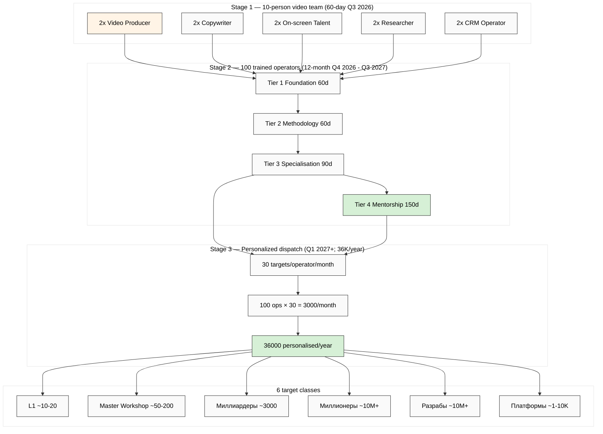

# Diagram 01 — Outreach System Overview

```mermaid
%%{init: {'theme':'base', 'themeVariables': {'primaryTextColor':'#000','textColor':'#000','lineColor':'#333','primaryBorderColor':'#333','primaryColor':'#fafafa'}}}%%
graph TB
  subgraph "Stage 1 — 10-person video team (60-day Q3 2026)"
    P1[2x Video Producer]
    P2[2x Copywriter]
    P3[2x On-screen Talent]
    P4[2x Researcher]
    P5[2x CRM Operator]
  end

  subgraph "Stage 2 — 100 trained operators (12-month Q4 2026 - Q3 2027)"
    T1[Tier 1 Foundation 60d]
    T2[Tier 2 Methodology 60d]
    T3[Tier 3 Specialisation 90d]
    T4[Tier 4 Mentorship 150d]
  end

  subgraph "Stage 3 — Personalized dispatch (Q1 2027+; 36K/year)"
    PE[30 targets/operator/month]
    AG[100 ops × 30 = 3000/month]
    YR[36000 personalised/year]
  end

  subgraph "6 target classes"
    TC1[L1 ~10-20]
    TC2[Master Workshop ~50-200]
    TC3[Миллиардеры ~3000]
    TC4[Миллионеры ~10M+]
    TC5[Разрабы ~10M+]
    TC6[Платформы ~1-10K]
  end

  P1 --> T1
  P2 --> T1
  P3 --> T1
  P4 --> T1
  P5 --> T1
  T1 --> T2 --> T3 --> T4
  T3 --> PE
  T4 --> PE
  PE --> AG --> YR

  YR --> TC1
  YR --> TC2
  YR --> TC3
  YR --> TC4
  YR --> TC5
  YR --> TC6

  style P1 fill:#fff4e6
  style T4 fill:#d6f0d6
  style YR fill:#d6f0d6
```
