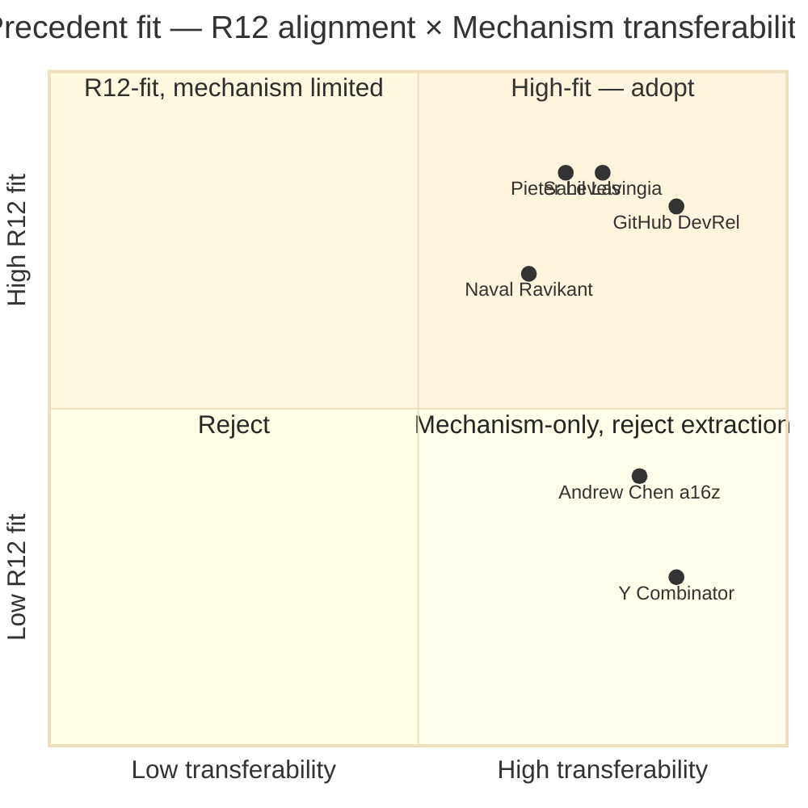

# Diagram 02 — Cross-Precedent Comparison

## Adopt verdict per precedent

| Precedent | Adopt? | Rationale |
|---|---|---|
| Sahil Lavingia | ✓ | Augmented-solo + vulnerability + R12 |
| Pieter Levels | ✓ | Build-in-public + community substrate |
| GitHub DevRel | ✓ | Education-as-outreach + community-funding |
| Naval Ravikant | ✓ | Asymmetric leverage + specific knowledge |
| Andrew Chen a16z | ◐ partial | Warm-intro chain mechanism only; reject capital-extraction |
| Y Combinator | ◐ partial | Funnel + cohort mechanism only; reject equity-extraction |
