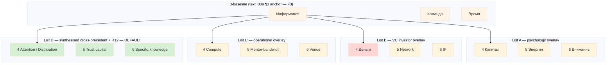

# Diagram 03 — 6-Resources Framework (4 candidate taxonomies)

## R12 fit per list

- List A — ✓ (no extraction framing)
- List B — ◐ (Деньги invites extraction logic; R12 caveat)
- List C — ✓ (operational; no extraction)
- List D — ✓✓ (explicit R12 alignment; brigadier flags default)
