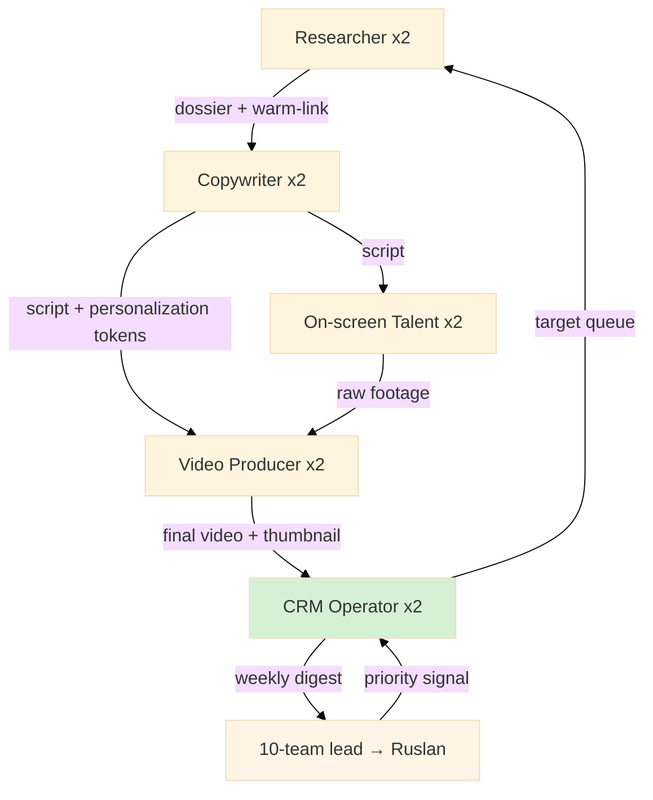

# Diagram 04 — 10-Person Team RACI + Handoff

## RACI summary

| Activity | R | A | C | I |
|---|---|---|---|---|
| Target research | Researcher | 10-team lead | Copywriter | CRM Op |
| Script draft | Copywriter | 10-team lead | Researcher + Talent | Producer |
| Video recording | Talent | 10-team lead | Copywriter + Producer | CRM Op |
| Video editing | Producer | 10-team lead | Talent | CRM Op |
| CRM pipeline | CRM Op | 10-team lead | All roles | Ruslan |
| Weekly digest | CRM Op | 10-team lead | All roles | Ruslan |
| R12 audit | All | 10-team lead | Ruslan | All |
