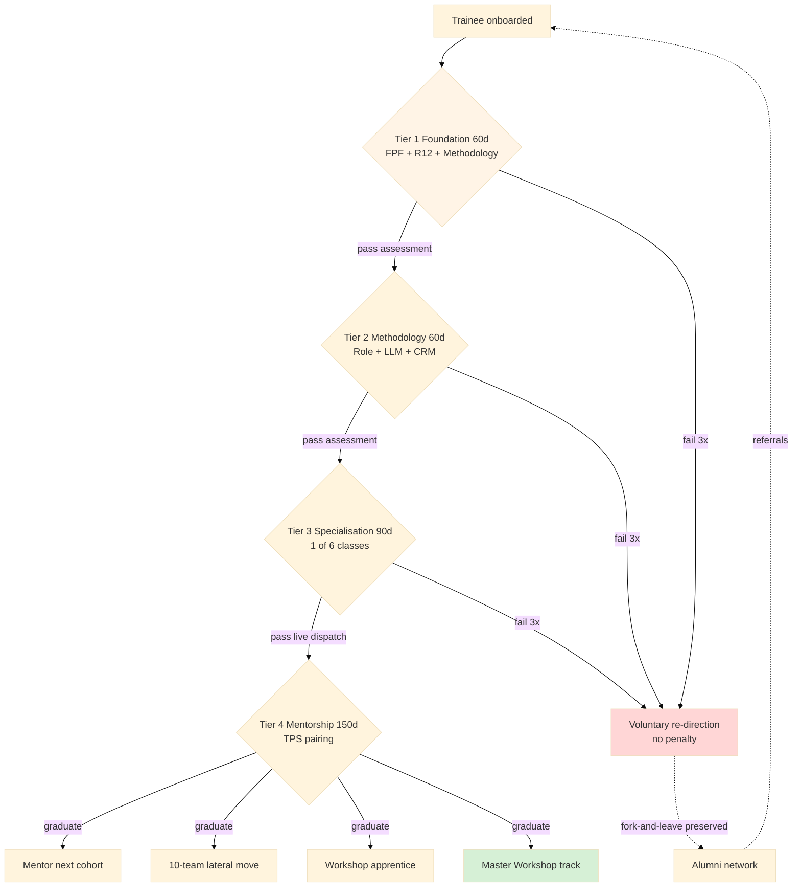

# Diagram 05 — 100-Trained Cohort 4-Tier Curriculum

## Quality predicate per Tier

- Tier 1 → Tier 2: written R12 case-study + FPF mapping (≥80% pass).
- Tier 2 → Tier 3: 5 trial deliverables ≥4/5 peer review.
- Tier 3 → Tier 4: 10 portfolio deliverables + 5 supervised dispatch pass.
- Tier 4 graduate: 5 sub-trainees mentored + ≥1 compound contribution.

Paternalism mitigation: voluntary opt-in; AP-6 dissent preserved; fork-and-leave no penalty.
