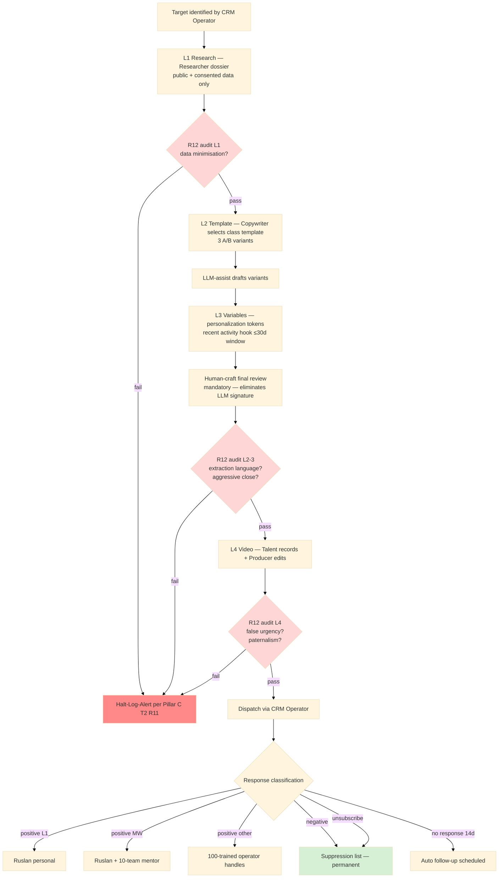

# Diagram 06 — Personalisation Pipeline (4-layer + R12 gates)

## Per-layer R12 audit summary

| Layer | Audit gate | Failure mode |
|---|---|---|
| L1 Research | Public + consented data only; no scraping | Halt + Researcher re-train |
| L2 Template | No extraction language baked-in | Halt + Copywriter re-train |
| L3 Variables | No surveillance / stalker feel | Halt + Copywriter human review |
| L4 Video | No false urgency / paternalism | Halt + Producer / Talent review |
