# Diagram 07 — Target Audience Tier Prioritisation

```mermaid
%%{init: {'theme':'base'}}%%
flowchart TB
  subgraph "Tier 1 — CRITICAL (Phase 1 immediate)"
    direction LR
    C1[L1 key-person ~10-20<br/>Karpathy/Musk/Anthropic/Buterin/Sutskever/Hassabis<br/>Ruslan personal]
    C2A[Master Workshop inner ring ~10<br/>Ruslan + 10-team]
  end

  subgraph "Tier 2 — HIGH (Phase 1-2)"
    direction LR
    C2B[Master Workshop next-tier ~50<br/>10-team distributed]
    C3[Миллиардеры ~3000<br/>100-trained T3 specialisation]
    C6[Платформы ~1-10K<br/>B2B + Ruslan + 10-team]
  end

  subgraph "Tier 3 — MEDIUM (Phase 2 Q1 2027+)"
    direction LR
    C2C[Master Workshop far-tier ~150<br/>100-trained operators]
    C4[Миллионеры ~10M+<br/>100-trained + content broadcast]
    C5[Разрабы ~10M+<br/>Hackathon + Workshop + content]
  end

  T1L[Outreach: Ruslan-driven]
  T2L[Outreach: 10-team-driven]
  T3L[Outreach: 100-trained-driven]

  C1 --> T1L
  C2A --> T1L
  C2B --> T2L
  C3 --> T2L
  C6 --> T2L
  C2C --> T3L
  C4 --> T3L
  C5 --> T3L

  classDef critical fill:#ffd6d6
  classDef high fill:#fff4e6
  classDef medium fill:#d6f0d6

  class C1 critical
  class C2A critical
  class C2B high
  class C3 high
  class C6 high
  class C2C medium
  class C4 medium
  class C5 medium
```

## Per-tier success criteria

| Tier | Classes | Response rate target |
|---|---|---|
| T1 Critical | L1 + MW inner | 5%+ L1 / 15%+ MW |
| T2 High | MW next-tier + Миллиардеры + Платформы | 5-10% MW / 1-3% Bn / 5-10% PF |
| T3 Medium | MW far-tier + Миллионеры + Разрабы | 1-3% MW / 0.1-1% M / 1-3% Dev |
