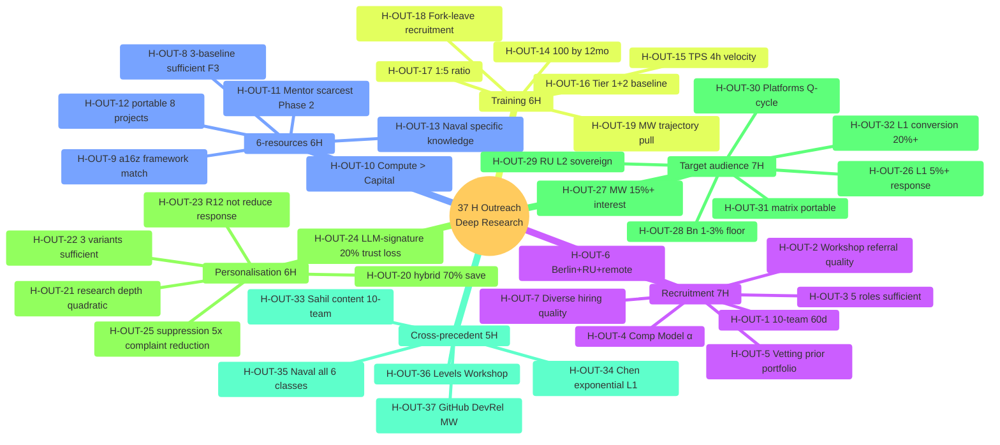

# Diagram 08 — Hypothesis Bank Visualisation (37 H)

## F-grade distribution

- F3: H-OUT-8 (3-baseline; voice anchor + 4-6/6 precedent), H-OUT-25 (CAN-SPAM/GDPR norm).
- F2: Остальные 35 H.

Per concept doc D F2 surface; F3 promotion requires post-cohort empirical validation.
