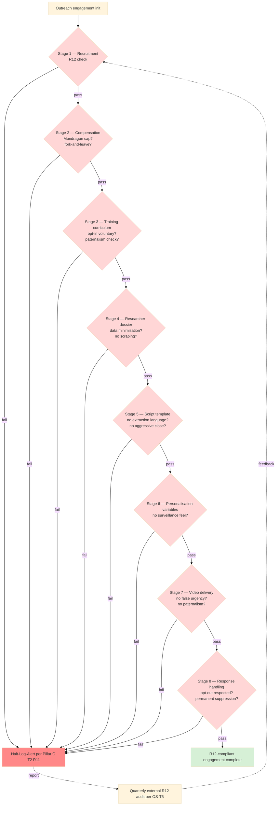

# Diagram 09 — R12 Anti-Extraction Gates Per Stage

## Programmable enforcement

Per RUSLAN-LAYER R12-programmable Option D Hybrid (acked 2026-05-18):
- 4 RUSLAN-LAYER action classes в `.claude/config/default-deny-table.yaml`:
  - `extraction_beyond_share`
  - `wage_ratio_violation`
  - `non_consensual_distribution`
  - `fork_prevention_attempt`
- Phase 1 manual enforcement → Phase 2+ Ethereum substrate programmable enforcement.
- Per-Clan opt-in via Charter.
