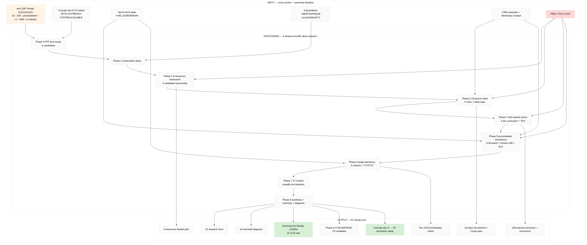

# Diagram 10 — Master TL;DR

## Constitutional layer (across all phases)

R1 surface + R6 provenance + R11 Default-Deny + R12 anti-extraction (CRITICAL) + EP-5 F-grade + AP-6 dissent preservation + breadth NOT selection + FPF-lens-FIRST + append-only.

8 LOCK content + Foundation + Pillar C + Schemas + VISION-FUNDAMENTAL = READ-ONLY.
