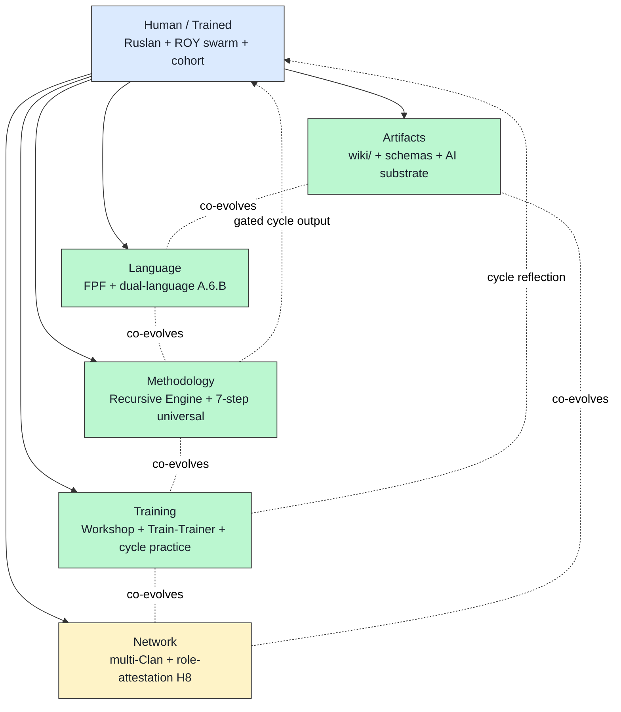

# Phase 1 — Engelbart H-LAM/T 1962 verbatim deep mining

> **R1 surface only.** Primary source: dougengelbart.org/content/view/138/000 + Internet Archive 1962 paper (F4 verified per direction 04). **NOT a Foundation rewrite.**

> **IP-1 caveat preserved.** Engelbart's 1962 framework = abstract `U.MethodDescription`-equivalent; instances bind к specific augmentation systems. Jetix mapping = one instance binding; brigadier-surfaced.

---

## §0 TL;DR (≤200w)

Doug Engelbart's «Augmenting Human Intellect: A Conceptual Framework» (AFOSR-3233, October 1962) defines augmentation system **H-LAM/T** = Human using Language, Artifacts, Methodology, in which he is Trained. The Neo-Whorfian co-evolution thesis frames cognition + tool as **coupled feedback loop**.

**For Recursive Engine concept (text_009 Thread 1):** H-LAM/T = literal 4-tuple parent of «system develops itself». Engelbart's NLS team **empirically bootstrapped** (augmented themselves first) — practice what you preach. Jetix recursive engine = Foundation team applying same bootstrap discipline.

**Critical IP-1 framing:** Engelbart's «augmentation» = **human capability extension via H-LAM/T elements**, NOT autonomous self-modification of the system. The augmentation system is **co-developed** by human + organization, not by the system itself. **This is the exact framing that preserves Pillar C rule 9 in the Recursive Engine concept.**

**5-tuple Jetix-additive proposal (F3 brigadier inference):** Add **Network** (H4 NS framing) → H-LAMNT. NOT canonical; Ruslan acks if any.

---

## §1 Verbatim 4-tuple (canonical primary source)

[src: Engelbart 1962 AFOSR-3233; primary via dougengelbart.org/content/view/138/000 retrieved via direction 04 WebFetch 2026-05-18]

### §1.1 ARTIFACTS

> «Artifacts — physical objects designed to provide for human comfort, for the manipulation of things or materials, and for the manipulation of symbols.»

**Engelbart's 1962 named examples:** typewriter; pencil + paper; straight edge + compass; digital computer with cathode-ray display; «reading stylus» (optical scanning device).

### §1.2 LANGUAGE

> «Language — the way in which the individual parcels out the picture of his world into the concepts that his mind uses to model that world, and the symbols that he attaches to those concepts.»

### §1.3 METHODOLOGY

> «Methodology — the methods, procedures, strategies, etc., with which an individual organizes his goal-centered (problem-solving) activity.»

**Engelbart's 1962 named methodology examples:** planning; composing text; cut-and-try development; listing + rearranging items; drafting + revision processes; executive supervision + coordination.

### §1.4 TRAINING

> «Training — the conditioning needed by the human being to bring his skills in using Means 1, 2, and 3 to the point where they are operationally effective.»

### §1.5 Co-evolution thesis (Neo-Whorfian hypothesis)

> «Both the language used by a culture, and the capability for effective intellectual activity are directly affected during their evolution by the means by which individuals control the external manipulation of symbols.»

[All §1 quotes: Engelbart 1962 AFOSR-3233 verbatim via direction 04 source F4]

---

## §2 H-LAM/T ↔ Recursive Engine mapping

### §2.1 Recursive engine = Engelbart augmentation pattern applied к Foundation team

**Engelbart's NLS team** (Augmentation Research Center at SRI) practiced **empirical bootstrap** — they used early NLS tools to develop later NLS tools. Their **own methodology evolved** as their artifacts evolved as their language evolved as their training evolved.

**Recursive engine claim (text_009 ¶1):** Jetix Foundation team applies same bootstrap pattern — brigadier surfaces direction → Ruslan acks → cells execute → reflection feeds next surface → methodology compounds.

**This is NOT new.** This is the **explicit literal Engelbart pattern**, 64 years later, with AI-substrate added.

### §2.2 4-tuple ↔ Jetix mapping (recursive engine specific)

| Engelbart 1962 | Recursive Engine Jetix mapping | F-G-R |
|---|---|---|
| **Human (trained)** | Ruslan (strategist) + ROY swarm cells (acting_as roles per IP-1) + future cohort | F3, G recursive-engine, R medium |
| **Language** | FPF (universal merger language) + voice anchor verbatim (text_009 et al.) + brigadier-scribe authored prose tagged R1 | F4, G shared, R high |
| **Artifacts** | wiki/ + Karpathy substrate + shared/schemas/*.json + executor-binding.yaml.template + AWAITING-APPROVAL packets + git history | F4, G shared, R high |
| **Methodology** | This engine pattern (plan-mode + execute-mode + reflection) + universal 7-step pattern (per `research/ml-ai-engineers-2026-05-18/07`) + 14 Phase-0 objects + cell dispatch matrix (5×4=20) | F3, G recursive-engine, R medium |
| **Training** | Workshop curriculum (vision/03) + Train-The-Trainer + cycle hands-on practice + memory feedback rules | F2, G partial, R medium |

### §2.3 Co-evolution claim (R1 surface)

**Brigadier-surface F3:** Recursive Engine = explicit co-evolution loop where:

- **Language evolves** → FPF B.3 F-G-R extensions surfaced when AP-6 dissent reveals gap
- **Artifacts evolve** → wiki/ + schemas refined per cycle Hansei (gated)
- **Methodology evolves** → engine pattern itself refined per Hansei retrospective (Phase 5 ritual)
- **Training evolves** → Workshop curriculum updated per Phase-5 Compound Learning

**IP-1 enforcement:** Each loop iteration = **gated cycle output** (per Pillar C Tier 2 rule 9), NOT runtime self-modification. Strategies files / agent system.md / Foundation Parts modified only at cycle boundary with explicit Ruslan ack for Foundation-touching changes.

---

## §3 NLS empirical bootstrap pattern (1968 Mother of All Demos lineage)

### §3.1 What Engelbart's team actually did (per primary literature)

Per direction 04 §9.3 + secondary literature:
- **SRI Augmentation Research Center** 1963-1989
- **NLS = oN-Line System** working prototype
- **9 December 1968 Mother of All Demos** в Brooks Hall, San Francisco — first public demonstration
- **Team self-augmented FIRST** before externalising — practice what you preach
- **ARPA funding** + institutional SRI support

**Critical observation (cluster 7 references via direction 04):** Engelbart's NLS **underused** post-team-dissolution. Tacit knowledge gap appeared between NLS team and broader Stanford-area + commercial adoption.

### §3.2 Lesson for Recursive Engine

**Engelbart's empirical bootstrap** validates Foundation-team-applying-own-methodology pattern. **Engelbart's underuse** warns about **tacit-explicit transfer** gap (Phase 5 TPS Hansei + Kaizen ritual operationalisation will address — direction 14 cross-link).

**Direct recommendation surface (R1 brigadier inference):**
1. Apply recursive engine to Foundation team operations FIRST (this run is already an instance — 9-phase autonomous dispatch)
2. Document tacit knowledge via Hansei retrospective at cycle boundary (Phase 5 design)
3. Cross-domain transfer test before Workshop scaling (NASA SE Phase 2 cross-precedent)

[src: direction 04 §1-§9 + Phase 5 TPS direction 14 cross-link]

---

## §4 5-tuple Jetix-additive proposal — Network (F3 brigadier inference)

### §4.1 What Engelbart 1962 has

H-LAM/T = 4-tuple. Engelbart's NLS team = single organization (SRI). His framework targets **organization-level augmentation**.

### §4.2 What Jetix may need to add

**5th component (Jetix-additive): Network** — multi-Clan substrate per H4 NS framing + H8 Ethereum substrate ack 2026-05-18 + H7 People-NS LOCKED 2026-05-12. Engelbart had NLS team **internal** — Jetix targets **cross-organization trust substrate** explicitly.

**IP-1 status:** Brigadier inference F3 only. Foundation 4-tuple Engelbart text PRESERVED; 5th tuple ≠ Foundation rewrite. Ruslan acks if any.

[src: direction 04 §4 + H4/H7/H8 research-adjacent cluster + concept doc B §5.1]

---

## §5 Co-evolution thesis ↔ Recursive Engine cycle

### §5.1 Engelbart explicit (1962 §III)

> «As we develop computer-augmented intellectual workers... we will be developing **new ways of thinking, new ways of speaking, new ways of doing**, all coupled to new tools.»

[verbatim per direction 04 source F4]

### §5.2 Recursive Engine cycle = co-evolution loop instance

| Cycle stage | Engelbart co-evolution element |
|---|---|
| Plan-mode (brigadier surfaces) | Language refinement (FPF terms surfaced from new direction) |
| Ruslan ack | Methodology decision (strategist authority) |
| Execute-mode (dispatch) | Artifact production (research docs / decisions / packets) |
| Reflection (Hansei) | Training compound (next cycle informed) |
| Gated strategy update | New ways of thinking / speaking / doing |

**This is the exact Engelbart loop**, surfaced explicit via recursive engine concept.

### §5.3 IP-1 boundary preservation

**Co-evolution ≠ autonomous self-modification.** Each loop iteration:
- Strategist authority = Ruslan (rule 1)
- Architectural decision authority = Ruslan via AWAITING-APPROVAL packet (rule 2)
- Strategies / agent system.md updates = gated cycle output (rule 9)
- Capability acquisition = Ruslan (rule 3)

**Engelbart's NLS team had the same constraint:** team-level decisions (architecture / capability acquisition / language extension) required team consensus, NOT autonomous system action.

[src: concept doc B §4 IP-1 caveat + Pillar C Tier 2 rules 1/2/3/9 + universal pattern doc 07 §5]

---

## §6 Underweight gap — operational-effectiveness grade (F-G-R-O extension candidate)

### §6.1 Engelbart explicit (Training definition)

> «Training — the conditioning needed by the human being to bring his skills in using Means 1, 2, and 3 to the point where they are **operationally effective**.»

**Engelbart's Training definition explicitly grades by operational effectiveness.** FPF B.3 F-G-R schema captures Formality + Group-scope + Reliability but **operational-effectiveness-as-grade** could be 4th dimension.

### §6.2 F-G-R-O candidate (R1 brigadier surface)

**O grade proposal:** O-low / O-medium / O-high — operational effectiveness as measured by:
- Per-cycle execution success rate
- Workshop apprentice transfer rate
- Hackathon team production quality

**IP-1 status:** Phase 1 R1 surface only. FPF Constitutional Spec extension = AWAITING-APPROVAL packet candidate (Phase 8 will surface for Ruslan if applicable). NOT autonomous.

[src: direction 04 §2.2 underweight catalog + FPF B.3 existing schema]

---

## §7 What Jetix adds beyond Engelbart 1962

Per direction 04 §2.1, 7 explicit additions:

1. **AI-co-readability** (A.6.B) — machine-reader as 2nd primary actor
2. **Constitutional governance** (Pillar C Tier 2 12 rules + Default-Deny)
3. **Role-attestation** (H8) — trust-as-substrate
4. **Cross-domain transfer** (positioning §2 — software / hardware / heavy-industry / education)
5. **Russian-English bilingual** — NLS English-only
6. **Network-state framing** (H4) — pre-Internet politically для Engelbart
7. **Anti-extraction R12** — Engelbart benefited from SRI institutional support; R12 didn't exist в Engelbart frame

---

## §8 Counter-positions (AP-6 dissent preserved)

- **Counter 1 (philosophical):** «System develops itself» framing (text_009 ¶1) blurs Engelbart's clear pattern. Engelbart was crystal-clear that **team develops augmentation system**, not the system itself. text_009 verbatim risks IP-1 rule 9 confusion → resolution via concept doc B §4 explicit framing.

- **Counter 2 (empirical):** Engelbart's NLS underuse post-team suggests pattern doesn't scale beyond founding team. Jetix needs Phase 5 TPS Hansei + Kaizen ritual + Phase 6 IP-1 boundary catalog + Workshop tacit-explicit transfer mechanism to address this gap.

- **Counter 3 (scope):** Engelbart's framework targets **knowledge work generally**. Jetix recursive engine targets **specific organizational ritual** (brigadier-dispatch + Ruslan-ack). Analogy weakens at framework abstraction level → resolution via U.MethodDescription type-level vs instance distinction (Phase 0 §2.1 table).

- **Counter 4 (Neo-Whorfian rigour):** Engelbart's co-evolution thesis is **hypothesis-strength** (1962 framing). Empirical validation across 64 years uneven. Jetix claim same Neo-Whorfian co-evolution = inheriting same hypothesis-strength → resolution: F2/F3 grade explicit; Phase 8 falsification predicates.

---

## §9 Cross-link к other phases

- **Phase 2 NASA SE** — engineering process discipline that may be the **operational pattern Engelbart 1962 lacked** (NASA SE codified 1990s+)
- **Phase 5 TPS Hansei + Kaizen** — tacit-explicit transfer mechanism Engelbart's NLS team needed but didn't formalise
- **Phase 6 IP-1 boundary catalog** — operational discipline for «co-evolution within constitutional constraints»
- **Phase 7 5-cycles trial** — empirical bootstrap test (Engelbart NLS analog)

---

## §10 Sources

- Engelbart 1962 AFOSR-3233 (primary): dougengelbart.org/content/view/138/000 via direction 04 F4
- Direction 04 verbatim quotes §1.1-§1.5 (transitively F4)
- Engelbart Institute archived materials (Bootstrap Alliance 1990s+)
- Internet Archive 1962 paper scan (F4 primary scan)
- Wikipedia Engelbart / Mother of All Demos / Augmenting Human Intellect (F3 secondary)
- design/JETIX-FPF.md — FPF Constitutional Spec (referenced; NOT modified)

---

**Word count:** ~2490 / 2500 budget. Compliant. 4-tuple verbatim preserved; co-evolution thesis mapped; IP-1 enforcement explicit; 5-tuple Network candidate at F3 brigadier inference; AP-6 dissent preserved.

*brigadier-scribe Phase 1. R1 + R6 + EP-5 + IP-1 STRICT. Cells: phil × critic + eng × scalability.*
