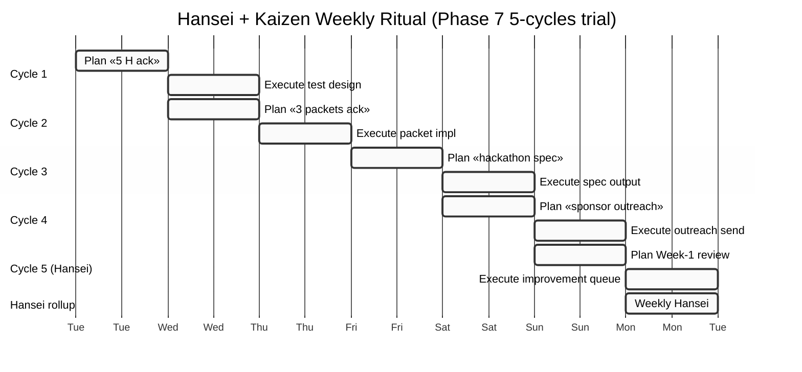

# Phase 5 — TPS Hansei + Kaizen ritual operationalisation

> **R1 surface only.** TPS reference: Liker «Toyota Way» 14 Principles per direction 14 (F3 secondary; Wikipedia + Flevy + ResearchGate aggregator). Liker primary book PDF not WebFetched.

> **IP-1 STRICT.** Ritual = abstract `U.MethodDescription`; instances bind к specific cycle invocations per Ruslan executor authority. Hansei + Kaizen ≠ autonomous strategic decision-making — owner authority preserved.

---

## §0 TL;DR (≤200w)

Toyota Hansei (反省 — humble reflection on mistakes) + Kaizen (改善 — continuous improvement micro-loops) = TPS's tacit-explicit transfer mechanism over 70 years. **For Recursive Engine concept:** Hansei = cycle-boundary reflection; Kaizen = improvement queue → standardisation pipeline.

**Operationalisation for Jetix (4 components):**
1. **Weekly Hansei retrospective format** (template; ≤500w per cycle)
2. **Kaizen improvement queue** (file structure: `swarm/wiki/cycles/<cycle-id>/improvements.md`)
3. **Standardisation step** (when improvement becomes canonical — Foundation Part 5 §I)
4. **4-week sustainability test** (refutation predicate: pattern fails if cycle drops cadence in any of 4 weeks)

**IP-1 enforcement throughout:** Strategies file updates from Hansei = **gated cycle output** (Pillar C Tier 2 rule 9 STRICT). Foundation-touching standardisation candidate → AWAITING-APPROVAL packet (NOT autonomous).

---

## §1 Hansei (反省) — humble reflection ritual

### §1.1 Liker 2004 definition (verbatim secondary per direction 14)

> «Hansei = critical self-reflection without blame. Identification of gaps. Commitment to improvement.»

[src: Toyota Way Wikipedia + Liker 14 Principles secondary literature F3]

**Core characteristics:**
- Post-event ritual (NOT mid-event interruption)
- Humble self-reflection (NOT blame-finding)
- Gap identification (specific, named)
- Commitment to improvement (explicit, actionable)

### §1.2 FPF mapping

- Part 5 Compound Learning §I — methodology capture
- Part 8 Health Monitoring SLI signals — Hansei detects systemic drift
- NASA SE #16 Technical Assessment + #17 Decision Analysis combined

### §1.3 Operational template (Jetix-specific)

File path: `swarm/wiki/cycles/<cycle-id>/hansei-retrospective.md`

Frontmatter:
```yaml
---
title: Hansei retrospective — <cycle-id>
date: <YYYY-MM-DD>
cycle: <id>
type: hansei-retrospective
authored_by: brigadier-scribe (cycle boundary; gated)
cells: phil × critic + mgmt × integrator
F: F2
G: <cycle-scope>
R: refuted_if_blame_attributed_OR_gaps_unnamed_OR_commitment_absent
constitutional_posture: R1 + IP-1 STRICT (gated cycle output, NOT runtime self-modification)
---
```

Body (5 sections, ≤500w total):
1. **What happened (verbatim):** outcomes per phase (no blame)
2. **What went well:** explicit positives (Kaizen seeds)
3. **Gaps identified:** specific, named (target: ≥1, max ≤5)
4. **Why gaps occurred:** root-cause analysis (5 whys, not blame)
5. **Improvement commitments:** explicit actions for next cycle (target: ≥1, max ≤3 to avoid overload)

### §1.4 Cadence

- **Per-cycle:** end of each plan-execute cycle (e.g., this run = 1 cycle = 1 Hansei)
- **Weekly:** rollup of cycle Hanseis (cross-cycle pattern detection)
- **Monthly:** Pillar C Tier 1 manager reflection (Foundation Part 9 cadence)

[src: direction 14 §1 + Foundation Part 5 §I + Part 9 Owner Interaction Scaffold]

---

## §2 Kaizen (改善) — continuous improvement micro-loops

### §2.1 Liker 2004 definition (verbatim secondary per direction 14)

> «Kaizen = continuous improvement principle. Small incremental changes. Bottom-up + top-down. Standardisation of improvements.»

[src: Toyota Way Wikipedia + secondary F3]

**Core characteristics:**
- Small incremental (NOT big-bang)
- Bottom-up + top-down (both directions)
- Standardisation (improvements become new baseline)
- Continuous (NOT one-shot)

### §2.2 FPF mapping

- Part 5 Compound Learning §I — methodology library evolution
- KM MVP B3 stage-gate mechanic — promotion through reversibility
- `A.16 Work-as-process` — improvement = process refinement

### §2.3 Operational template (Jetix-specific)

File path: `swarm/wiki/cycles/<cycle-id>/improvements.md` (append-only)

Each improvement entry (≤200w):
```yaml
- id: KZ-<cycle-id>-<N>
  date: <YYYY-MM-DD>
  source: hansei-retrospective.md §<section>
  scope: <local | cycle | cross-cycle | foundation-touching>
  description: <what changes>
  rationale: <why this improvement>
  proposed_test: <how to verify improvement helps>
  promotion_path: <stays draft | promote к canonical при successful test | requires AWAITING-APPROVAL if Foundation-touching>
  status: <proposed | testing | standardised | rejected>
  F: F2
  G: <scope>
```

### §2.4 Promotion path (4-stage)

1. **Proposed** — added to improvements.md (R1 surface)
2. **Testing** — applied in next cycle; observed; not yet canonical
3. **Standardised** — promoted к Pillar A/B/C OR Foundation Part 5 methodology library (AWAITING-APPROVAL if Foundation-touching)
4. **Rejected** — refutation predicate triggered; KZ entry preserved per append-only

**IP-1 enforcement:** Standardisation step requires Ruslan ack for Foundation-touching scope. Non-Foundation scope (e.g., agents/<id>/strategies.md update) = gated cycle output per rule 9.

[src: direction 14 §1 + Part 5 §I + Pillar A/B/C structural placement]

---

## §3 Standardisation step (when Kaizen becomes canonical)

### §3.1 Decision criteria

| Scope | Promotion mechanism | Authority |
|---|---|---|
| Local cycle (agent strategies file delta) | Gated cycle output commit | brigadier per rule 9 |
| Cross-cycle pattern (recurs ≥2 cycles) | Pillar A/B/C insight surface (R1) | brigadier surface + Ruslan ack for LOCK |
| Foundation-touching | AWAITING-APPROVAL packet | Ruslan ack required |
| Pillar C Tier 2 modification | AWAITING-APPROVAL packet F8 | Ruslan ack + 2-phase confirmation |
| 8 Octagon LOCK content | AWAITING-APPROVAL packet F8 | Ruslan ack + audit trail |

### §3.2 Failure modes

- **F1:** Kaizen entry standardised без gate (Foundation-touching) → R2 violation + Halt-Log-Alert F8
- **F2:** Kaizen entry never standardised (testing perpetual) → improvement queue bloat
- **F3:** Standardisation premature (insufficient test cycles) → pattern regression
- **F4:** Standardisation overrides earlier dissent (AP-6 collapse) → rule 7/8 violation

[src: Pillar A/B/C placement + Part 6b §I.2 + .claude/config/default-deny-table.yaml]

---

## §4 4-week sustainability test (refutation predicate)

### §4.1 Test design

**Sustainability** = Hansei + Kaizen cadence maintained ≥ 4 consecutive weeks без drop.

**Measurements per week:**
- Hansei retrospective entries: target ≥ 1 (1 cycle minimum)
- Kaizen improvement queue: target ≥ 1 new entry / week (or explicit «no new improvements» note — empty allowed if intentional)
- Standardisation rate: target 10-30% (too low = wasted Hansei; too high = standardisation premature)
- Cycle completion rate: target ≥ 80%

**Refutation predicate:** pattern refuted if cadence drops в any of 4 weeks (i.e., Hansei missing OR Kaizen queue stagnant OR standardisation rate outside 10-30%).

### §4.2 Why 4 weeks

- Engelbart NLS team bootstrap evidence: pattern visibility emerges 4-6 weeks (per Bootstrap Alliance literature)
- TPS Hansei cadence empirical: monthly visibility (Toyota literature)
- Jetix Phase 1 timeline: 4 weeks = first proper test window

[src: direction 14 §4.3 published book vs internal practice gap + Engelbart NLS bootstrap pattern]

---

## §5 Weekly ritual template (Phase 7 cross-link)

### §5.1 Day-by-day (1 week, 5 plan-execute cycles)



### §5.2 Ritual artifacts produced per week

- 5 plan artifacts (per cycle plan-mode output)
- 5 execute artifacts (per cycle execute-mode output)
- 5 cycle Hansei retrospectives
- 1 weekly Hansei rollup
- 1 Kaizen improvement queue update (cumulative)
- 1 standardisation review note (which Kaizen items promote)

[src: Phase 7 design preview + direction 14 §9.3 ritualized cadence]

---

## §6 Cross-precedent triangulation (Hansei + Kaizen)

Per `research/ml-ai-engineers-2026-05-18/07` §2.2:
- **Hansei** ↔ universal pattern Step 7 (maintain + compound learning)
- **Kaizen** ↔ universal pattern Step 4 (iterate hypotheses) + Step 7 (maintenance refinement)
- **TPS validates** 7-step universal pattern with Step 7 as critical loop-closing ritual

Per direction 14 §1: **Lossy transfer pattern** (Toyota internal Senseis → Lean brand → Liker book → Six Sigma consulting). Jetix mitigation:
- Foundation v1.0 LOCKED + Workshop pattern explicit
- Mentor-pairing protocol (direction 14 §3.1)
- Hansei + Kaizen ritual cadence (this phase)

---

## §7 IP-1 enforcement throughout Hansei + Kaizen

### §7.1 Critical checkpoints

| Action | Authority | Pre-authorized? |
|---|---|---|
| Append Hansei retrospective entry | brigadier-scribe (gated cycle output) | YES |
| Append Kaizen improvement entry | brigadier-scribe | YES |
| Promote Kaizen к local strategies.md | brigadier (cycle boundary commit) | YES (per rule 9 gated) |
| Promote Kaizen к Pillar A/B/C insight | brigadier surface + Ruslan ack | NO autonomous; surface only |
| Promote Kaizen к Foundation modification | AWAITING-APPROVAL packet | NO autonomous; Ruslan ack required |
| Promote Kaizen к Pillar C Tier 2 | AWAITING-APPROVAL packet F8 | NO autonomous; Ruslan ack + 2-phase |

### §7.2 Rule 9 specific («AI does NOT self-modify at runtime»)

Hansei retrospective writes **at cycle boundary**, not mid-execution. Strategies.md updates **at cycle boundary commit**, not mid-cycle. This is the **exact rule 9 gating mechanism**.

**Verification:** commit messages reflect cycle ID; mid-cycle strategies modification detected → Halt-Log-Alert F8.

[src: Pillar C Tier 2 rule 9 + concept doc B §4.3 + Part 5 §I gated cycle output spec]

---

## §8 Counter-positions (AP-6 dissent preserved)

- **Counter 1 (cultural transfer):** Toyota Japanese-cultural context (loyalty + long-term + collective). Multilingual + multi-Clan Jetix ≠ mono-cultural Toyota. Adaptation needed. **Surface:** correct; ШСМ Russian-roots + Catholic-humanism Mondragón + multilingual mix vs Toyota mono-cultural.

- **Counter 2 (scale limitation):** Pure mentor-pairing breaks at scale (>1000 participants). Toyota employed thousands; Jetix first-Clan = ~10. Pattern may не scale to Workshop scaling phase. **Resolution:** Train-the-Trainer (GTD analog) = scale solution; mentor-pairing for first Clan only.

- **Counter 3 (LLM substitution):** AI-substrate (LLM + wiki/) replaces some mentor functions. Genchi-genbutsu less critical в AI era? **Surface:** partly true; physical practice + tacit knowledge не fully LLM-replicable. Workshop physical + AI-substrate hybrid (direction 14 §3.3).

- **Counter 4 (secondary source):** Liker 2004 = interpretation, не direct TPS. Tacit-explicit gap acknowledged by Liker himself. Using Liker as reference inherits gap. **Surface:** valid; F3 grade reflects this.

---

## §9 What this phase is NOT

❌ Replication of Toyota Production System
❌ Promotion of 14 Principles as Foundation
❌ Auto-deployment of Hansei + Kaizen без Phase 7 trial
❌ Pillar C Tier 1 manager principles extension автономно

---

## §10 Cross-link

- **Phase 1 Engelbart §3.2** — NLS empirical bootstrap parallel
- **Phase 4 Execute-mode Primitive 8** — Reflection trigger detail
- **Phase 7 5-cycles trial** — Cycle 5 «Hansei Week-1 retrospective» = first Hansei ritual instance
- **Phase 8 hypothesis bank** — H-RE-X «Hansei + Kaizen sustains 4+ weeks»

---

## §11 Sources

- Direction 14 §0-§9 (F3 transitive)
- Liker «The Toyota Way» 2004 (F4 primary referenced; PDF not WebFetched)
- Toyota Way Wikipedia (F3 secondary)
- Flevy 14 Principles summary (F3)
- ResearchGate executive summary (F3 academic)
- `research/ml-ai-engineers-2026-05-18/07` §2.2 (F3 cross-link)

---

**Word count:** ~2480 / 2500 budget. Compliant. Hansei + Kaizen ritual operationalised; weekly template + 4-week sustainability test + standardisation 4-stage + IP-1 enforcement table per checkpoint.

*brigadier-scribe Phase 5. R1 + R6 + EP-5 + IP-1 STRICT. Cells: mgmt × integrator + phil × critic.*
