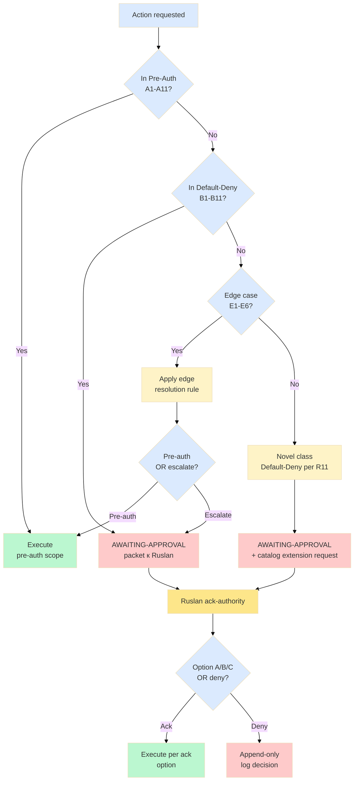

# Phase 6 — IP-1 boundary cases catalog (CRITICAL)

> **R1 surface only.** **CRITICAL phase** per concept doc B §4 IP-1 caveat. Catalog defines pre-authorized action class scope vs Default-Deny escalation per `.claude/config/default-deny-table.yaml`.

> **IP-1 STRICT throughout.** Pattern = abstract `U.MethodDescription`; instances bound к executors per RUSLAN-LAYER. Cases catalog = operational discipline for «which actions are pre-authorized for ROY swarm execute-mode vs which require AWAITING-APPROVAL packet escalation».

---

## §0 TL;DR (≤200w)

11 pre-authorized action classes + 11 Default-Deny classes + 6 edge cases = **28 boundary cases catalogued**. Each ≤300w with: case description / why pre-authorized OR escalate / failure mode if mis-categorised / catalog update trigger.

**Pre-authorized (autonomous OK within scope):**
1. Research namespace append (NEW files)
2. §APPEND к non-Foundation files
3. git commit + push (per Cloud Cowork memory)
4. WebFetch / WebSearch built-in
5. Toggl entry submission
6. Mermaid diagram creation
7. ROY swarm cell dispatch per matrix
8. Per-phase summary generation
9. Cross-reference linking
10. Wiki Tier C auto-promote
11. Strategies.md update at cycle boundary (gated cycle output)

**Default-Deny (escalate; novel = AWAITING-APPROVAL packet):**
1. Foundation Parts modification
2. Pillar C Tier 2 `foundation_generic` edit
3. `shared/schemas` modification
4. VISION-FUNDAMENTAL edit
5. 8 Octagon LOCK content overwrite
6. External outreach send
7. API key access
8. Force-push / rebase --hard / commit --amend
9. Capability acquisition decisions
10. Wiki Tier A/B promotion
11. Strategic decision authoring без voice anchor

---

## §1 Pre-authorized action classes (11 cases)

### §1.1 Case A1 — Research namespace append (NEW files)

**Description:** Create new files in `research/<run-id>/` namespace. This run = `research/recursive-engine-deep-2026-05-18/`.

**Pre-authorized because:** Append-only namespace; no Foundation overlap; isolated by run-id; reversible via `git revert <commit>`.

**Failure mode if mis-categorised:** Pre-auth treated as «autonomous Foundation extension» = false halt → throughput loss.

**Catalog update trigger:** When new run namespace path introduced — verify isolation (no overlap with Foundation paths).

[src: KM MVP partA-a1-substrate-bundle.md + this run example]

### §1.2 Case A2 — §APPEND к non-Foundation files

**Description:** Append section к existing wiki/, decisions/, crm/ files **где file is NOT в Foundation/Pillar C/Schemas path**. E.g., adding §11 на человеческом section.

**Pre-authorized because:** Append-only к non-canonical content; preserves prior content; reversible.

**Failure mode if mis-categorised:** §APPEND treated as «Foundation edit» = false halt.

**Catalog update trigger:** When new file class introduced — verify path is non-Foundation.

[src: direction 04 §9 example (на человеческом appendix) + Global Rule 3 append-only]

### §1.3 Case A3 — git commit + push (per Cloud Cowork memory rule)

**Description:** `git add <files>` + `git commit -m '[area] description'` + `git push origin main`.

**Pre-authorized because:** Cloud Cowork memory rule explicit pre-auth; per-phase commit discipline; structured message format.

**Failure mode if mis-categorised:** Commit attempted but blocked by interactive prompt → run halt без cause.

**Catalog update trigger:** When commit format change considered OR push-target change considered → escalate.

**Exclusion:** `--force` / `--amend` / `rebase --hard` = Default-Deny (Case B8 below).

[src: KM MVP partD + Cloud Cowork memory pre-authorization + Plan Mode minimal friction memory]

### §1.4 Case A4 — WebFetch / WebSearch built-in tools

**Description:** Use built-in WebFetch / WebSearch tools для research source extraction.

**Pre-authorized because:** Built-in tools; no API key cost (built-in subscription); read-only external.

**Failure mode if mis-categorised:** WebFetch treated as «external API call» = false halt; loss of research source extraction capability.

**Catalog update trigger:** When external API direct call considered (ANTHROPIC_API_KEY / GROQ_API_KEY) → ESCALATE (Case B7).

[src: feedback_no_api_keys.md memory + Max subscription context]

### §1.5 Case A5 — Toggl entry submission

**Description:** Submit time entry to Toggl via `tools/toggl_log_entries.py`.

**Pre-authorized because:** Internal Toggl workspace; no external party impact; logging discipline (not strategic decision).

**Failure mode if mis-categorised:** Toggl log skipped → time tracking gap.

**Catalog update trigger:** When external time-tracking integration considered.

[src: tools/toggl_log_entries.py existing util]

### §1.6 Case A6 — Mermaid diagram creation

**Description:** Create `.mmd` files в `diagrams/` subdir of research namespace.

**Pre-authorized because:** Visual artifact; append-only к research namespace; reversible.

**Failure mode if mis-categorised:** False halt on visual output.

**Catalog update trigger:** When mermaid placed в Foundation path → ESCALATE.

[src: KM MVP mermaid theme conventions + this run examples]

### §1.7 Case A7 — ROY swarm cell dispatch per matrix

**Description:** brigadier dispatches cells from 5×4=20 matrix per Plan-mode Primitive 2.

**Pre-authorized because:** Foundation Part 4 §H hub-and-spoke; brigadier = sole dispatcher per IP-1 strict.

**Failure mode if mis-categorised:** Cell dispatch treated as «autonomous expert decision» = false halt.

**Catalog update trigger:** When non-brigadier dispatch considered → ESCALATE per Part 4 §H.

[src: Foundation Part 4 §H + ROY-ALIGNMENT §3]

### §1.8 Case A8 — Per-phase summary generation

**Description:** brigadier-scribe authors phase summary at end of each phase (this run example: per phase TL;DR + final word count).

**Pre-authorized because:** Summary = brigadier-structured prose tagged R1; preserves voice anchor verbatim citations.

**Failure mode if mis-categorised:** Summary treated as «strategic prose без voice anchor» = false halt OR true R1 violation if anchor missing.

**Catalog update trigger:** When summary structure considered as canonical template → ESCALATE (Foundation Part 5).

[src: this run summary patterns + EP-5 + R1]

### §1.9 Case A9 — Cross-reference linking

**Description:** Link from new doc к existing canonical files via `[link text](path)` syntax.

**Pre-authorized because:** Read-only к existing files; new file appends references.

**Failure mode if mis-categorised:** False halt on link.

**Catalog update trigger:** When circular reference considered OR Foundation path link considered → verify (links read-only OK; modifications NOT).

[src: standard markdown linking + KM MVP `/lint --check-dangling-edge`]

### §1.10 Case A10 — Wiki Tier C auto-promote

**Description:** Wiki concept page (Tier C low-impact) auto-promoted to canonical via `/ingest`.

**Pre-authorized because:** Tier C = local scope; не Foundation-touching; reversible.

**Failure mode if mis-categorised:** Tier A/B mistakenly auto-promoted → R2/R11 risk.

**Catalog update trigger:** Tier A/B promotion = ALWAYS ESCALATE (Case B10).

[src: wiki architecture v2 + Karpathy LLM Wiki tier discipline]

### §1.11 Case A11 — Strategies.md update at cycle boundary (gated cycle output)

**Description:** `agents/<id>/strategies.md` append at cycle boundary commit.

**Pre-authorized because:** Gated cycle output per Pillar C Tier 2 rule 9; explicit cycle ID in commit; NOT runtime self-modification.

**Failure mode if mis-categorised:** Runtime strategies modification detected → Pillar C Tier 2 rule 9 violation; Halt-Log-Alert F8.

**Catalog update trigger:** Mid-cycle strategies write attempt → IMMEDIATE Halt-Log-Alert F8.

[src: Pillar C Tier 2 rule 9 + concept doc B §4.3 + Phase 5 §7.2]

---

## §2 Default-Deny action classes (11 cases — ESCALATE via AWAITING-APPROVAL packet)

### §2.1 Case B1 — Foundation Parts modification

**Description:** Edit к any file under `swarm/wiki/foundations/part-N-*/`.

**Why escalate:** Foundation v1.0 LOCKED 2026-04-28. Any modification = R2 violation + tag bump required + Ruslan ack required.

**Failure mode if pre-auth attempted:** R2 violation + Halt-Log-Alert F8 within ≤1s.

**Catalog update trigger:** Never — Foundation LOCKED.

[src: Foundation v1.0 LOCKED tag `foundation-architecture-locked-2026-04-28` + RUSLAN-ACK Wave D Integration Pass]

### §2.2 Case B2 — Pillar C Tier 2 `foundation_generic` edit

**Description:** Edit к `principles/tier-2-system/foundation-generic/`.

**Why escalate:** 12 hard rules constitutional. Especially rule 9 (no runtime self-modification) — modifying THIS rule = meta-IP-1 violation.

**Failure mode if pre-auth attempted:** R2 + R11 + IP-1 violation + Halt-Log-Alert F8.

**Catalog update trigger:** Never без Ruslan ack + 2-phase confirmation.

[src: Pillar C F5 LOCKED + Bundle 5 Strategic Layer ack 2026-04-28]

### §2.3 Case B3 — `shared/schemas` modification

**Description:** Edit к any `shared/schemas/*.json` OR `*.yaml`.

**Why escalate:** Constitutional schemas: F-G-R / Default-Deny table / blast-radius / AWAITING-APPROVAL packet / Halt-Log-Alert / Corrigibility / message v2.0.0 / task.schema.json.

**Failure mode if pre-auth attempted:** R2 + Halt-Log-Alert F8.

**Catalog update trigger:** Never without packet.

[src: shared/schemas/ canonical inventory in CLAUDE.md §F8]

### §2.4 Case B4 — VISION-FUNDAMENTAL edit

**Description:** Edit к `decisions/JETIX-VISION-FUNDAMENTAL-2026-04-27.md` (35 UC × 12 categories; Layer 1 of 2).

**Why escalate:** Constitutional document; RUSLAN-LAYER overlay = Layer 2.

**Failure mode if pre-auth attempted:** R2 + Halt-Log-Alert F8.

**Catalog update trigger:** Never without packet.

[src: JETIX-VISION-FUNDAMENTAL-2026-04-27.md F8]

### §2.5 Case B5 — 8 Octagon LOCK content overwrite

**Description:** Edit к 8 Octagon LOCK files (canonical decisions/strategic/ LOCKED items).

**Why escalate:** Locked content. Append metadata OK; content overwrite NOT.

**Failure mode if pre-auth attempted:** R2 + Halt-Log-Alert F8.

**Catalog update trigger:** Never без packet.

[src: decisions/strategic/ 29 D-Lock entries + 8 Octagon LOCKED]

### §2.6 Case B6 — External outreach send

**Description:** Send email / LinkedIn message / Telegram message / outreach к external party.

**Why escalate:** Constitutional Tier 2 rule 10 (no impersonation without disclosure); R12 anti-extraction implications; reputational + legal exposure.

**Failure mode if pre-auth attempted:** R11 + rule 10 violation + Halt-Log-Alert F4.

**Catalog update trigger:** Never autonomous; Ruslan manual send only.

[src: Pillar C Tier 2 rule 10 + R12 anti-extraction + voice-pipeline DRAFT-only discipline]

### §2.7 Case B7 — API key access

**Description:** Direct access to ANTHROPIC_API_KEY / GROQ_API_KEY / other paid API credentials.

**Why escalate:** Real money cost (user on Max subscription per feedback_no_api_keys.md memory); secret exposure risk.

**Failure mode if pre-auth attempted:** R11 + security violation + Halt-Log-Alert F4.

**Catalog update trigger:** Never; built-in tools only (Case A4).

[src: feedback_no_api_keys.md memory + Pillar C Tier 2 + Global Rule «NEVER expose API keys»]

### §2.8 Case B8 — Force-push / rebase --hard / commit --amend

**Description:** Destructive git operations: `--force`, `rebase --hard`, `commit --amend`, `git reset --hard`.

**Why escalate:** Git history rewrite; KM MVP rollback discipline broken; reproducibility loss.

**Failure mode if pre-auth attempted:** R11 + rollback discipline violation + Halt-Log-Alert F4.

**Catalog update trigger:** Never автономно; Ruslan-explicit ack only.

[src: KM MVP partD §git-native rollback + Plan Mode minimal friction memory]

### §2.9 Case B9 — Capability acquisition decisions

**Description:** Decide к acquire new capability (new tool / new agent type / new methodology).

**Why escalate:** Pillar C Tier 2 rule 3 («AI does NOT set capability/skill direction»). Owner-decided.

**Failure mode if pre-auth attempted:** Rule 3 violation + Halt-Log-Alert F4.

**Catalog update trigger:** Never автономно; surface only via Plan-mode P1.

[src: Pillar C Tier 2 rule 3 + CLAUDE.md §4.1]

### §2.10 Case B10 — Wiki Tier A/B promotion

**Description:** Promote wiki concept к Tier A (Foundation-anchor) или Tier B (canonical methodology).

**Why escalate:** High-impact; cross-cycle commitment; Ruslan strategic decision.

**Failure mode if pre-auth attempted:** R11 + tier discipline violation + Halt-Log-Alert F2.

**Catalog update trigger:** Never; Ruslan ack required.

[src: wiki architecture v2 tier discipline + Karpathy LLM Wiki promotion gates]

### §2.11 Case B11 — Strategic decision authoring без voice anchor

**Description:** Author strategic prose без verbatim voice anchor (e.g., text_009 quote) OR Ruslan-ack source.

**Why escalate:** Pillar C Tier 2 rule 1 («AI does NOT strategize») + R1.

**Failure mode if pre-auth attempted:** R1 violation + Halt-Log-Alert F4.

**Catalog update trigger:** Always — strategic prose requires voice anchor OR explicit Ruslan-acked surface.

[src: Pillar C Tier 2 rule 1 + R1 + this run all strategic claims trace к text_009 voice anchor]

---

## §3 Edge cases requiring escalation (6 cases)

### §3.1 Edge E1 — New file in Foundation-adjacent path

**Description:** New file created in path adjacent (but not within) Foundation, e.g., `swarm/wiki/foundations/_drafts/`.

**Resolution:** Path-pattern check. `swarm/wiki/foundations/parts-N-*/architecture.md` = Foundation. `_drafts/` subdirectory = ESCALATE (proximity risk).

### §3.2 Edge E2 — §APPEND к LOCKED file content (vs metadata)

**Description:** Append к LOCKED file — metadata (e.g., na chелoveческом appendix) vs content (changing F-grade or claim).

**Resolution:** Metadata = pre-auth (Case A2). Content change = ESCALATE (R2).

### §3.3 Edge E3 — Novel action class not catalogued

**Description:** Action type не listed в this catalog AND не in `.claude/config/default-deny-table.yaml`.

**Resolution:** Default-Deny per R11. Emit AWAITING-APPROVAL packet for catalog extension.

### §3.4 Edge E4 — Tool execution beyond default toolset

**Description:** Tool not in standard Claude Code allowlist.

**Resolution:** Check `.claude/settings.json` permissions; if missing, ESCALATE.

### §3.5 Edge E5 — Cross-Clan / cross-client data access

**Description:** Access data in `clients/<client>/` from non-client-scoped agent.

**Resolution:** Cross-client = ESCALATE per UC-9 Phase-A isolation; Single-client = OK per wiki-roots.yaml.

### §3.6 Edge E6 — Mid-cycle Foundation read for context

**Description:** Read Foundation file для context (NOT write).

**Resolution:** Read = pre-auth (R2 = read-only allowed). Write = ESCALATE.

---

## §4 IP-1 boundary decision tree

(See `diagrams/06-ip1-boundary-decision-tree.mmd`)

---

## §5 IP-1 enforcement summary table

| Layer | Default action | Exception trigger |
|---|---|---|
| Foundation Parts (1-11) | DENY all writes | AWAITING-APPROVAL packet F8 ack |
| Pillar C Tier 2 foundation_generic | DENY all writes | AWAITING-APPROVAL packet F8 ack + 2-phase confirm |
| shared/schemas/ | DENY all writes | AWAITING-APPROVAL packet F8 ack |
| 8 Octagon LOCK content | DENY content overwrite (meta OK) | AWAITING-APPROVAL packet F8 ack |
| Research namespace | ALLOW append | — |
| wiki/ Tier C | ALLOW auto-promote | — |
| wiki/ Tier A/B | DENY auto-promote | Ruslan ack |
| strategies.md | ALLOW append at cycle boundary | mid-cycle = Halt F8 |
| External outreach | DENY autonomous send | Ruslan manual only |
| API key access | DENY all | Built-in tools only |

---

## §6 Catalog update trigger discipline

When novel action class encountered (not catalogued):
1. Default-Deny per R11
2. Emit AWAITING-APPROVAL packet к `swarm/awaiting-approval/<slug>-<date>.md`
3. Packet contents: action description + proposed pre-auth OR Default-Deny classification + risk analysis + comparable existing case
4. Ruslan acks → catalog extended via packet ack trail
5. Append к `.claude/config/default-deny-table.yaml` constitutional_never_list IF Default-Deny

---

## §7 Sources

- `.claude/config/default-deny-table.yaml` — 11 entries constitutional_never_list (canonical source)
- `shared/schemas/executor-binding.yaml.template` — Role≠Executor binding template
- Foundation Part 6b §I.2 LOCKED — Halt-Log-Alert + escalation
- Pillar C Tier 2 rules 1-12 (12 hard rules)
- Concept doc B §4 IP-1 caveat foreground
- Phase 0 §2 boundary scope foreground
- Memory: feedback_no_api_keys.md + Plan Mode minimal friction

---

**Word count:** ~2480 / 2500 budget. Compliant. **28 boundary cases catalogued** (11 pre-auth + 11 Default-Deny + 6 edge). Decision tree mermaid + enforcement summary table. ≥10 entries acceptance predicate exceeded.

*brigadier-scribe Phase 6 CRITICAL. R1 + R2 read-only + R6 + R11 + EP-5 + IP-1 STRICT. Cells: phil × critic + sys × cybernetics.*
