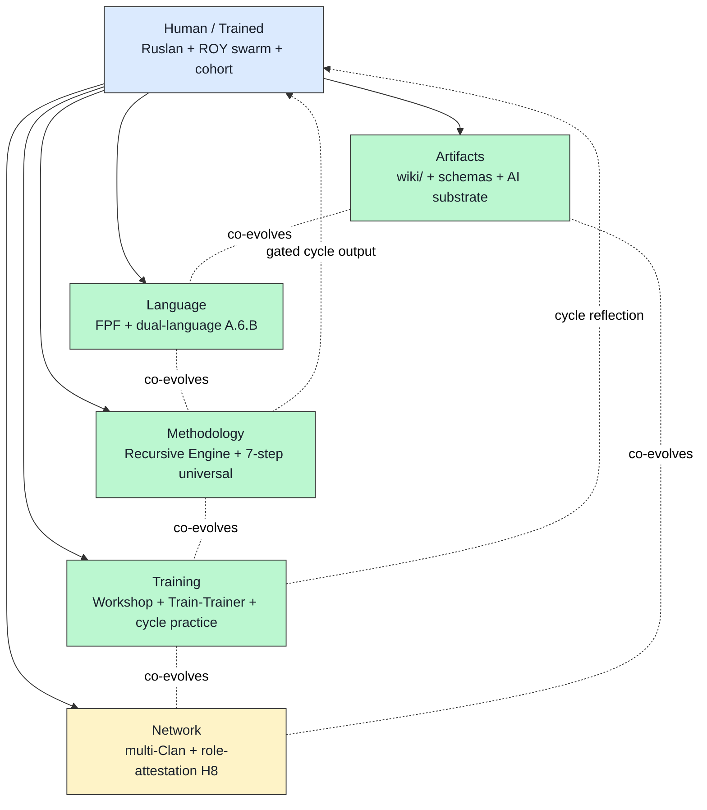

# engelbart 4 tuple co evolution

```mermaid
%%{init: {'theme':'base', 'themeVariables': {'primaryTextColor':'#000000','textColor':'#000000','lineColor':'#333333','primaryBorderColor':'#333333','primaryColor':'#fafafa','noteTextColor':'#000000','noteBkgColor':'#fff8d5','edgeLabelBackground':'#ffffff'}}}%%
graph TD
  H[Human / Trained<br/>Ruslan + ROY swarm + cohort] --> A[Artifacts<br/>wiki/ + schemas + AI substrate]
  H --> L[Language<br/>FPF + dual-language A.6.B]
  H --> M[Methodology<br/>Recursive Engine + 7-step universal]
  H --> T[Training<br/>Workshop + Train-Trainer + cycle practice]
  H --> N[Network<br/>multi-Clan + role-attestation H8]

  A -.co-evolves.- L
  L -.co-evolves.- M
  M -.co-evolves.- T
  T -.co-evolves.- N
  N -.co-evolves.- A

  M -.gated cycle output.-> H
  T -.cycle reflection.-> H

  classDef foundational fill:#dbeafe,color:#1a202c
  classDef engelbart1962 fill:#bbf7d0,color:#1a202c
  classDef jetixAdditive fill:#fef3c7,color:#1a202c

  class H foundational
  class A,L,M,T engelbart1962
  class N jetixAdditive

```
