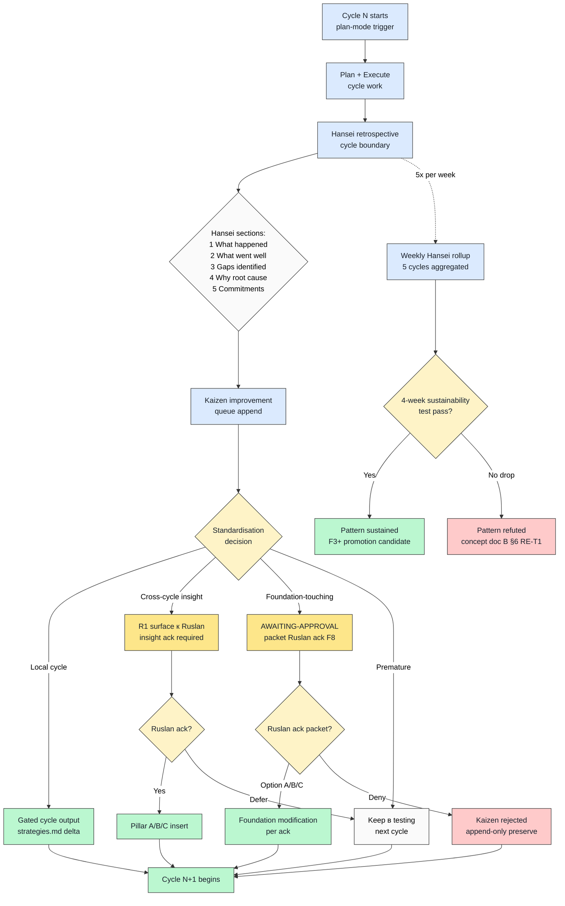

# hansei kaizen weekly ritual

```mermaid
%%{init: {'theme':'base', 'themeVariables': {'primaryTextColor':'#000000','textColor':'#000000','lineColor':'#333333','primaryBorderColor':'#333333','primaryColor':'#fafafa','noteTextColor':'#000000','noteBkgColor':'#fff8d5','edgeLabelBackground':'#ffffff'}}}%%
flowchart TD
  start[Cycle N starts<br/>plan-mode trigger]
  start --> exec[Plan + Execute<br/>cycle work]
  exec --> hansei[Hansei retrospective<br/>cycle boundary]
  hansei --> retroSections{Hansei sections:<br/>1 What happened<br/>2 What went well<br/>3 Gaps identified<br/>4 Why root cause<br/>5 Commitments}
  retroSections --> kaizenQ[Kaizen improvement<br/>queue append]
  kaizenQ --> promote{Standardisation<br/>decision}
  promote -->|Local cycle| gatedCommit[Gated cycle output<br/>strategies.md delta]
  promote -->|Cross-cycle insight| ruslanSurface[R1 surface к Ruslan<br/>insight ack required]
  promote -->|Foundation-touching| packet[AWAITING-APPROVAL<br/>packet Ruslan ack F8]
  promote -->|Premature| keepTesting[Keep в testing<br/>next cycle]
  gatedCommit --> nextCycle[Cycle N+1 begins]
  ruslanSurface --> ackOrDefer{Ruslan ack?}
  ackOrDefer -->|Yes| canonical[Pillar A/B/C insert]
  ackOrDefer -->|Defer| keepTesting
  packet --> ackPacket{Ruslan ack packet?}
  ackPacket -->|Option A/B/C| applied[Foundation modification<br/>per ack]
  ackPacket -->|Deny| rejectedKZ[Kaizen rejected<br/>append-only preserve]
  applied --> nextCycle
  canonical --> nextCycle
  keepTesting --> nextCycle
  rejectedKZ --> nextCycle

  weekRollup[Weekly Hansei rollup<br/>5 cycles aggregated]
  hansei -.5x per week.-> weekRollup
  weekRollup --> sustainCheck{4-week sustainability<br/>test pass?}
  sustainCheck -->|Yes| pattern[Pattern sustained<br/>F3+ promotion candidate]
  sustainCheck -->|No drop| refuted[Pattern refuted<br/>concept doc B §6 RE-T1]

  classDef ritual fill:#dbeafe,color:#1a202c
  classDef decision fill:#fef3c7,color:#1a202c
  classDef ruslan fill:#fde68a,color:#1a202c
  classDef terminal fill:#bbf7d0,color:#1a202c
  classDef refuted fill:#fecaca,color:#1a202c

  class start,exec,hansei,kaizenQ,weekRollup ritual
  class promote,ackOrDefer,ackPacket,sustainCheck decision
  class ruslanSurface,packet ruslan
  class gatedCommit,canonical,applied,nextCycle,pattern terminal
  class refuted,rejectedKZ refuted

```
