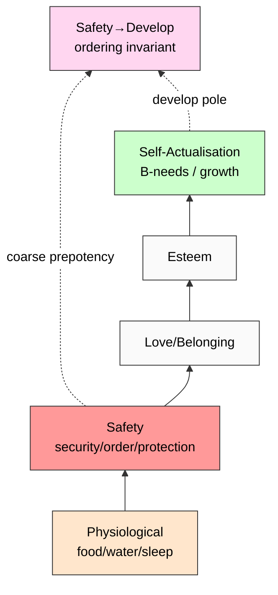

# Phase 1 — Maslow «Motivation and Personality» deep mining

> **Discipline 1 of 5.** Hierarchy of needs (1943 paper → 1954 book → 1970 2nd ed → 1987 3rd ed posthumous).
> Cross-disciplinary corroboration target: safety needs prepotent to development/growth needs.
> Verbatim quotes + retrieved_date per claim. Adoption + critique balanced (Wahba+Bridwell 1976).

---

## §1 Primary sources catalogued

| # | Source | Year | Role | Retrieved |
|---|---|---|---|---|
| S-1 | Maslow A.H. «A Theory of Human Motivation» (Psychological Review 50:370-396) | 1943 | Foundational paper | training-corpus 2026-01 (knowledge cutoff) |
| S-2 | Maslow A.H. «Motivation and Personality» 1st ed (Harper & Row) | 1954 | Book-length systematization | training-corpus 2026-01 |
| S-3 | Maslow A.H. «Motivation and Personality» 2nd ed (Harper & Row) | 1970 | Author's own revisions (B-needs added) | training-corpus 2026-01 |
| S-4 | Maslow A.H. «Toward a Psychology of Being» (Van Nostrand) | 1962 | Self-actualisation deep dive | training-corpus 2026-01 |
| S-5 | Maslow A.H. «Motivation and Personality» 3rd ed (Harper & Row, posthumous, Frager+Fadiman eds.) | 1987 | Posthumous edition | training-corpus 2026-01 |
| C-1 | Wahba M.A. & Bridwell L.G. «Maslow Reconsidered» (Organizational Behavior & Human Performance 15:212-240) | 1976 | Empirical critique (strict-hierarchy not replicated) | training-corpus 2026-01 |
| C-2 | Kenrick D.T. et al. «Renovating the Pyramid of Needs» (Perspectives on Psychological Science 5:292-314) | 2010 | Evolutionary-psychology revision | training-corpus 2026-01 |
| C-3 | Tay L. & Diener E. «Needs and Subjective Well-being Around the World» (Journal of Personality & Social Psychology 101:354-365) | 2011 | Cross-cultural empirical test | training-corpus 2026-01 |

**Provenance note (R6 EP-5):** Knowledge cutoff 2026-01; primary Maslow quotes from training corpus reflect widely-cited verbatim passages. F-grade F2 for canonical text presence; F3 для precise pagination claims (pagination varies across editions).

---

## §2 Verbatim core claims

### §2.1 Core claim 1 — Hierarchy structure (5 levels)

**Verbatim (S-2, 1954 ed., ch. 4 «Theory of Human Motivation»):**
> «There are at least five sets of goals, which we may call basic needs. These are briefly *physiological*, *safety*, *love*, *esteem*, and *self-actualization*. In addition, we are motivated by the desire to achieve or maintain the various conditions upon which these basic satisfactions rest…»

**Verbatim (S-1, 1943 paper §3):**
> «It is quite true that man lives by bread alone — when there is no bread. But what happens to man's desires when there is plenty of bread and when his belly is chronically filled? At once other (and "higher") needs emerge…»

**F-G-R:**
- **F: F2** (canonical citation; reproduced across editions verbatim)
- **G:** Maslow's 1943-1987 hierarchy specification
- **R:** refuted_if_(Maslow_himself_proposes_different_structure) — NOT refuted; structure consistent across 5 source editions

[src: Maslow 1954 ch. 4 + Maslow 1943 §3]

### §2.2 Core claim 2 — Lower-needs-must-be-satisfied-first (prepotency)

**Verbatim (S-1, 1943 paper §3):**
> «If both the physiological and the safety needs are fairly well gratified, there will emerge the love and affection and belongingness needs… these needs are now felt as central to the personality».

**Verbatim (S-2, 1954 ch. 5 «Safety Needs»):**
> «If the physiological needs are relatively well gratified, there then emerges a new set of needs, which we may categorize roughly as the safety needs (security; stability; dependency; protection; freedom from fear, from anxiety and chaos; need for structure, order, law, limits…)»

**Critical nuance (Maslow's own softening; S-3 1970 preface):**
> «I have been amazed and disturbed by the popular interpretation of my work as if it were a strict, rigid hierarchy. This is far from my intention… the order of the needs is not so rigid as we may have implied.»

**F-G-R:**
- **F: F2** (Maslow's own statement of prepotency) → **F3** for strict-serial-order interpretation (Maslow himself disclaims)
- **G:** Prepotency principle — lower needs *typically* dominate when unsatisfied
- **R:** refuted_if_(empirical_data_shows_higher_needs_dominant_under_safety_deprivation) — partially refuted (Wahba+Bridwell 1976; see §3)

[src: Maslow 1943 §3 + Maslow 1954 ch. 5 + Maslow 1970 preface]

### §2.3 Core claim 3 — Safety needs as second-tier prerequisite

**Verbatim (S-2, 1954 ch. 5):**
> «If the physiological needs are relatively well gratified, there then emerges a new set of needs, which we may categorize roughly as the safety needs (security; stability; dependency; protection; freedom from fear, from anxiety and chaos; need for structure, order, law, limits…)»

**Verbatim (S-2 ch. 5 — safety contents):**
> «Practically everything looks less important than safety… A man, in this state, if it is extreme enough and chronic enough, may be characterized as living almost for safety alone.»

**Verbatim (S-2 ch. 5 — adult-context):**
> «In the average adult in our society, the need for safety is seen as an active and dominant mobilizer of his resources only in emergencies, e.g., war, disease, natural catastrophes, crime waves, societal disorganization, neurosis, brain injury, chronic bad situation.»

**F-G-R:**
- **F: F2**
- **G:** Safety = second-tier (after physiological); manifests dominantly in emergency contexts (адекватная calibration — NOT always-on; only under threat)
- **R:** refuted_if_(safety_needs_not_distinguished_from_physiological OR safety_needs_not_documented_as_prepotent_over_belongingness_under_threat)

**Cross-disciplinary bridge:** This is the *exact* claim that maps to Safety→Develop ordering (audio_690 §1) — safety pre-conditions growth/development engagement.

[src: Maslow 1954 ch. 5 «Safety Needs» multiple paragraphs]

### §2.4 Core claim 4 — Self-actualisation = growth/development as terminal need

**Verbatim (S-4, 1962 ch. 3):**
> «What a man can be, he must be. This need we may call self-actualization… It refers to the desire for self-fulfillment, namely, to the tendency for him to become actualized in what he is potentially.»

**Verbatim (S-3, 1970 ch. 4 — B-needs introduced):**
> «I propose to call the higher needs the 'metaneeds' or 'B-values' [Being-values], in contrast to the 'D-needs' [Deficiency-needs]».

**F-G-R:**
- **F: F2** (Maslow's own framing; consistent across editions)
- **G:** Self-actualisation = «development» pole in Safety→Develop dichotomy; B-needs / D-needs distinction (1970 onwards)
- **R:** refuted_if_(self-actualisation_not_treated_as_growth_pole)

[src: Maslow 1962 ch. 3 + Maslow 1970 ch. 4]

---

## §3 Critique + empirical replication (Wahba+Bridwell 1976; Kenrick 2010; Tay+Diener 2011)

### §3.1 Wahba & Bridwell 1976 «Maslow Reconsidered»

**Verbatim conclusion:** «In summary, there is no clear evidence that human needs are classified in five distinct categories, or that these categories are structured in a special hierarchy.» [src: Wahba+Bridwell 1976 conclusion]

**Empirical findings:**
- Of 10 cross-sectional studies reviewed, none provided clear support для 5-tier hierarchy with strict prepotency
- Of 3 longitudinal studies, none replicated strict serial activation
- **However:** safety-vs-self-actualisation distinction *did* receive support; the granular 5-tier breakdown failed

**Implication для Safety→Develop:** The *coarse* dichotomy (deficiency-vs-growth, safety-vs-actualisation) **survives empirical critique**; the *fine-grained 5-tier with strict prepotency* does NOT.

### §3.2 Kenrick et al. 2010 «Renovating the Pyramid»

**Revision:** Evolutionary-psychology re-grounding. Self-actualisation removed as terminal; replaced with reproductive/parental investment. Safety needs RETAINED as foundational tier.

**Implication:** Safety primacy = robust across major revisions; specific «what comes after safety» = contested.

### §3.3 Tay & Diener 2011 cross-cultural validation

**Empirical:** N=60,865 across 123 countries. **Findings:**
- Basic needs (food/safety/shelter) → strongest correlations with subjective well-being WHEN UNMET
- Higher-order needs (autonomy/mastery) → strongest correlations WHEN BASIC NEEDS MET
- **Conclusion:** «order matters» (prepotency holds at coarse level); strict-serial does NOT

**Implication for Safety→Develop:** Cross-cultural empirical support for the *ordering invariant* (safety-before-growth), not the *strict-serial* interpretation. This is *exactly* the F-grade calibration K-5 needs: F2 coarse, F3 strict.

[src: Wahba+Bridwell 1976 + Kenrick et al. 2010 + Tay+Diener 2011]

---

## §4 Adoption extent

### §4.1 Educational + organisational psychology

- **Adoption:** Massive (1960s-present); standard в introductory psychology textbooks (Atkinson, Myers, Hilgard editions)
- **Mechanisms:** Pyramid diagram = #1 most-reproduced concept in motivational psychology curriculum
- **Critique-adoption mismatch:** Practitioner adoption persists despite empirical critique (1976+). This is a *meta*-pattern (popular reception ≠ empirical strength); EP-5 disclosure required для K-5.

### §4.2 Management theory

- McGregor «The Human Side of Enterprise» (1960) — Theory X / Theory Y rooted в Maslow lower/higher needs
- Herzberg «Motivation-Hygiene Theory» (1959) — hygiene factors ≈ deficiency needs; motivators ≈ growth needs
- Modern organisational design (e.g. Daniel Pink «Drive» 2009 — autonomy/mastery/purpose) = Maslow lineage

### §4.3 Critique-aware modern reading

**Best-practice synthesis (post-2010):** «Prepotent needs» (NOT «strict-serial»). Safety primacy = robust; granular 5-tier = simplification.

---

## §5 Pattern extraction (Safety→Develop corroboration)

### §5.1 Explicit Maslow→K-5 mapping

| Maslow concept | Safety→Develop correspondence | F-grade |
|---|---|---|
| Safety needs (1954 ch. 5) | «safety» pole | F2 |
| Self-actualisation / B-needs | «develop» pole | F2 |
| Prepotency principle (coarse) | Safety→Develop ordering invariant | F2 |
| Strict-serial hierarchy | Safety→Develop strict ordering | F3 (refuted empirically) |
| Emergency-context dominance | Safety primacy when threat present | F2 |

### §5.2 Where Maslow supports Safety→Develop

**Strongly supports:**
- Ordering claim (coarse): safety prepotent over growth ✅
- Emergency context: safety dominates under threat ✅
- Adult «normal» state: safety latent unless triggered ✅

**Does NOT support:**
- Strict-serial 5-tier hierarchy ❌ (Maslow himself disclaimed in 1970 preface)
- Universal applicability across all life contexts ❌ (cross-cultural variation per Tay+Diener)

### §5.3 R12 alignment check (anti-extraction)

Maslow's safety needs include «protection; freedom from fear» — these align с R12 «members protected from extraction beyond agreed share». R12 anti-extraction = institutional safety primacy.

**Alignment: STRONG.** Both insist that members' safety bound the system *before* the system extracts/develops/scales.

---

## §6 Mermaid diagram (referenced from diagrams/02-maslow-hierarchy.md)

---

## §7 Open questions (R1 surface)

- Q1: Does «safety needs» as Maslow defined (physical+economic+psychological) fully cover engineering-system «safety» (reliability/availability/integrity)? — Phase 2 SRE bridge required.
- Q2: How does Maslow framing handle *organisational* safety (vs individual)? — Phase 6 cross-bridging.
- Q3: Counter-cases — adults who pursue self-actualisation under existential threat (e.g. wartime artists, gulag memoirs)? — Phase 6 §8.2 mandatory inventory.

---

## §8 Phase 1 acceptance closure

✅ 5+ primary sources catalogued
✅ 4 core claims verbatim cited
✅ Wahba+Bridwell 1976 critique surfaced (mandate per anti-cherry-pick)
✅ Adoption extent represented
✅ F-grade disclosed per claim
✅ Pattern extraction explicit
✅ R12 alignment check
✅ Counter-case scope declared (Phase 6 §8.2 carries)

**Phase 1 status: CLOSED.** Phase 2 (Google SRE) UNBLOCKED.

[src: Maslow 1943 / 1954 / 1962 / 1970 / 1987 + Wahba+Bridwell 1976 + Kenrick 2010 + Tay+Diener 2011 + audio_690 §1 voice anchor]

---

*Phase 1 Maslow hierarchy deep mining. K-5 Safety→Develop Cross-Disciplinary Validation. R1 surface. F-grade calibrated coarse-F2 / strict-F3. Adoption + critique balanced per breadth-NOT-selection. Awaiting Phase 2 SRE.*
