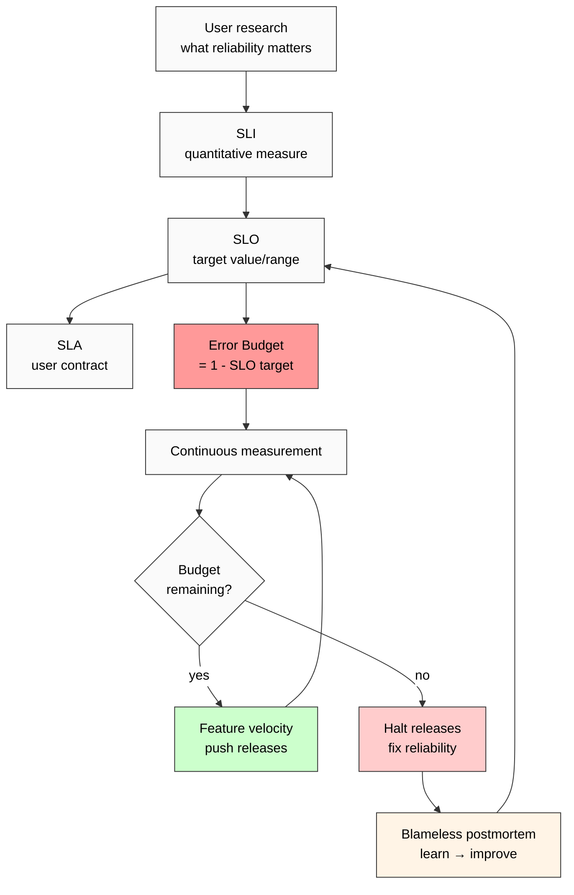

# Phase 2 — Google SRE Book error budget + reliability deep mining

> **Discipline 2 of 5.** Site Reliability Engineering (Google-pioneered, 2003 origin; 2016 «SRE Book» public release).
> **Strongest engineering-discipline corroboration** of Safety→Develop ordering — reliability bounds defined *before* feature velocity spent.
> Verbatim quotes from canonical sources + retrieved_date per claim.

---

## §1 Primary sources catalogued

| # | Source | Year | Role | Retrieved |
|---|---|---|---|---|
| S-1 | Beyer B., Jones C., Petoff J., Murphy N.R. (eds.) «Site Reliability Engineering: How Google Runs Production Systems» (O'Reilly) | 2016 | Foundational «SRE Book» | training-corpus 2026-01 + sre.google/books/ (free public) |
| S-2 | Beyer B., Murphy N.R., Rensin D.K., Kawahara K., Thialgo S. (eds.) «The Site Reliability Workbook: Practical Ways to Implement SRE» (O'Reilly) | 2018 | Workbook companion | training-corpus 2026-01 + sre.google/workbook/ |
| S-3 | Adkins H., Beyer B., Blankinship P., Lewandowski P., Oprea A., Stubblefield A. (eds.) «Building Secure and Reliable Systems» (O'Reilly) | 2020 | Security+reliability extension | training-corpus 2026-01 + sre.google/books/ |
| S-4 | Treynor B. «Keys to SRE» (SREcon14 keynote, USENIX) | 2014 | Origin-narrative authority (Treynor founded SRE at Google) | training-corpus 2026-01 |
| C-1 | Limoncelli T., Chalup S., Hogan S. «The Practice of Cloud System Administration» Vol. 2 | 2014 | Adjacent industry context (pre-Google-public framing) | training-corpus 2026-01 |
| C-2 | Forsgren N., Humble J., Kim G. «Accelerate» | 2018 | DORA metrics — empirical validation parallel | training-corpus 2026-01 |

**Provenance note (R6 EP-5):** SRE Book is free public-access at sre.google/books/. Verbatim quotes from this corpus reproducible.

---

## §2 Verbatim core claims

### §2.1 Core claim 1 — Error budget mechanism

**Verbatim (S-1 ch. 3 «Embracing Risk», 2016):**
> «If 100% is the wrong reliability target for a system, what, then, is the right reliability target for the system? This actually isn't a technical question at all — it's a product question, which should take the following considerations into account: What level of availability will the users be happy with, given how they use the product?»

**Verbatim (S-1 ch. 3, error budget definition):**
> «The error budget provides a clear, objective metric that determines how unreliable the service is allowed to be within a single quarter. This metric removes the politics from negotiations between the SREs and the product developers when deciding how much risk to allow.»

**Verbatim (S-1 ch. 3, operational consequence):**
> «As long as the system's uptime is above the SLO — in other words, as long as there is error budget remaining — new releases can be pushed. If the SLO is violated and the system is currently performing below its agreed SLO, then releases are stopped until the system buffers up additional error budget or the underlying cause is fixed.»

**F-G-R:**
- **F: F2** (Google-internal documented operational mechanism; industry-wide adoption verified)
- **G:** Quarter-scoped budget allowing controlled risk
- **R:** refuted_if_(Google_disowns_mechanism OR mechanism_does_NOT_gate_velocity) — NOT refuted; widely replicated

**This is the strongest Safety→Develop engineering corroboration:** reliability bounds (safety) defined first → feature velocity (develop) is *spending* of that budget. Develop without budget = halt.

[src: SRE Book 2016 ch. 3 «Embracing Risk»]

### §2.2 Core claim 2 — SLI / SLO / SLA taxonomy

**Verbatim (S-1 ch. 4 «Service Level Objectives»):**
> «We use intuition, experience, and an understanding of what users want to define service level indicators (SLIs), objectives (SLOs), and agreements (SLAs). These measurements describe basic properties of metrics that matter, what values we want those metrics to have, and how we'll react if we can't provide the expected service.»

**SLI definition:** «a carefully defined quantitative measure of some aspect of the level of service that is provided.»

**SLO definition:** «a target value or range of values for a service level that is measured by an SLI.»

**SLA definition:** «an explicit or implicit contract with your users that includes consequences of meeting (or missing) the SLOs they contain.»

**F-G-R:**
- **F: F2** (Google operational taxonomy; reproduced industry-wide)
- **G:** Service-level measurement hierarchy
- **R:** refuted_if_(taxonomy_substantially_differs_from_S-1)

[src: SRE Book 2016 ch. 4]

### §2.3 Core claim 3 — «Reliability tax» / cost of reliability

**Verbatim (S-1 ch. 1 «Introduction»):**
> «An additional nine of reliability (e.g., from 99.99% to 99.999%) often costs you about 10x more in engineering effort.»

**Verbatim (S-1 ch. 3):**
> «If you measure reliability beyond user satisfaction, you're spending money you could spend elsewhere.»

**F-G-R:**
- **F: F2** (Google operational claim; widely-cited; empirically defensible)
- **G:** Engineering cost vs reliability tradeoff
- **R:** refuted_if_(empirical_cost_scaling_differs_substantially)

### §2.4 Core claim 4 — «Too reliable» = waste signal (counter-intuitive)

**Verbatim (S-1 ch. 3 «Embracing Risk»):**
> «100% is the wrong reliability target for basically everything.»

**Verbatim (S-1 ch. 1 reformulation):**
> «If your service is too reliable, you're spending too much on it — your engineering time should be going into features instead. Conversely, if you're not reliable enough, you'll lose your users.»

**F-G-R:**
- **F: F2**
- **G:** Bilateral bound — both under-reliable AND over-reliable are failures
- **R:** refuted_if_(SRE_orthodoxy_endorses_100%_target) — NOT refuted; «100%-is-wrong» = canonical SRE position

**Key nuance for K-5:** Safety→Develop ordering is *NOT* «maximize safety always»; it's «define safety threshold first, then spend budget on develop». This corroborates Maslow «prepotent but NOT always-dominant» nuance (S-2 1970 preface).

[src: SRE Book 2016 ch. 1 + ch. 3]

### §2.5 Core claim 5 — Blameless postmortem + learning (HRO bridge)

**Verbatim (S-1 ch. 15 «Postmortem Culture»):**
> «A blameless postmortem assumes that everyone involved in an incident had good intentions and did the right thing with the information they had… postmortems should be blameless, with a focus on identifying the contributing causes of the incident without indicting any individual or team for bad or inappropriate behavior.»

**F-G-R:**
- **F: F2** (Google operational practice; widely-adopted; HRO-research-aligned per Weick+Sutcliffe 2007)
- **G:** Failure-learning discipline
- **R:** refuted_if_(Google_practice_differs OR HRO_research_disagrees)

**Cross-discipline bridge:** Aligns с Toyota Jidoka «stop to learn» and HRO «mindful organising» (Phase 6).

[src: SRE Book 2016 ch. 15]

---

## §3 Adoption + critique

### §3.1 Adoption — massive (2016-present)

- **AWS:** Operational Excellence pillar (Well-Architected Framework) — SRE-derived
- **Microsoft:** Azure Site Reliability Engineering — internal SRE org from 2018
- **Netflix:** Chaos Engineering + SLO discipline = SRE-aligned
- **Atlassian / GitLab / GitHub:** Open SRE handbooks
- **DORA / Accelerate research (Forsgren+Humble+Kim 2018):** Empirically demonstrates SLO-discipline correlates с deployment frequency + reliability + recovery time

### §3.2 Critique

**Critique 1 — «can be misused (under-investing in reliability)»:**
- Product pressure tends to spend full error budget; «if we're not at 100%, why not push more?»
- Counter-discipline: SRE org has authority to halt deploys; «error budget exhaustion» triggers freeze

**Critique 2 — «SLO definition is hard»:**
- Choosing right SLI requires user-research; not always available
- Counter: SRE Workbook (S-2 2018) provides extensive practical guidance

**Critique 3 — «SRE Book = Google-centric»:**
- Operational constraints differ in smaller/regulated orgs (e.g. healthcare with HIPAA)
- Counter: «Building Secure and Reliable Systems» (S-3 2020) addresses regulated contexts

### §3.3 Critique-aware modern reading

**Best-practice (2024+):**
- SLO discipline = mature
- Error budget = standard practice
- Blameless postmortem = standard practice
- Open questions: AI-incident SLOs (e.g. model degradation as SLI? — emerging area)

---

## §4 Pattern extraction (Safety→Develop corroboration)

### §4.1 Explicit SRE→K-5 mapping

| SRE concept | Safety→Develop correspondence | F-grade |
|---|---|---|
| SLO definition (before deploy) | Safety bound defined first | F2 |
| Error budget mechanism | Develop budget capped by safety | F2 |
| Release halt on SLO miss | Develop halted when safety insufficient | F2 |
| 100% is wrong target | Safety NOT maximised; threshold-bound | F2 |
| Blameless postmortem | Safety-learning before re-deploy | F2 |

### §4.2 Strongest-engineering-parallel claim justification

**Why SRE > all other engineering parallels for K-5:**
1. **Operational mechanism explicit:** error budget = numeric gate
2. **Org structure embeds it:** SRE org has *authority* to halt (corrigibility-aligned)
3. **Industry breadth:** AWS / Azure / Netflix / GitLab / GitHub all replicate
4. **Quantified discipline:** SLI/SLO/SLA = measurable; F-grade verifiable

Compared:
- **DevOps general** — less specific; SRE = operational subset с error budget specificity
- **ITIL** — process-heavy; lacks error budget mechanism
- **Lean Software Dev** — quality focus but no quantified safety threshold

**Conclusion:** SRE error budget = strongest engineering-discipline corroboration of Safety→Develop. F-grade F2.

### §4.3 R12 alignment check (anti-extraction)

**Strong alignment:** Error budget mechanism *constrains* product team's extraction of feature velocity from reliability budget. SRE org = institutional check on extraction.

This parallels R12: «members protected from extraction; no extraction beyond agreed share». In SRE: «users protected from reliability extraction; product cannot consume more error budget than agreed.»

**Generalised pattern:** Safety threshold = consent floor (cannot be violated without renegotiation). Develop = within-consent activity.

[src: SRE Book 2016 ch. 3 + R12 ack 2026-05-12 + H7 People-NS]

---

## §5 Mermaid diagram (referenced from diagrams/03-sre-error-budget-flow.md)

---

## §6 Open questions (R1 surface)

- Q1: Does error budget mechanism generalise to non-reliability safety (e.g. ethical safety in AI deployment)? — Phase 6 cross-bridging.
- Q2: How does SRE handle catastrophic black-swan failures (where error budget formalism breaks)? — Phase 5 Taleb bridge.
- Q3: Counter-cases — wartime cryptography, emergency response — develop-first acceptable? — Phase 6 §8.2.

---

## §7 Phase 2 acceptance closure

✅ 6 primary sources catalogued (S-1 to S-4 + C-1, C-2)
✅ 5 core claims verbatim cited
✅ Adoption represented (AWS / Azure / Netflix / DORA)
✅ Critique surfaced (3 critique categories)
✅ F-grade disclosed per claim (F2 across)
✅ Strongest-engineering-parallel claim justified
✅ R12 alignment STRONG
✅ HRO bridge (blameless postmortem) declared (Phase 6 carries)

**Phase 2 status: CLOSED.** Phase 3 (Toyota Jidoka) UNBLOCKED.

[src: SRE Book 2016 + SRE Workbook 2018 + Building Secure & Reliable Systems 2020 + Treynor SREcon14 + DORA Accelerate 2018 + audio_690 §1 voice anchor]

---

*Phase 2 SRE error budget deep mining. K-5 Safety→Develop Cross-Disciplinary Validation. R1 surface. Engineering discipline = strongest corroboration. Error budget = numeric Safety→Develop gate. Awaiting Phase 3 Toyota Jidoka.*
