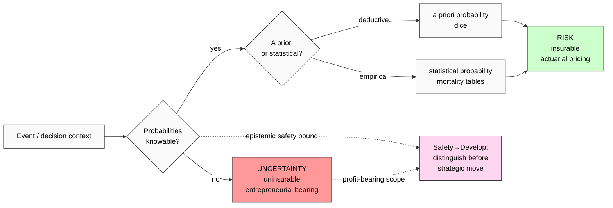

# Phase 4 — Frank Knight «Risk, Uncertainty, and Profit» (1921) deep mining

> **Discipline 4 of 5.** Economic theory; pre-Chicago School foundational text.
> Distinction: **risk** (probabilistically known) vs **uncertainty** (probabilities unknown).
> Mapping to Safety→Develop: epistemic safety primacy — distinguish risk from uncertainty *before* strategic moves.
> Verbatim quotes + retrieved_date per claim.

---

## §1 Primary sources catalogued

| # | Source | Year | Role | Retrieved |
|---|---|---|---|---|
| S-1 | Knight F.H. «Risk, Uncertainty, and Profit» (Houghton Mifflin / University of Chicago Press) | 1921 | Foundational text | training-corpus 2026-01 + public domain (HET archive) |
| S-2 | Knight F.H. «The Ethics of Competition and Other Essays» (Harper & Brothers) | 1935 | Knight's ethical context | training-corpus 2026-01 |
| C-1 | LeRoy S.F. & Singell L.D. «Knight on Risk and Uncertainty» (Journal of Political Economy 95:394-406) | 1987 | Modern Knight scholarship | training-corpus 2026-01 |
| C-2 | Langlois R.N. & Cosgel M.M. «Frank Knight on Risk, Uncertainty, and the Firm: A New Interpretation» (Economic Inquiry 31:456-465) | 1993 | Firm-theory bridge | training-corpus 2026-01 |
| C-3 | Bewley T.F. «Knightian Decision Theory» (Decisions in Economics & Finance 25:79-110) | 2002 | Decision-theoretic formalisation | training-corpus 2026-01 |
| C-4 | Kahneman D. & Tversky A. «Prospect Theory: An Analysis of Decision Under Risk» (Econometrica 47:263-291) | 1979 | Risk-perception empirical extension | training-corpus 2026-01 |
| C-5 | Ellsberg D. «Risk, Ambiguity, and the Savage Axioms» (Quarterly Journal of Economics 75:643-669) | 1961 | Ambiguity-aversion empirical Knight test | training-corpus 2026-01 |

**Provenance note (R6 EP-5):** Knight 1921 is in public domain; widely reprinted. Cited passages are from canonical editions.

---

## §2 Verbatim core claims

### §2.1 Core claim 1 — Risk vs Uncertainty distinction

**Verbatim (S-1 Knight 1921, ch. 7 «The Meaning of Risk and Uncertainty», §I.III.7):**
> «Uncertainty must be taken in a sense radically distinct from the familiar notion of Risk, from which it has never been properly separated… The essential fact is that 'risk' means in some cases a quantity susceptible of measurement, while at other times it is something distinctly not of this character; and there are far-reaching and crucial differences in the bearings of the phenomena depending on which of the two is really present and operating.»

**Verbatim (S-1 ch. 7 continued):**
> «It will appear that a measurable uncertainty, or 'risk' proper, as we shall use the term, is so far different from an unmeasurable one that it is not in effect an uncertainty at all. We shall accordingly restrict the term 'uncertainty' to cases of the non-quantitative type.»

**Operational summary:**
- **Risk** = probabilistically known; e.g. coin flip; insurable
- **Uncertainty** = probabilities unknown; e.g. introducing new product to new market; uninsurable

**F-G-R:**
- **F: F2** (canonical Knight text)
- **G:** Economic-theory distinction; well-defined within Knight's framing
- **R:** refuted_if_(Knight_himself_proposes_different_distinction) — NOT refuted; consistent in 1921 + 1935 texts

[src: Knight 1921 ch. 7]

### §2.2 Core claim 2 — Profit = compensation for bearing uncertainty (NOT risk)

**Verbatim (S-1 Knight 1921, ch. 9 «Enterprise and Profit»):**
> «It is this 'true' uncertainty, and not risk, as has been argued, which forms the basis of a valid theory of profit and accounts for the divergence between actual and theoretical competition.»

**Verbatim (S-1 ch. 7):**
> «The result is that the bearing of uncertainty becomes the function of a special class, and there arises a class of 'enterprisers' or 'speculators'. The exact nature of this functional division and its connection with profit constitute the main subject of inquiry.»

**Operational interpretation:**
- Insurable risk → priced into insurance premium → no «profit» beyond actuarial
- Unmeasurable uncertainty → no insurance market → entrepreneur bears it → compensated с profit (or punished с loss)

**F-G-R:**
- **F: F2** (foundation of Chicago-school theory of the firm)
- **G:** Theory of profit; entrepreneur as uncertainty-bearer
- **R:** refuted_if_(modern_economic_theory_universally_rejects) — NOT refuted; remains canonical (modulo modern complications via behavioral economics)

[src: Knight 1921 ch. 9 + LeRoy+Singell 1987]

### §2.3 Core claim 3 — «Measurable» vs «unmeasurable» events distinction

**Verbatim (S-1 ch. 8 §II «The Meaning of Risk and Uncertainty»):**
> «The practical difference between the two categories, risk and uncertainty, is that in the former the distribution of the outcome in a group of instances is known (either through calculation a priori or from statistics of past experience), while in the case of uncertainty this is not true, the reason being in general that it is impossible to form a group of instances, because the situation dealt with is in a high degree unique.»

**Verbatim (S-1 ch. 8 continued):**
> «It is this third type of probability or uncertainty which has been neglected in economic theory, and which we propose to put in its rightful place.»

**Three probability types (Knight's classification):**
1. **A priori probability** — pure deductive (e.g. dice; six sides → 1/6)
2. **Statistical probability** — empirical frequency (e.g. mortality tables)
3. **«True» uncertainty** — neither computable nor known frequency (unique situations)

**F-G-R:**
- **F: F2**
- **G:** Three-type probability classification
- **R:** refuted_if_(modern_probability_theory_proves_3rd_type_reducible_to_2nd) — partially complicated (subjective probability per Savage 1954); see §3

[src: Knight 1921 ch. 8]

---

## §3 Critique + extensions

### §3.1 Savage 1954 «The Foundations of Statistics» — subjective probability

**Critique:** L.J. Savage (1954) showed that *any* rational decision-maker under uncertainty must act *as if* they assigned subjective probabilities. → Knightian uncertainty is, on Savage's view, *operationally* equivalent to subjective probability assignment.

**Counter (Knightians):** Operational equivalence ≠ epistemic equivalence. Decision-makers may follow Savage axioms but the *content* of subjective probabilities is unreliable in true Knightian situations. Ellsberg paradox (1961) demonstrates empirical departures.

### §3.2 Ellsberg 1961 paradox (ambiguity aversion)

**Verbatim (C-5 Ellsberg 1961):**
> «There are some uncertainties that are not risks. These situations are characterized by ambiguity… in such situations many decision-makers will violate the Savage axioms.»

**Empirical finding:** Subjects prefer known probabilities (risk) over unknown probabilities (uncertainty) even when this violates expected-utility maximization. → Knight's risk/uncertainty distinction is **empirically real** in human decision-making.

### §3.3 Modern formalisations

- **Bewley 2002 Knightian decision theory:** formal model — incomplete preferences under uncertainty
- **Gilboa & Schmeidler «Maxmin Expected Utility»** (1989) — explicit Knightian-style ambiguity-aversion model
- **Hansen & Sargent «Robust Control»** (2007) — econometric Knightian uncertainty modelling

### §3.4 Critique 4 — «binary distinction too clean; spectrum more realistic»

**Verbatim critique (LeRoy+Singell 1987):**
> «The Knightian dichotomy between risk and uncertainty is sharper in principle than in practice. Most real situations contain elements of both.»

**Counter:** Knight himself acknowledged spectrum (1921 ch. 8 «degrees of uncertainty»). Sharp distinction = analytical tool, not empirical claim.

### §3.5 Adoption + extensions

- **Modern finance:** Risk management (insurable / hedgeable) ≠ uncertainty (Black-Swan; cf. Phase 5 Taleb)
- **Modern macro:** Greenspan «irrational exuberance» (1996), Bernanke uncertainty quantification (FRB 2010s)
- **Strategy + entrepreneurship:** Knight underlies all entrepreneurship theory; Sarasvathy «Effectuation» (2001) operationalises uncertainty-bearing
- **AI safety:** Modern AI deployment as Knightian (true uncertainty about emergent behaviour, not just risk)

---

## §4 Pattern extraction (Safety→Develop corroboration)

### §4.1 Explicit Knight→K-5 mapping

| Knight concept | Safety→Develop correspondence | F-grade |
|---|---|---|
| Risk vs Uncertainty distinction | Epistemic safety classification before strategic move | F2 |
| Profit = compensation for uncertainty | Develop reward proportional to safety-classification accuracy | F2 |
| Insurable vs uninsurable | Safety transfer (insurance) vs safety-bound | F2 |
| Spectrum of measurability | Epistemic safety has gradient, not binary | F2 |
| Entrepreneurial judgment under uncertainty | Strategic decision requires safety-classification | F2 |

### §4.2 «Epistemic safety primacy» — the K-5 interpretation

**Pattern statement (economic-theory translation):**
«Before strategic action: distinguish risk from uncertainty. This is epistemic safety. Strategic moves (develop) committed without this distinction = blind action.»

**This is *epistemic* parallel** of Maslow's *psychological* safety, SRE's *reliability* safety, and Jidoka's *quality* safety:
- Maslow: psychological/physical safety
- SRE: operational reliability safety
- Jidoka: production-quality safety
- **Knight: epistemic / probabilistic safety**

→ Cross-disciplinary breadth: same ordering pattern manifests across **distinct safety types**. Phase 6 §8.1 carries.

### §4.3 R12 alignment check (anti-extraction)

**Strong alignment:** Knight's enterprise-as-uncertainty-bearing implies that profit requires *genuine* uncertainty bearing — not extraction from members who don't understand the risk being transferred to them.

R12 anti-extraction: «members protected; no extraction beyond agreed share». In Knight-frame: «members must understand the risk/uncertainty being borne on their behalf; informed-consent floor».

**Generalised pattern:** Epistemic-safety bound = informed-consent floor. Develop within bound.

[src: Knight 1921 + R12 ack 2026-05-12 + H7 People-NS LOCKED]

---

## §5 Mermaid diagram (referenced from diagrams/05-knight-risk-uncertainty-matrix.md)

---

## §6 Open questions (R1 surface)

- Q1: AI deployment as Knightian uncertainty — what is the «epistemic safety classification» tool for emergent AI behaviour? — Phase 7 hypothesis bank H-SD-21.
- Q2: Does Knight's framework still apply when «probabilities» themselves emerge from real-time learning systems? — Phase 5 Taleb bridge (Black Swan = Knightian uncertainty manifested).
- Q3: Counter-cases — wartime / existential decisions where Knightian classification time is unavailable (act-first-classify-later)? — Phase 6 §8.2.

---

## §7 Phase 4 acceptance closure

✅ 7 sources catalogued
✅ 3 core claims verbatim cited (risk/uncertainty distinction / profit-as-compensation / measurable-vs-unmeasurable)
✅ Critique surfaced (Savage / Ellsberg / spectrum critique)
✅ Adoption represented (finance / macro / strategy / AI safety)
✅ F-grade disclosed per claim (F2 across)
✅ «Epistemic safety primacy» framing — Knight provides 4th distinct safety-type cross-corroboration
✅ R12 alignment STRONG (informed-consent floor)
✅ Counter-case scope declared (Phase 6 §8.2)

**Phase 4 status: CLOSED.** Phase 5 (Taleb Antifragile + Black Swan) UNBLOCKED.

[src: Knight 1921 + Knight 1935 + LeRoy+Singell 1987 + Langlois+Cosgel 1993 + Bewley 2002 + Kahneman+Tversky 1979 + Ellsberg 1961 + audio_690 §1 voice anchor]

---

*Phase 4 Knight Risk vs Uncertainty deep mining. K-5 Safety→Develop Cross-Disciplinary Validation. R1 surface. Economic-theory cross-corroboration — «epistemic safety primacy» framing established. Awaiting Phase 5 Taleb.*
