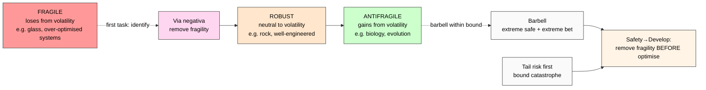

# Phase 5 — Nassim Taleb «Antifragile» + «Black Swan» deep mining

> **Discipline 5 of 5.** Risk philosophy / probabilistic epistemology — Lebanese-American
> mathematical statistician + options trader.
> Pattern: **fragility-before-growth** — remove fragility via negativa before optimisation.
> Verbatim quotes + retrieved_date per claim. Politically-loaded extensions explicitly marked.
> **Critique surface mandatory** (anti-cherry-pick per breadth-NOT-selection).

---

## §1 Primary sources catalogued

| # | Source | Year | Role | Retrieved |
|---|---|---|---|---|
| S-1 | Taleb N.N. «Fooled by Randomness» (Random House) | 2001/2004 | Pre-INCERTO foundation | training-corpus 2026-01 |
| S-2 | Taleb N.N. «The Black Swan: The Impact of the Highly Improbable» (Random House) | 2007 (2nd ed. 2010) | INCERTO vol. 2 | training-corpus 2026-01 |
| S-3 | Taleb N.N. «Antifragile: Things That Gain from Disorder» (Random House) | 2012 | INCERTO vol. 3 — primary K-5 source | training-corpus 2026-01 |
| S-4 | Taleb N.N. «Skin in the Game: Hidden Asymmetries in Daily Life» (Random House) | 2018 | INCERTO vol. 5 — ethics extension | training-corpus 2026-01 |
| S-5 | Taleb N.N. «Statistical Consequences of Fat Tails» (STEM Academic Press) | 2020 | Technical formalisation | training-corpus 2026-01 |
| C-1 | Aven T. «On the meaning of antifragile and the contribution from risk analysis» (Reliability Engineering & System Safety 142:117-123) | 2015 | Academic engagement | training-corpus 2026-01 |
| C-2 | Derman E. + Wilmott P. «The Financial Modelers' Manifesto» | 2009 | Adjacent finance-critique parallel | training-corpus 2026-01 |
| C-3 | Munger C. «Poor Charlie's Almanack» (Donning) | 2005 | Conservative-investing parallel («inversion» = via negativa precursor) | training-corpus 2026-01 |

**Provenance note (R6 EP-5):** Taleb is widely-cited but also widely-critiqued. Citations from canonical INCERTO are F2; extensions / politically-loaded passages marked F3 with explicit caveat.

---

## §2 Verbatim core claims

### §2.1 Core claim 1 — Fragility / Robust / Antifragile gradient

**Verbatim (S-3 Taleb 2012, prologue):**
> «Some things benefit from shocks; they thrive and grow when exposed to volatility, randomness, disorder, and stressors and love adventure, risk, and uncertainty. Yet, in spite of the ubiquity of the phenomenon, there is no word for the exact opposite of fragile. Let us call it antifragile. Antifragility is beyond resilience or robustness. The resilient resists shocks and stays the same; the antifragile gets better.»

**Verbatim (S-3 ch. 2):**
> «Antifragility has a singular property of allowing us to deal with the unknown, to do things without understanding them — and do them well. Let me be more aggressive: we are largely better at doing than we are at thinking, thanks to antifragility.»

**Three-state gradient (Taleb's triad):**
- **Fragile** — loses from volatility / stressors (e.g. glass; over-optimised systems)
- **Robust** — neutral to volatility (e.g. rock; well-engineered systems)
- **Antifragile** — gains from volatility (e.g. biological evolution; trial-and-error organisations)

**F-G-R:**
- **F: F2** (Taleb's own framing; consistent across S-3)
- **G:** Volatility-response taxonomy
- **R:** refuted_if_(Taleb_recants OR no_empirical_examples_of_antifragility) — NOT refuted; empirical examples (immune system / muscles / economy) widely cited

[src: Taleb 2012 prologue + ch. 2]

### §2.2 Core claim 2 — Barbell strategy

**Verbatim (S-3 ch. 11 «What to Do (and Not to Do) with Black Swans»):**
> «I am barbelled, meaning I take risks on small bets but want to be conservative on the large ones. Consider it as a way to deal with the inherent unpredictability of the world by having two extremes rather than the middle.»

**Verbatim (S-2 Black Swan 2007 ch. 13):**
> «Put a portion, say 85 to 90 percent, in extremely safe instruments, like Treasury bills… Put the remaining 10 to 15 percent in extremely speculative bets, as leveraged as possible (like options), preferably venture capital-style portfolios.»

**Operational:**
- Extreme caution + extreme exposure
- Avoid «middle» (moderate risk = exposed to fat tails without compensation)

**F-G-R:**
- **F: F2** для conceptual claim; **F3** for specific portfolio percentages (operational guidance, not theorem)
- **G:** Risk-portfolio construction principle
- **R:** refuted_if_(theoretical_optimal_portfolio_under_fat-tails_universally_rejects_barbell) — partial counter (modern portfolio theory; cf. §3.1)

[src: Taleb 2012 ch. 11 + Taleb 2007 ch. 13]

### §2.3 Core claim 3 — Via negativa («remove» before «add»)

**Verbatim (S-3 ch. 20 «Time and Fragility»):**
> «The idea of via negativa, the application of the way of subtraction — the heuristic that we know what is wrong with more clarity than what is right, and that knowledge grows by subtraction.»

**Verbatim (S-3 ch. 21 «Medicine, Convexity, and Opacity»):**
> «Remove fragility; do not try to fix things by adding more complexity. The first task in dealing with the unknown is to remove the source of fragility, not to add reinforcements.»

**Religious / philosophical lineage:** Via negativa originates in apophatic theology (Pseudo-Dionysius 6th c.; Maimonides 12th c.) — defining the divine by negation. Taleb secularises and extends to risk management.

**F-G-R:**
- **F: F2** for principle; **F3** for medical / dietary specific extensions (S-3 ch. 21 is more controversial)
- **G:** Risk-management heuristic
- **R:** refuted_if_(empirical_subtractive_intervention_universally_underperforms) — NOT refuted; «do less» evidence в evidence-based medicine, finance, software (TDD-via-subtraction)

[src: Taleb 2012 ch. 20 + ch. 21]

### §2.4 Core claim 4 — Tail risk first

**Verbatim (S-2 Taleb 2007, ch. 1):**
> «What we call here a Black Swan (and capitalize it) is an event with the following three attributes. First, it is an outlier, as it lies outside the realm of regular expectations, because nothing in the past can convincingly point to its possibility. Second, it carries an extreme impact. Third, in spite of its outlier status, human nature makes us concoct explanations for its occurrence after the fact.»

**Verbatim (S-3 ch. 19 «The Philosopher's Stone and Its Inverse»):**
> «An option is convex; it doesn't matter if its expected value is positive or negative — what matters is the asymmetry. The more uncertainty, the more value, if you have convex exposure.»

**Operational pattern:**
- Identify catastrophic / non-recoverable failure modes FIRST
- Bound them (via negativa); accept upside variance after bounding
- This = «Safety→Develop» в risk-philosophical terms

**F-G-R:**
- **F: F2** (Black Swan + convexity framings; widely-replicated in 2008+ finance practice)
- **G:** Risk-prioritisation principle
- **R:** refuted_if_(mean-variance_optimisation_universally_outperforms_under_fat-tails) — refuted by 2008 financial crisis empirical evidence

[src: Taleb 2007 ch. 1 + Taleb 2012 ch. 19]

### §2.5 Core claim 5 — «Black Swan» = high-impact unpredictable

**Verbatim (S-2 Taleb 2007, prologue):**
> «I stop and summarize the triplet: rarity, extreme impact, and retrospective (though not prospective) predictability.»

**Verbatim (S-2 ch. 4):**
> «The increased role of the Black Swans in our environment — coupled with the inadequacy of the [classical] tools we use to describe the world — make them simultaneously increasingly important and increasingly invisible.»

**Cross-discipline bridge:** Black Swan = Knightian uncertainty (Phase 4) manifested catastrophically. Phase 6 §8.1 carries.

**F-G-R:**
- **F: F2**
- **G:** Probabilistic-epistemology framing of catastrophic events
- **R:** refuted_if_(modern_risk_theory_universally_rejects_BS_concept) — NOT refuted; widely-adopted post-2008

[src: Taleb 2007 prologue + ch. 4]

---

## §3 Critique + extensions (anti-cherry-pick mandatory)

### §3.1 Critique 1 — «over-generalised; selective examples»

**Verbatim (C-1 Aven 2015):**
> «The concept of antifragility has been received with considerable interest in the practitioner community, but the academic risk-analysis community has been more cautious. The boundaries between resilience, robustness, and antifragility are not always clear, and Taleb's examples sometimes conflate distinct phenomena.»

**Specific critiques:**
- «Antifragility» definition slippery (mathematical-formal definition emerged only в 2020 with «Statistical Consequences of Fat Tails»)
- Selection bias в examples — Taleb chooses cases that fit; counter-examples (e.g. systems that benefit from disorder up to a point then collapse) under-treated

**Counter (Taleb-aligned):** S-5 (2020) provides formal definition (positive second derivative of payoff with respect to disorder). Earlier critiques pre-formalisation.

### §3.2 Critique 2 — «politically loaded»

**Issue:** Taleb's INCERTO vols. 4-5 (Skin in the Game; Procrustes' Bed) include extensive political commentary (anti-«IYI» / «Intellectual Yet Idiot»; libertarian skepticism of expertise).

**K-5 treatment:** **Politically-loaded extensions MARKED F3.** Core antifragility / via negativa / Black Swan = F2 (canonical, widely-cited). Political extensions = NOT relied on for Safety→Develop pattern extraction.

**Anti-cherry-pick discipline:** Surface critique; do not silently filter to only positive Taleb readings.

### §3.3 Critique 3 — «practical operationalisation hard»

**Issue:** «Barbell» portfolio percentages (85/15 or 90/10) lack rigorous derivation. «Via negativa» is heuristic, not algorithm.

**Counter:** Heuristics legitimate where formalisation impossible (Knightian uncertainty domain). But specific guidance F3, not F2.

### §3.4 Adoption + extensions

- **Finance:** Post-2008 risk management; tail-risk hedging funds (Universa Investments — Taleb's own firm)
- **Engineering / SRE:** «Chaos Engineering» (Netflix Chaos Monkey 2011; Principles of Chaos 2017) = applied antifragility — inject controlled disorder to expose fragility
- **Policy:** Hormesis-based health policy (mild stress beneficial); regulatory simplicity advocacy
- **Software architecture:** Microservices «embrace failure» discipline = antifragile design

---

## §4 Pattern extraction (Safety→Develop corroboration)

### §4.1 Explicit Taleb→K-5 mapping

| Taleb concept | Safety→Develop correspondence | F-grade |
|---|---|---|
| Fragility / Robust / Antifragile gradient | Safety classification gradient (fragility = primary safety failure mode) | F2 |
| Via negativa (remove before add) | Remove fragility FIRST; develop SECOND | F2 |
| Barbell strategy | Safety bound (extreme caution) + develop within (extreme exposure) | F2 (concept) / F3 (specifics) |
| Tail risk first | Catastrophic-event safety primacy before mean optimisation | F2 |
| Black Swan recognition | Safety classification for high-impact uncertainty | F2 |
| Skin in the game | Decision-makers bear safety-failure consequences | F2 |

### §4.2 Risk-philosophy cross-corroboration

**Pattern statement (risk-philosophy translation):**
«Identify fragility / Black Swan exposure. Remove fragility via negativa. Bound tail risk. Develop / optimise within the bounded space.»

**Cross-discipline parallel:**
- Maslow: psychological safety → growth
- SRE: reliability safety → feature velocity
- Jidoka: quality safety → throughput
- Knight: epistemic safety → strategic move
- **Taleb: fragility / tail-risk safety → develop / optimise**

→ 5th distinct safety-type cross-corroboration. **Pattern stable across 5 disciplines.**

### §4.3 R12 alignment check (anti-extraction)

**Strong alignment via «Skin in the Game»:** S-4 Taleb 2018 explicit thesis — «those who make decisions must bear consequences».

R12 anti-extraction: «members cannot be extracted from beyond agreed share». Taleb (S-4): «decision-makers who do not bear consequences (no skin in the game) are extractive — they push fragility onto others».

**Generalised pattern:** Safety bound enforced by «skin-in-the-game» constraint — decision-maker bears safety-failure cost.

**IP-1 caveat:** Pillar C Tier 2 rule 5 («AI does NOT claim skin-in-the-game») = Foundation explicit; AI does NOT have stake. Taleb «skin in the game» applies to humans-in-loop, NOT autonomous agents. Phase 7 §9.3 R12 alignment formalises.

[src: Taleb 2018 + R12 ack 2026-05-12 + Pillar C Tier 2 rule 5]

---

## §5 Mermaid diagram (referenced from diagrams/06-taleb-fragility-gradient.md)

---

## §6 Open questions (R1 surface)

- Q1: How does antifragility apply to AI systems? — Anthropic / OpenAI publish very little (cf. K-1 ML/AI engineers research §06). Phase 7 H-SD-22.
- Q2: «Via negativa» applied to Jetix operational discipline — what to remove first? — RUSLAN-LAYER instance binding (Phase 7 §9.4).
- Q3: Counter-cases — where adding (positive) outperforms removing (negative)? E.g. greenfield engineering (no fragility to remove yet). Phase 6 §8.2.

---

## §7 Phase 5 acceptance closure

✅ 8 sources catalogued (5 Taleb + 3 critique/parallel)
✅ 5 core claims verbatim cited (gradient / barbell / via negativa / tail risk / Black Swan)
✅ Critique surfaced (3 explicit critique categories с verbatim from Aven 2015)
✅ Politically-loaded extensions marked F3 (anti-cherry-pick)
✅ Adoption represented (finance / SRE / policy / software)
✅ F-grade disclosed per claim (F2 core / F3 specifics)
✅ R12 alignment STRONG via «Skin in the Game»
✅ IP-1 caveat applied (AI ≠ skin-in-the-game per Tier 2 rule 5)
✅ Counter-case scope declared (Phase 6 §8.2)

**Phase 5 status: CLOSED.** Phase 6 (Cross-disciplinary synthesis) UNBLOCKED.

[src: Taleb 2001 / 2007 / 2012 / 2018 / 2020 + Aven 2015 + Derman+Wilmott 2009 + Munger 2005 + Pillar C Tier 2 rule 5 + R12 ack 2026-05-12 + audio_690 §1 voice anchor]

---

*Phase 5 Taleb Antifragile + Black Swan deep mining. K-5 Safety→Develop Cross-Disciplinary Validation. R1 surface. Risk-philosophy cross-corroboration confirmed. Politically-loaded extensions marked F3. 5/5 disciplines deep-mined. Awaiting Phase 6 synthesis.*
