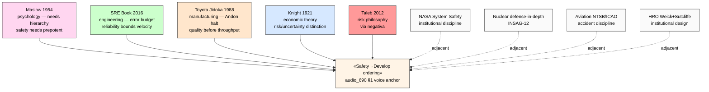

# Diagram 01 — 5 disciplines corroborate Safety→Develop ordering

```mermaid
%%{init: {'theme':'base', 'themeVariables': {'primaryTextColor':'#000000','textColor':'#000000','lineColor':'#333333','primaryBorderColor':'#333333','primaryColor':'#fafafa','noteTextColor':'#000000','noteBkgColor':'#fff8d5','edgeLabelBackground':'#ffffff'}}}%%
graph TB
    SD[«Safety→Develop ordering»<br/>audio_690 §1 voice anchor]
    M[Maslow 1954<br/>psychology — needs hierarchy<br/>safety needs prepotent]
    SRE[SRE Book 2016<br/>engineering — error budget<br/>reliability bounds velocity]
    TJ[Toyota Jidoka 1988<br/>manufacturing — Andon halt<br/>quality before throughput]
    K[Knight 1921<br/>economic theory<br/>risk/uncertainty distinction]
    T[Taleb 2012<br/>risk philosophy<br/>via negativa]
    NASA[NASA System Safety<br/>institutional discipline]
    NUC[Nuclear defense-in-depth<br/>INSAG-12]
    AV[Aviation NTSB/ICAO<br/>accident discipline]
    HRO[HRO Weick+Sutcliffe<br/>institutional design]
    M --> SD
    SRE --> SD
    TJ --> SD
    K --> SD
    T --> SD
    NASA -.adjacent.-> SD
    NUC -.adjacent.-> SD
    AV -.adjacent.-> SD
    HRO -.adjacent.-> SD
    style SD fill:#fff4e6
    style M fill:#ffd6f0
    style SRE fill:#ccffcc
    style TJ fill:#ffe6cc
    style K fill:#d6e8ff
    style T fill:#ff9999
```

[src: Phases 1-5 + Phase 6 §3 adjacent disciplines]
