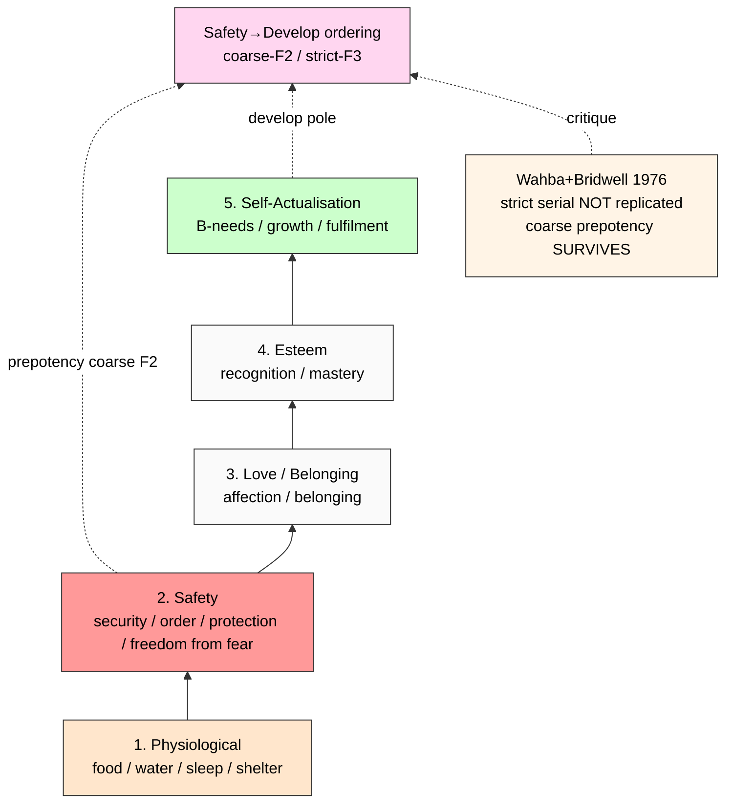

# Diagram 02 — Maslow hierarchy of needs (safety as second tier)

```mermaid
%%{init: {'theme':'base', 'themeVariables': {'primaryTextColor':'#000000','textColor':'#000000','lineColor':'#333333','primaryBorderColor':'#333333','primaryColor':'#fafafa','noteTextColor':'#000000','noteBkgColor':'#fff8d5','edgeLabelBackground':'#ffffff'}}}%%
graph BT
    P[1. Physiological<br/>food / water / sleep / shelter]
    S[2. Safety<br/>security / order / protection / freedom from fear]
    L[3. Love / Belonging<br/>affection / belonging]
    E[4. Esteem<br/>recognition / mastery]
    A[5. Self-Actualisation<br/>B-needs / growth / fulfilment]
    P --> S
    S --> L
    L --> E
    E --> A
    SD[Safety→Develop ordering<br/>coarse-F2 / strict-F3]
    S -.prepotency coarse F2.-> SD
    A -.develop pole.-> SD
    EMP[Wahba+Bridwell 1976<br/>strict serial NOT replicated<br/>coarse prepotency SURVIVES]
    EMP -.critique.-> SD
    style P fill:#ffe6cc
    style S fill:#ff9999
    style A fill:#ccffcc
    style SD fill:#ffd6f0
    style EMP fill:#fff4e6
```

[src: Maslow 1943/1954/1970/1987 + Wahba+Bridwell 1976 + Tay+Diener 2011]
