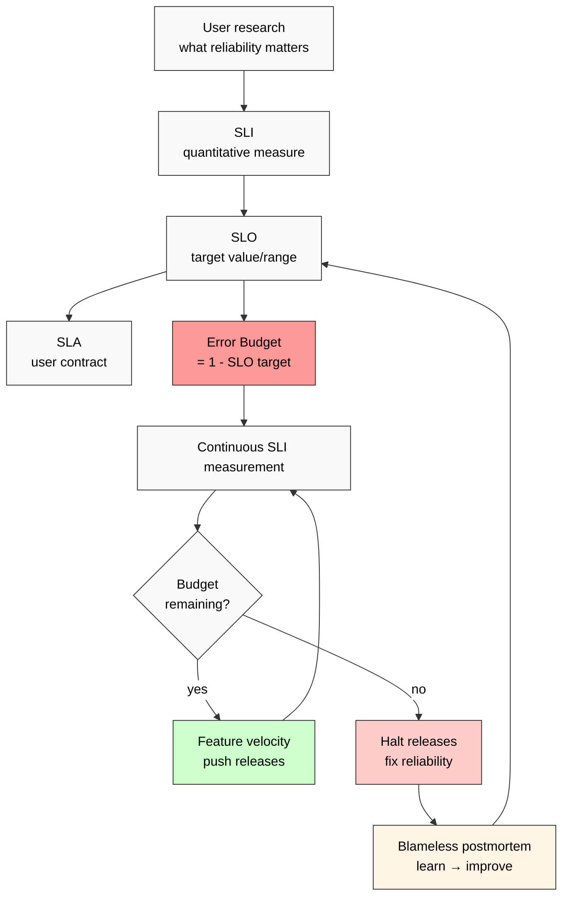

# Diagram 03 — SRE error budget Safety→Develop gate

```mermaid
%%{init: {'theme':'base', 'themeVariables': {'primaryTextColor':'#000000','textColor':'#000000','lineColor':'#333333','primaryBorderColor':'#333333','primaryColor':'#fafafa','noteTextColor':'#000000','noteBkgColor':'#fff8d5','edgeLabelBackground':'#ffffff'}}}%%
graph TB
    U[User research<br/>what reliability matters]
    SLI[SLI<br/>quantitative measure]
    SLO[SLO<br/>target value/range]
    SLA[SLA<br/>user contract]
    EB[Error Budget<br/>= 1 - SLO target]
    MEAS[Continuous SLI measurement]
    DEC{Budget<br/>remaining?}
    DEV[Feature velocity<br/>push releases]
    HALT[Halt releases<br/>fix reliability]
    PM[Blameless postmortem<br/>learn → improve]
    U --> SLI
    SLI --> SLO
    SLO --> SLA
    SLO --> EB
    EB --> MEAS
    MEAS --> DEC
    DEC -->|yes| DEV
    DEC -->|no| HALT
    HALT --> PM
    PM --> SLO
    DEV --> MEAS
    style EB fill:#ff9999
    style HALT fill:#ffcccc
    style DEV fill:#ccffcc
    style PM fill:#fff4e6
```

[src: SRE Book 2016 ch. 3 «Embracing Risk» + ch. 15 «Postmortem Culture»]
