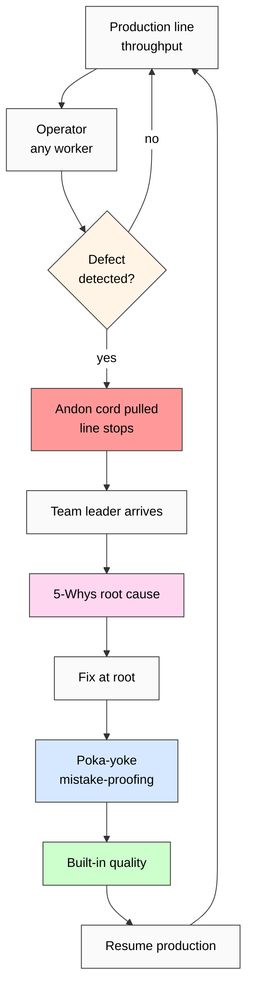

# Diagram 04 — Toyota Jidoka Andon halt + 5-Whys root cause

```mermaid
%%{init: {'theme':'base', 'themeVariables': {'primaryTextColor':'#000000','textColor':'#000000','lineColor':'#333333','primaryBorderColor':'#333333','primaryColor':'#fafafa','noteTextColor':'#000000','noteBkgColor':'#fff8d5','edgeLabelBackground':'#ffffff'}}}%%
graph TB
    PROD[Production line<br/>throughput]
    OP[Operator<br/>any worker]
    DEF{Defect<br/>detected?}
    AND[Andon cord pulled<br/>line stops]
    TEAM[Team leader arrives]
    F5W[5-Whys root cause]
    FIX[Fix at root]
    POKA[Poka-yoke<br/>mistake-proofing]
    QC[Built-in quality]
    RESUME[Resume production]
    PROD --> OP
    OP --> DEF
    DEF -->|yes| AND
    DEF -->|no| PROD
    AND --> TEAM
    TEAM --> F5W
    F5W --> FIX
    FIX --> POKA
    POKA --> QC
    QC --> RESUME
    RESUME --> PROD
    style AND fill:#ff9999
    style DEF fill:#fff4e6
    style QC fill:#ccffcc
    style F5W fill:#ffd6f0
    style POKA fill:#d6e8ff
```

[src: Ohno 1988 + Liker 2003 + Shingo 1989 poka-yoke]
