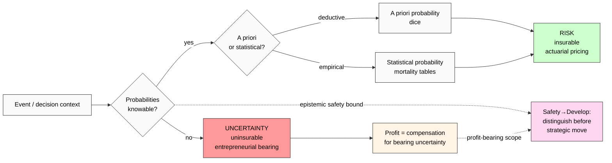

# Diagram 05 — Knight Risk / Uncertainty epistemic safety classification

```mermaid
%%{init: {'theme':'base', 'themeVariables': {'primaryTextColor':'#000000','textColor':'#000000','lineColor':'#333333','primaryBorderColor':'#333333','primaryColor':'#fafafa','noteTextColor':'#000000','noteBkgColor':'#fff8d5','edgeLabelBackground':'#ffffff'}}}%%
graph LR
    EVENT[Event / decision context]
    Q1{Probabilities<br/>knowable?}
    Q2{A priori<br/>or statistical?}
    RISK[RISK<br/>insurable<br/>actuarial pricing]
    UNC[UNCERTAINTY<br/>uninsurable<br/>entrepreneurial bearing]
    APRIORI[A priori probability<br/>dice]
    STAT[Statistical probability<br/>mortality tables]
    PROF[Profit = compensation<br/>for bearing uncertainty]
    EVENT --> Q1
    Q1 -->|yes| Q2
    Q1 -->|no| UNC
    Q2 -->|deductive| APRIORI
    Q2 -->|empirical| STAT
    APRIORI --> RISK
    STAT --> RISK
    UNC --> PROF
    SD[Safety→Develop:<br/>distinguish before<br/>strategic move]
    Q1 -.epistemic safety bound.-> SD
    PROF -.profit-bearing scope.-> SD
    style UNC fill:#ff9999
    style RISK fill:#ccffcc
    style SD fill:#ffd6f0
    style PROF fill:#fff4e6
```

[src: Knight 1921 ch. 7-9 + Ellsberg 1961 ambiguity-aversion]
