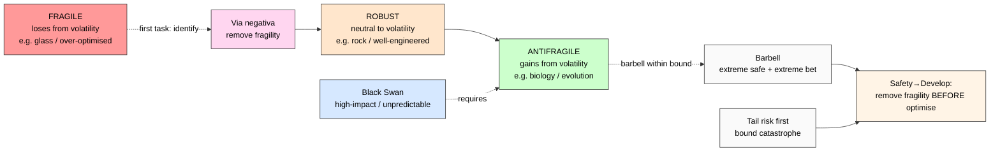

# Diagram 06 — Taleb antifragility gradient + barbell + via negativa

```mermaid
%%{init: {'theme':'base', 'themeVariables': {'primaryTextColor':'#000000','textColor':'#000000','lineColor':'#333333','primaryBorderColor':'#333333','primaryColor':'#fafafa','noteTextColor':'#000000','noteBkgColor':'#fff8d5','edgeLabelBackground':'#ffffff'}}}%%
graph LR
    FRAG[FRAGILE<br/>loses from volatility<br/>e.g. glass / over-optimised]
    ROB[ROBUST<br/>neutral to volatility<br/>e.g. rock / well-engineered]
    AF[ANTIFRAGILE<br/>gains from volatility<br/>e.g. biology / evolution]
    VN[Via negativa<br/>remove fragility]
    BB[Barbell<br/>extreme safe + extreme bet]
    TR[Tail risk first<br/>bound catastrophe]
    BS[Black Swan<br/>high-impact / unpredictable]
    SD[Safety→Develop:<br/>remove fragility BEFORE optimise]
    FRAG -.first task: identify.-> VN
    VN --> ROB
    ROB --> AF
    AF -.barbell within bound.-> BB
    BB --> SD
    TR --> SD
    BS -.requires.-> AF
    style FRAG fill:#ff9999
    style ROB fill:#ffe6cc
    style AF fill:#ccffcc
    style VN fill:#ffd6f0
    style SD fill:#fff4e6
    style BS fill:#d6e8ff
```

[src: Taleb 2007 Black Swan + Taleb 2012 Antifragile + Taleb 2018 Skin in the Game]
