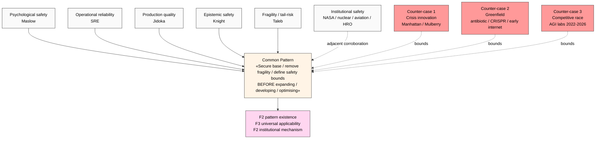

# Diagram 07 — Common Safety→Develop pattern + counter-cases

```mermaid
%%{init: {'theme':'base', 'themeVariables': {'primaryTextColor':'#000000','textColor':'#000000','lineColor':'#333333','primaryBorderColor':'#333333','primaryColor':'#fafafa','noteTextColor':'#000000','noteBkgColor':'#fff8d5','edgeLabelBackground':'#ffffff'}}}%%
graph TB
    PATTERN[Common Pattern<br/>«Secure base / remove fragility / define safety bounds<br/>BEFORE expanding / developing / optimising»]
    PSYCH[Psychological safety<br/>Maslow]
    OPS[Operational reliability<br/>SRE]
    QUAL[Production quality<br/>Jidoka]
    EPI[Epistemic safety<br/>Knight]
    FRAG[Fragility / tail-risk<br/>Taleb]
    INST[Institutional safety<br/>NASA / nuclear / aviation / HRO]
    PSYCH --> PATTERN
    OPS --> PATTERN
    QUAL --> PATTERN
    EPI --> PATTERN
    FRAG --> PATTERN
    INST -.adjacent corroboration.-> PATTERN
    CC1[Counter-case 1<br/>Crisis innovation<br/>Manhattan / Mulberry]
    CC2[Counter-case 2<br/>Greenfield<br/>antibiotic / CRISPR / early internet]
    CC3[Counter-case 3<br/>Competitive race<br/>AGI labs 2022-2026]
    CC1 -.bounds.-> PATTERN
    CC2 -.bounds.-> PATTERN
    CC3 -.bounds.-> PATTERN
    F[F2 pattern existence<br/>F3 universal applicability<br/>F2 institutional mechanism]
    PATTERN --> F
    style PATTERN fill:#fff4e6
    style F fill:#ffd6f0
    style CC1 fill:#ff9999
    style CC2 fill:#ff9999
    style CC3 fill:#ff9999
```

[src: Phases 1-5 + Phase 6 §1.2 common pattern statement + Phase 6 §2 counter-cases]
