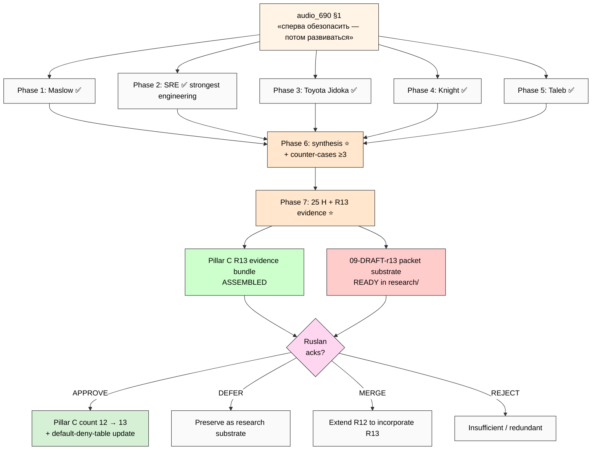

# Diagram 08 — K-5 master TL;DR

```mermaid
%%{init: {'theme':'base', 'themeVariables': {'primaryTextColor':'#000000','textColor':'#000000','lineColor':'#333333','primaryBorderColor':'#333333','primaryColor':'#fafafa','noteTextColor':'#000000','noteBkgColor':'#fff8d5','edgeLabelBackground':'#ffffff'}}}%%
graph TB
    V[audio_690 §1<br/>«сперва обезопасить — потом развиваться»]
    P1[Phase 1: Maslow ✅]
    P2[Phase 2: SRE ✅ strongest engineering]
    P3[Phase 3: Toyota Jidoka ✅]
    P4[Phase 4: Knight ✅]
    P5[Phase 5: Taleb ✅]
    P6[Phase 6: synthesis ⭐<br/>+ counter-cases ≥3]
    P7[Phase 7: 25 H + R13 evidence ⭐]
    EVID[Pillar C R13 evidence bundle<br/>ASSEMBLED]
    DRAFT[09-DRAFT-r13 packet substrate<br/>READY in research/]
    RUSLAN{Ruslan<br/>acks?}
    PROMOTE[Pillar C count 12 → 13<br/>+ default-deny-table update]
    DEFER[Preserve as research substrate]
    MERGE[Extend R12 to incorporate R13]
    REJECT[Insufficient / redundant]
    V --> P1
    V --> P2
    V --> P3
    V --> P4
    V --> P5
    P1 --> P6
    P2 --> P6
    P3 --> P6
    P4 --> P6
    P5 --> P6
    P6 --> P7
    P7 --> EVID
    P7 --> DRAFT
    EVID --> RUSLAN
    DRAFT --> RUSLAN
    RUSLAN -->|APPROVE| PROMOTE
    RUSLAN -->|DEFER| DEFER
    RUSLAN -->|MERGE| MERGE
    RUSLAN -->|REJECT| REJECT
    style V fill:#fff4e6
    style EVID fill:#ccffcc
    style DRAFT fill:#ffcccc
    style RUSLAN fill:#ffd6f0
    style PROMOTE fill:#d6f0d6
    style P6 fill:#ffe6cc
    style P7 fill:#ffe6cc
```

[src: Phases 0-8 K-5 cross-disciplinary validation + R1 STRICT Ruslan ack discipline]
