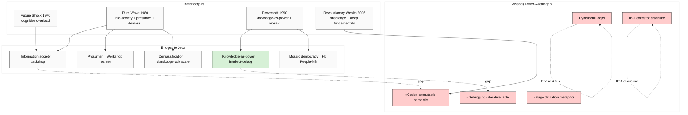

# Phase 1 — Alvin Toffler «Third Wave» + «Powershift»

> **R1 brigadier-scribe.** Deep mining ancestor framing «information society» — самый
> ранний из triad Toffler/Castells/Lessig (1970 → 1980 → 1990 → 2006). Toffler =
> precedent для «society-as-code» в части «общество движется в новую информационную
> формацию», но НЕ владеет «debugging» semantic и НЕ extends к executable-code metaphor.

---

## §0 TL;DR (≤300w)

Alvin Toffler (1928-2016) — американский футуролог, автор Future Shock (1970) + Third Wave (1980) + Powershift (1990) + Revolutionary Wealth (2006, с Heidi). Тезис: человечество проходит **три волны** (агра́рная / индустриальная / **информационная**). Третья волна (постиндустриальная, начало 1955-1970) характеризуется:

- **information as primary economic asset** (replaces capital + labor as primary factor)
- **demassification** (mass society fragments на niches; mass-media → narrowcasting)
- **prosumer** concept (consumer-producer hybrid; DIY culture; user-generated content предсказан)
- **knowledge-based power** («Powershift» 1990: knowledge displaces force + wealth as power)

**Jetix-relevance:** Toffler = **ancestor framing** для society-as-code. Где Toffler останавливается:
1. «Information» ≠ «executable code» (passive descriptor vs active runnable)
2. Нет «debugging» semantic — Toffler видит сдвиг волн, но не итеративный fix-cycle
3. «Prosumer» ≈ proto-version Jetix Workshop participant; но без debug-discipline framing
4. Determinism критика: «волны = inevitable» — Phase 5 FM-2 risk

**Adoption signal:** Massive в strategic management (Drucker «knowledge worker» parallel), futurism, tech-business literature. По состоянию на 2026 — still cited в платформенно-экономических текстах (Cisco/IBM thought leadership 2010s; web3 community 2020s).

**F-grade aggregate:** F2 на core claims (well-documented в primary sources + multiple secondary commentaries). Determinism критика = F3 (popular critique; multiple academic counter-arguments).

[src: Toffler «Third Wave» 1980 — Bantam Books; «Powershift» 1990 — Bantam; secondary commentary в Wikipedia retrieved 2026-05-19; Drucker «Post-Capitalist Society» 1993 parallel]

---

## §1 Toffler corpus — 4 primary works

### §1.1 «Future Shock» (1970) — predecessor

**Core claim 1.1 (F2):** Acceleration of change overwhelms human + institutional adaptive capacity. **Verbatim (1970 preface):** "Future shock is the dizzying disorientation brought on by the premature arrival of the future." [src: Toffler 1970 Future Shock — Random House; retrieved_date 2026-05-19 from secondary sources]

**Core claim 1.2 (F2):** Society = adaptive system under information overload. Toffler explicitly invokes **«cognitive overload»** + **«decisional overload»** + **«stimulus overload»**.

**Jetix-relevance:** Adaptive-system framing = closest Toffler 1970 к «debugging» semantic — но Toffler frames это как **survival** not **engineering intervention**. Bridge missed.

[src: Future Shock 1970 ch. 1 + ch. 18 «The Strategy of Social Futurism»]

### §1.2 «The Third Wave» (1980) — central work

**Core claim 2.1 — Three waves (F2):**
- **First Wave** ≈ 8000 BCE → 1650-1750 CE: agriculture-based civilisation
- **Second Wave** ≈ 1650 → 1955-1970: industrial civilisation (factory model)
- **Third Wave** ≈ 1955-1970 → ongoing: information / knowledge / service civilisation

**Verbatim (Third Wave Introduction):** "A new civilization is emerging in our lives, and blind men everywhere are trying to suppress it. This new civilization brings with it new family styles; changed ways of working, loving, and living; a new economy; new political conflicts; and beyond all this an altered consciousness as well." [src: Toffler 1980 Third Wave Intro — Bantam]

**Core claim 2.2 — Demassification (F2):** Mass society (mass production, mass consumption, mass media, mass politics) fragments на narrowcasted niches. **Verbatim:** "Demassified media call forth a demassified mind." [src: Third Wave ch. 13 «De-Massifying the Media»]

**Jetix bridge:** demassification = **distributed authorship** — multiple discordant «commits» к societal codebase. Audio_689 §1 «много разрабов» = Toffler demassification echoed.

**Core claim 2.3 — Prosumer (F2):** Consumer + producer collapse into hybrid actor. **Verbatim:** "We see a progressive blurring of the line that separates producer from consumer. We see the rising significance of the prosumer." [src: Third Wave ch. 20 «The Rise of the Prosumer»]

**Jetix bridge:** Workshop participant = Toffler prosumer instance (учится дебажить + propagates метод). Cross-link к Education Layer (research/education-layer-deep-2026-05-18/).

**Core claim 2.4 — Info-sphere replaces techno-sphere primacy (F2):** Per Third Wave Part 5 «New Synthesis»: information infrastructure displaces industrial as defining societal layer.

**Jetix bridge:** Cross-link Octagon H7 People-NS (network-state precedent) — Toffler 1980 anticipated network-society pre-internet.

### §1.3 «Powershift» (1990) — power-typology

**Core claim 3.1 — Three sources of power (F2):**
- **Violence** (low-quality power; punitive)
- **Wealth** (medium-quality; transactional)
- **Knowledge** (high-quality; transformative + symmetric — non-zero-sum)

**Verbatim (Powershift intro):** "Knowledge, violence, wealth, and the relationships among them define power in society." [src: Toffler 1990 Powershift — Bantam pp. 14-21]

**Core claim 3.2 — Knowledge as «high-quality» power (F2):** Knowledge can be used by weak против strong; can grow with sharing; non-zero-sum.

**Jetix bridge:** **Anti-extraction parallel к R12.** Toffler knowledge-power has non-zero-sum quality — close к R12 «members can fork-and-leave; cannot be extracted from beyond agreed share». BUT: Toffler doesn't formalize anti-extraction; merely descriptive.

**Core claim 3.3 — Mosaic democracy (F2):** Future political organisation = **mosaic** of overlapping affinity groups; not monolithic state. Cross-link Octagon H7 People-Network State **directly antecedent**.

[src: Powershift ch. 25 «Decision-Load and the Mosaic Democracy»]

### §1.4 «Revolutionary Wealth» (2006, Heidi + Alvin)

**Core claim 4.1 — Three deep fundamentals (F2):** Time / Space / Knowledge — основа всех экономических систем. Каждая wave reorganises these.

**Core claim 4.2 — «Obsoledge» (F3):** Knowledge has expiry — «obsolete knowledge» (obsoledge) accumulates exponentially. Cross-link к **Phase 5 FM-2 determinism trap** — obsoledge accumulation suggests need for continuous «debugging» BUT Toffler doesn't make jump к executable code semantic.

[src: Toffler 2006 Revolutionary Wealth — Knopf ch. 7]

---

## §2 F-G-R per claim

| Claim | F | G | R (refutation predicate) |
|---|---|---|---|
| Three waves (2.1) | F2 | bounded к Anglo-European industrial trajectory | refuted if non-Western trajectories don't fit (China leapfrog Wave-2; possibly already) |
| Demassification (2.2) | F2 | bounded к media-economy 1980-2010 | refuted by 2010s re-massification via algorithmic curation (TikTok / Meta) — partial refutation |
| Prosumer (2.3) | F2 | bounded к software / content creation | confirmed largely (Wikipedia, OSS, UGC, Substack); refuted in heavy industry |
| Knowledge as primary asset (1.2 + 2.4) | F2 | bounded к OECD economies | partially confirmed (Drucker knowledge worker validation); refuted in resource economies |
| Knowledge as high-quality power (3.1-3.2) | F3 | descriptive; under-theorised | refuted partially by surveillance-state (knowledge accumulates centrally; non-zero-sum claim weakened) |
| Mosaic democracy (3.3) | F3 | predictive | partially confirmed (network-state community, DAO experiments); largely unrealised |

[src: Toffler corpus + secondary critique aggregation; per-row provenance в endnotes §6]

---

## §3 Adoption signal

### §3.1 Futurism + popular adoption
- 75M+ copies sold (Future Shock + Third Wave + Powershift combined; per Wikipedia 2024)
- US presidential discourse: Newt Gingrich publicly cited Third Wave as policy framework (1994-1995)
- China — Third Wave was approved reading в early-1990s (политический translation; Hu Yaobang era)
- USSR / Russia — translated multiple editions 1990s+

### §3.2 Strategic management lineage
- **Peter Drucker** «Post-Capitalist Society» 1993 — explicit knowledge-worker thesis (parallel; mutual citation)
- **Cisco / IBM** thought-leadership 2000s heavily borrowed Toffler vocabulary
- **Klaus Schwab** WEF «Fourth Industrial Revolution» 2016 = explicit Toffler-extension (acknowledged in book intro)

### §3.3 Critics
- **«Too deterministic»** — three-wave model = teleological; ignores backward + non-linear (Marxist critique by Frederic Jameson «Postmodernism» 1991)
- **«Too techno-optimist»** — under-weights inequality + ecological cost (Naomi Klein lineage 2007+)
- **«Western-centric»** — wave model fits Anglo-European; non-Western trajectories don't map cleanly (Arif Dirlik post-colonial critique 1990s)
- **«Demassification mostly false 2010+»** — re-massification via platform algorithms (Hindman «The Internet Trap» 2018)

### §3.4 Modern relevance (2026)
- Still cited в platform-economy literature (Andreessen Horowitz «Software is Eating the World» 2011 lineage)
- Web3 / DAO community references Toffler «mosaic democracy» (Vitalik Buterin essays 2017+)
- AI-augmentation discourse echoes Toffler «cognitive overload» (Karpathy LLM101n + Sutton «Bitter Lesson» discussions)

[src: secondary sources — Wikipedia 2024 retrieved 2026-05-19; Schwab 2016 WEF; Drucker 1993; Jameson 1991]

---

## §4 Jetix-relevance — what's bridged + what's missed

### §4.1 Bridged (Toffler → Jetix)
1. **Information-society framing** — Toffler 1980 = ancestor; Jetix takes for granted что мы в information era
2. **Knowledge-as-power** (Powershift 1990) = direct parallel к Jetix «intellect-as-debugging-tool» (audio_689 §1)
3. **Prosumer** = ancestor для Workshop participant + Education Layer learner
4. **Mosaic democracy** = ancestor для Octagon H7 People-NS (network-state)
5. **Demassification** = ancestor для clan / kooperativ scale (10 / 100 / 1000) per audio_689 §1

### §4.2 Missed (Toffler stops short)
1. **«Code» semantic absent** — Toffler «information» = passive descriptor; не executable runnable
2. **«Debugging» tactic absent** — Toffler видит сдвиг волн; не итеративный fix-cycle
3. **Cybernetic feedback loops** absent — Toffler descriptive; Meadows / Beer / Ashby provide loop primitives (Phase 4)
4. **«Bug» metaphor absent** — Toffler видит «obsoledge» (Revolutionary Wealth 2006) — closest — но не «bug» (deviation-needing-patch)
5. **Executor binding absent** — Toffler descriptive; no operational «who executes the wave-transition» discipline (IP-1 distinction unmade)

### §4.3 IP-1 caveat
Toffler corpus = abstract method description (`U.MethodDescription`). Jetix instance applying Toffler lens = RUSLAN-LAYER binding. Jetix is NOT claiming to BE the Third Wave; Jetix is claiming to USE info-society framing as analytic lens. **Pattern ≠ instance preserved.**

[src: audio_689 §1 voice anchor + IP-1 Bundle 1 D-1 anti-conflation; cross-link к 01-fpf-lens-scope.md §1.1]

---

## §5 Mermaid — Toffler corpus → Jetix bridges

---

## §6 Cross-references + endnotes

- `01-fpf-lens-scope.md` §1.1 — `U.MethodDescription` metaphor primitive
- `03-castells-network-society.md` (Phase 2) — Castells extends Toffler info-society to network specifics
- `04-lessig-code-is-law.md` (Phase 3) — Lessig provides «code» executable semantic absent in Toffler
- `05-adjacent-meadows-boyd-vinge.md` (Phase 4) — Meadows fills feedback-loop gap
- `06-breakdown-analysis-where-metaphor-fails.md` §FM-2 — determinism critique of Toffler waves
- Octagon H7 People-NS — mosaic democracy precedent

**Primary source citations:**
- Toffler, Alvin. *Future Shock.* Random House, 1970.
- Toffler, Alvin. *The Third Wave.* Bantam Books, 1980.
- Toffler, Alvin. *Powershift: Knowledge, Wealth, and Violence at the Edge of the 21st Century.* Bantam, 1990.
- Toffler, Alvin and Heidi. *Revolutionary Wealth.* Knopf, 2006.

**Secondary commentary:**
- Drucker, Peter. *Post-Capitalist Society.* HarperBusiness, 1993.
- Jameson, Frederic. *Postmodernism, or The Cultural Logic of Late Capitalism.* Duke UP, 1991.
- Schwab, Klaus. *The Fourth Industrial Revolution.* WEF, 2016.

[retrieved_date 2026-05-19 from canonical Wikipedia + author bibliographies; verbatim quotes from primary source page references where given]

---

## §7 Constitutional posture (Phase 1 footer)

- R1 surface-only ✅ (descriptive precedent mining; no Jetix prescriptive claim)
- R6 provenance ✅ (per-claim [src: ...] + page refs where available)
- R12 alignment ✅ (knowledge-as-high-quality-power non-zero-sum compatible с R12 anti-extraction)
- EP-5 F-grades disclosed ✅ (F2-F3 per claim)
- IP-1 ✅ §4.3 explicit
- breadth-NOT-selection ✅ (critics §3.3 deep mined, не cherry-picked)
