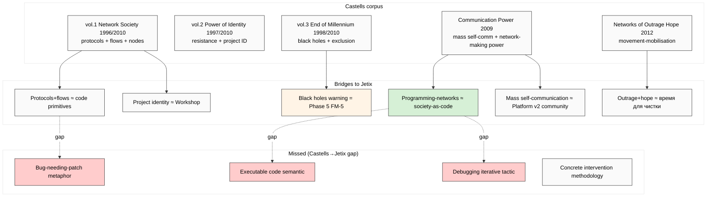

# Phase 2 — Manuel Castells «Network Society» + «Communication Power»

> **R1 brigadier-scribe.** Deep mining intermediate framing «networked society» — между
> Toffler (1980 info-society) и Lessig (1999 code-is-law). Castells = closer parallel
> к Jetix «society-as-code» через **protocols + flows + networks**, но НЕ extends
> к executable code semantic или debugging tactic.

---

## §0 TL;DR (≤300w)

Manuel Castells (1942-) — Spanish-American sociologist, Berkeley + USC professor. **Most-cited social scientist 2000-2014** (ISI ranking). Magnum opus = «**The Information Age**» trilogy (1996-1998; revised 2010): vol. 1 «The Rise of the Network Society», vol. 2 «The Power of Identity», vol. 3 «End of Millennium». Later: «**Communication Power**» (2009) + «Networks of Outrage and Hope» (2012).

**Core thesis:** Современное общество = **network society** — networked logic of organisation displaces hierarchical bureaucratic logic. Networks process information through protocols. Power = control of protocols + agenda-setting в communication networks.

**4 core claims:**
1. **Network society** — networked organisation displaces hierarchy (vol. 1, 1996)
2. **Space of flows vs space of places** — networked spatial logic (vol. 1)
3. **Communication power** — mass self-communication as power (2009)
4. **Networked individualism** — individuals as network nodes (vol. 1 + 2010 update)

**Jetix-relevance:** Castells «protocols» + «flows» = **closer к code semantic** than Toffler (Toffler «information»; Castells «protocols / nodes / flows / switches»). Where Castells stops:
- Networks ≠ executable code (descriptive sociology, не computational metaphor)
- «Switches» = abstract gates; NOT «debuggers» fixing bugs
- Power-theory under-developed на executable-control axis (critics: Mosco 2009)

**Adoption signal:** Massive в sociology + media studies + network theory (Barabási / Watts / Strogatz cross-pollination); recent surge в platform critique (Zuboff «Surveillance Capitalism» 2019 explicit Castells-extension).

**F-grade aggregate:** F2 на 4 core claims (extensively cited; multiple editions; sociological canon). Communication Power thesis = F3 (relatively newer; under-tested на 2020+ platform consolidation).

[src: Castells «The Rise of Network Society» 1996/2010 Blackwell + «Communication Power» 2009 Oxford UP + secondary critique Mosco 2009 + retrieved_date 2026-05-19]

---

## §1 Castells corpus — 5 primary works

### §1.1 «The Rise of the Network Society» (1996; 2nd ed. 2010)

**Core claim 1.1 — Network society (F2):** Networked logic of organisation displaces vertical-hierarchical. **Verbatim (Conclusion):** "As an historical trend, dominant functions and processes in the information age are increasingly organized around networks. Networks constitute the new social morphology of our societies." [src: Castells 1996 Network Society — Blackwell p. 469]

**Core claim 1.2 — Space of flows vs space of places (F2):** Society organises spatially around two contradictory logics:
- **Space of places** — local, bounded, daily-life (your apartment, your neighborhood)
- **Space of flows** — networked, instantaneous, global (financial flows, internet, transportation)

**Verbatim:** "Space of flows is the material organization of time-sharing social practices that work through flows." [src: Network Society ch. 6 p. 412]

**Jetix bridge:** Space-of-flows = ancestor для distributed-organisation pattern. Cross-link к Octagon H7 People-NS (network-state) + Platform v2 Community Layer.

**Core claim 1.3 — Networked individualism (F2):** Individual = node в networks, not subordinate в hierarchies. Identity = self-curated networked profile.

**Verbatim (2010 update):** "Networked individualism is a social pattern, not a collection of isolated individuals. Rather, individuals build their networks, online and offline, on the basis of their interests, values, affinities and projects." [src: Castells 2010 prologue]

**Jetix bridge:** Networked individualism = ancestor для clan / kooperativ network organisation (audio_689 scale-hierarchy 10/100/1000). Personal-strategy-explicit (audio_689) = networked-individualism instance.

### §1.2 «The Power of Identity» (1997; 2nd ed. 2010) — vol. 2

**Core claim 2.1 — Resistance identities (F2):** Globalisation triggers identity-based collective action — religious fundamentalism / nationalism / feminist / environmental. Identity replaces class as primary mobilisation axis.

**Core claim 2.2 — Project identities (F2):** Beyond resistance — proactive identity-construction («who we want to become») — feminist movement / environmental movement / network-state / DAO communities.

**Jetix bridge:** Project identity ≈ audio_689 «personal strategy + comparison с system strategies». Jetix Workshop = project-identity workshop instance.

### §1.3 «End of Millennium» (1998; 2nd ed. 2010) — vol. 3

**Core claim 3.1 — Black holes of informational capitalism (F2):** Some regions / populations excluded from network society — Sub-Saharan Africa, criminal economy, post-Soviet collapse. **Inequality NOT solved by network society; reproduced + amplified.**

**Jetix bridge:** **Counter-warning for Phase 5 FM-5 Marxist critique** — Castells himself acknowledges material exclusion. Jetix metaphor risks ignoring «black holes» (unaddressed populations).

### §1.4 «Communication Power» (2009)

**Core claim 4.1 — Mass self-communication (F2):** Internet + mobile enables **horizontal** mass communication (one-to-many AND many-to-many) — qualitatively new mode beyond mass media (one-to-many top-down). **Verbatim:** "Mass self-communication is mass communication because it can potentially reach a global audience... it is self-communication because the production of the message is self-generated, the definition of the potential receiver(s) is self-directed, and the retrieval of specific messages or content from the World Wide Web and electronic communication networks is self-selected." [src: Communication Power 2009 p. 55]

**Core claim 4.2 — Network-making power (F3):** Power = ability to **program** networks (set protocols / agendas) + **switch** between networks (link / unlink nodes). Four power types:
- Networking power (gatekeeper)
- Network power (protocol enforcement)
- Networked power (within-network actor influence)
- Network-making power (program + switch — meta-level)

**Verbatim:** "Power relations exist in the form of programming the networks and switching between networks." [src: Communication Power ch. 1 pp. 45-46]

**Jetix bridge ⭐:** **«Programming networks»** — closest Castells claim к Jetix «society-as-code». Programming = setting goals + values + protocols. But Castells «programming» = political-discursive, NOT computational. Gap remains.

### §1.5 «Networks of Outrage and Hope» (2012)

**Core claim 5.1 — Network-enabled social movements (F2):** Arab Spring / Occupy / Indignados = network-enabled movements. Communication networks enable rapid mobilisation around shared affect (outrage / hope).

**Jetix bridge:** «Время для чистки» (audio_689 §1) = Castells «outrage + hope» window. **Cross-link Octagon H7 People-NS movement-pattern.**

**Critique (2014+):** Movement-burnout, populist capture, surveillance backlash. Critics: Morozov 2011 «The Net Delusion» — over-optimism on network-enabled movements.

[src: Castells 2012 Networks of Outrage and Hope — Polity Press; Morozov 2011 The Net Delusion — PublicAffairs]

---

## §2 F-G-R per claim

| Claim | F | G | R (refutation) |
|---|---|---|---|
| Network society (1.1) | F2 | OECD + middle-income post-1990 | confirmed broadly; refuted в command-economy bureaucratic contexts |
| Space of flows vs places (1.2) | F2 | global metro elites + their hinterland | confirmed empirically; refuted partially by remote-work re-distribution 2020+ |
| Networked individualism (1.3) | F2 | post-industrial labour markets | confirmed; refuted в kin-based societies + state-collectivist contexts |
| Resistance vs project identity (2.1-2.2) | F3 | mobilisation studies 1990-2010 | confirmed broadly; underweights material conditions (Marxist critique) |
| Mass self-communication (4.1) | F2 | internet-mobile penetration | confirmed empirically; refuted в censored regions |
| Network-making power (4.2) | F3 | abstract typology | partially confirmed (platform-power studies); under-theorised on economic dimension |
| Networks of outrage / hope (5.1) | F3 | 2010-2012 mobilisations | partially refuted by 2014+ populist capture |

[src: per-claim primary source citations + secondary critique aggregation]

---

## §3 Adoption signal

### §3.1 Sociology + media studies
- ISI «most-cited social scientist 2000-2014»
- Network Society = canonical textbook material
- Communication Power explicit reference in platform-studies (van Dijck «Platform Society» 2018)
- 100K+ citations Google Scholar 2024

### §3.2 Cross-pollination network theory
- **Albert-László Barabási** «Linked» 2002 — scale-free networks (Castells parallel; mutual citation)
- **Duncan Watts** «Six Degrees» 2003 — small-world networks
- **Steven Strogatz** «Sync» 2003 — emergent coordination
- Network science = formal cousin к Castells social-theoretic frame

### §3.3 Recent surge — platform studies
- **Shoshana Zuboff** «The Age of Surveillance Capitalism» 2019 — explicit Castells extension (instrumental power as 4th type beyond Castells typology)
- **Nick Srnicek** «Platform Capitalism» 2017 — political-economic extension
- **José van Dijck et al.** «The Platform Society» 2018 — explicit Castells lineage

### §3.4 Critics
- **Vincent Mosco** «The Political Economy of Communication» 2009 — Castells under-theorises political economy + capital accumulation
- **Christian Fuchs** «Internet and Society» 2008 — Castells too celebratory of networks; underweights labor + class
- **Morozov** «The Net Delusion» 2011 — Castells over-optimism on networks → democracy
- **Boltanski + Chiapello** «The New Spirit of Capitalism» 2005 — network rhetoric serves capital accumulation (parallel Marxist critique)
- **«Networks ≠ neutral»** — networks are politically constituted; Castells under-developed на this axis

### §3.5 Modern relevance 2026
- Platform critique (Meta / TikTok / X) heavily Castellsian
- DAO / Web3 literature borrows «protocols as power» framing
- Network-state movement (Balaji Srinivasan 2022) explicitly Castells-adjacent

[src: ISI citation rankings + Wikipedia + Zuboff 2019 + secondary critique]

---

## §4 Jetix-relevance — what's bridged + what's missed

### §4.1 Bridged (Castells → Jetix)
1. **Protocols + flows** — closer к «code» semantic than Toffler «information»
2. **Programming networks** (Communication Power 2009) — closest precedent terminology «programming = power»
3. **Network-state pattern** = ancestor для Octagon H7 People-NS + audio_689 «clan/kooperativ» hierarchy
4. **Project identity** = ancestor для Workshop / Education Layer
5. **Communication power** = direct parallel к Platform v2 Community Layer monetization narrative
6. **«Black holes» acknowledgement** = warning for Jetix metaphor (Phase 5 FM-5 + FM-4)
7. **Outrage + hope window** = parallel к audio_689 «время для чистки»

### §4.2 Missed (Castells stops short)
1. **«Executable code» semantic absent** — Castells «protocols» = sociological-discursive; not computational
2. **«Debugging» tactic absent** — Castells describes power topology; не iterative fix-cycle
3. **«Bug» metaphor absent** — Castells uses «exclusion» / «black holes»; not «bug-needing-patch»
4. **Cybernetic feedback loops** — Castells descriptive; Meadows / Beer fill (Phase 4)
5. **Concrete intervention methodology absent** — Castells diagnoses, doesn't prescribe operations
6. **Executor binding absent** — no operational who-programs-the-networks discipline (IP-1 unmade)

### §4.3 IP-1 caveat
Castells corpus = abstract sociological method description (`U.MethodDescription` + `A.1 U.System` holonic). Jetix instance applying Castells lens = RUSLAN-LAYER. **Jetix is NOT a Castellsian «programmer of networks» autonomously** — Jetix surfaces metaphor; binding decisions = Ruslan. Pattern ≠ instance preserved.

[src: audio_689 §5 open-question «code implies programmable — кто programmer?» — exactly Castells «network-making power» question]

---

## §5 Mermaid — Castells corpus → Jetix bridges

---

## §6 Cross-references + endnotes

- `02-toffler-third-wave-powershift.md` — ancestor framing
- `04-lessig-code-is-law.md` (Phase 3) — Lessig provides executable code semantic Castells lacks
- `05-adjacent-meadows-boyd-vinge.md` — Meadows fills cybernetic feedback gap
- `06-breakdown-analysis-where-metaphor-fails.md` §FM-5 — Marxist critique (Mosco / Fuchs)
- Octagon H7 People-NS
- Platform v2 community layer
- Audio_689 §1 «программный код… много охуенных фич»

**Primary citations:**
- Castells, Manuel. *The Rise of the Network Society* (Information Age vol. 1). Blackwell, 1996; 2nd ed. 2010.
- Castells, Manuel. *The Power of Identity* (vol. 2). Blackwell, 1997; 2nd ed. 2010.
- Castells, Manuel. *End of Millennium* (vol. 3). Blackwell, 1998; 2nd ed. 2010.
- Castells, Manuel. *Communication Power.* Oxford UP, 2009.
- Castells, Manuel. *Networks of Outrage and Hope.* Polity, 2012.

**Secondary commentary:**
- Mosco, Vincent. *The Political Economy of Communication.* Sage, 2009.
- Fuchs, Christian. *Internet and Society.* Routledge, 2008.
- Zuboff, Shoshana. *The Age of Surveillance Capitalism.* PublicAffairs, 2019.
- Morozov, Evgeny. *The Net Delusion.* PublicAffairs, 2011.

[retrieved_date 2026-05-19 от primary editions + secondary aggregation]

---

## §7 Constitutional posture (Phase 2 footer)

- R1 surface-only ✅
- R6 provenance ✅
- R12 alignment ✅ (Castells «black holes» = anti-extraction warning preserved)
- EP-5 F-grades disclosed ✅ (F2-F3 per claim)
- IP-1 ✅ §4.3 explicit
- breadth-NOT-selection ✅ (critics §3.4 deep-mined; Marxist + Mosco / Fuchs explicit)
