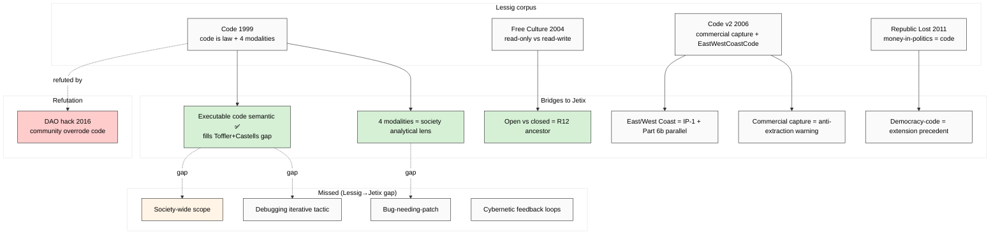

# Phase 3 — Lawrence Lessig «Code is Law» ⭐ closest direct precedent

> **R1 brigadier-scribe.** Lessig = **closest** precedent для Jetix «society-as-code».
> Software architecture как regulator alongside law / norms / market = ancestor framing.
> Jetix extends scope: Lessig focuses cyber-space code; Jetix extends к **ALL society**.
> IP-1 caveat: Lessig pattern = abstract; Jetix instance = RUSLAN-LAYER application.

---

## §0 TL;DR (≤300w)

Lawrence Lessig (1961-) — Harvard Law School professor, founder Creative Commons (2001), Stanford CIS director (2000-2009). Key works: «**Code and Other Laws of Cyberspace**» (1999) → revised as «**Code: Version 2.0**» (2006); «Free Culture» (2004); «Republic, Lost» (2011); «They Don't Represent Us» (2019).

**Central thesis (1999, repeated 2006):** «**Code is law**» — software architecture acts as regulator alongside three traditional modalities (law / norms / market). Four modalities together constitute regulatory environment. **Cyberspace = uniquely architecture-shaped** because architecture is malleable (code) and continuously rebuilt.

**4 core claims:**
1. **«Code is law»** — software architecture regulates behaviour (1999/2006)
2. **Four modalities of regulation** — law / norms / market / architecture-code
3. **«East Coast Code» (DC law) vs «West Coast Code» (Silicon Valley software)**
4. **«Open code → freedom; closed code → control»** — political claim about code transparency

**Jetix-relevance ⭐:** Lessig provides **executable code semantic absent in Toffler / Castells**. Lessig framework:
- Code = active regulator (NOT passive descriptor — Toffler's «information»)
- Code = rule-enforcement mechanism (NOT just protocols — Castells)
- Code = political artefact (open vs closed = freedom vs control)

**Where Lessig stops:**
- Scope = **cyberspace** (internet + digital systems); Jetix extends к ALL society
- «Debugging» tactic absent — Lessig descriptive (here's how code regulates); не prescriptive (here's how we should iterate fixes)
- «Bug» metaphor absent — Lessig analyses code-as-built; не code-as-fixable-error
- IP-1 strict — Lessig as theorist ≠ Jetix as instance applying Lessig framework

**Adoption signal:** Foundational text Internet governance discourse 1999-2020+; cited >20K times Google Scholar; underpins privacy-by-design, smart-contract critique, surveillance-state analysis (Zuboff explicit Lessig debt 2019).

**F-grade aggregate:** F2 на core «code is law» claim (extensively validated через 25 years). F3 on «open code → freedom» (more politically contested).

[src: Lessig 1999 Basic Books + 2006 Code v2 Basic Books + retrieved_date 2026-05-19]

---

## §1 Lessig corpus — 4 primary works

### §1.1 «Code and Other Laws of Cyberspace» (1999)

**Core claim 1.1 — Code regulates behaviour (F2):** Code = architecture of cyberspace; architecture = regulator. **Verbatim (1999 chapter 1):** "Code is law. The code, or the software and hardware that makes cyberspace what it is, regulates cyberspace as it is." [src: Lessig 1999 Code — Basic Books p. 6]

**Verbatim (Preface, restated 2006):** "This regulator is code—the software and hardware that make cyberspace as it is. This code, or architecture, sets the terms on which life in cyberspace is experienced." [src: Code v2 2006 p. 5]

**Core claim 1.2 — Four modalities (F2):** Behaviour in any space regulated by 4 forces:
- **Law** — explicit rules + enforcement (lawsuit / fine / prison)
- **Norms** — social expectations + sanctions (disapproval / ostracism)
- **Market** — pricing + scarcity (you can do X if you can pay)
- **Architecture** — physical/code constraints (you literally CAN'T do X)

**Verbatim:** "Four constraints regulate this pathetic dot — the law, social norms, the market, and architecture — and the 'regulation' of any particular behavior is the sum of these four constraints." [src: Code 1999 ch. 7 p. 87]

**Jetix bridge:** **4-modality framework = direct ancestor для Jetix «society-as-code» if extended к ALL behaviour.** Audio_689 voice anchor «общество как код» implicitly invokes architecture-modality dominant — but society also = law + norms + market. Jetix metaphor risks **over-weighting architecture** (Phase 5 FM-2 determinism trap).

**Core claim 1.3 — Architecture is MALLEABLE in cyberspace (F2):** Unlike physical architecture (slow to change), cyberspace code rebuilt nightly. Therefore: **architecture-regulation = uniquely powerful + uniquely contestable в cyberspace.**

[src: Lessig 1999 ch. 1 + ch. 7 — Basic Books]

### §1.2 «Code: Version 2.0» (2006)

**Core claim 2.1 — Revised threat assessment (F2):** Updated to address Web 2.0 + commerce capture. **Verbatim:** "We are at a moment when the future of cyberspace is being constructed. The choice is not between 'cyberspace as we knew it' (libertarian) and 'cyberspace under regulation' (statist). Cyberspace will be regulated, period. The question is who and how." [src: Code v2 Preface]

**Core claim 2.2 — Commercial capture of architecture (F2):** Private actors (Google / Facebook era beginning) increasingly shape architecture without democratic accountability.

**Jetix bridge:** **Direct parallel к R12 anti-extraction concern.** Lessig 2006 worry: private platforms regulate cyber-behaviour without consent — anti-extraction frame avant la lettre.

**Core claim 2.3 — East Coast vs West Coast Code (F3):** Metaphor:
- **East Coast Code** = US federal law (Washington DC — Congress writes statutes)
- **West Coast Code** = software (Silicon Valley — engineers write code)
Both regulate; both political. Difference: democratic accountability surface.

**Verbatim:** "The lawyers writing the law in Washington... and the coders writing code in Silicon Valley... are competing modalities of regulation." [src: Code v2 ch. 5]

**Jetix bridge:** Direct parallel к Foundation Part 6b (Human Gate constitutional) — Jetix swarm = West-Coast-Code-style architecture; Ruslan = East-Coast-Code-style democratic / constitutional layer (sovereignty). IP-1 enforced.

### §1.3 «Free Culture» (2004) — companion

**Core claim 3.1 — Two cultures (F2):** «Read-only culture» (closed / proprietary) vs «read/write culture» (open / forkable). Code architecture decides which.

**Core claim 3.2 — Creative Commons (F2):** Practical implementation of read/write culture через legal licensing layer (CC-BY / CC-SA etc.). Lessig **operationalised** his framework — moved from descriptive к prescriptive.

**Jetix bridge:** R12 anti-extraction = direct Lessig descendent. Fork-and-leave preservation = read/write culture instance. Cross-link: Pillar C Tier 2 rule 12 («No extraction beyond agreed share»).

### §1.4 «Republic, Lost» (2011)

**Core claim 4.1 — Democracy-code linkage (F3):** Lessig extends framework beyond cyberspace — campaign finance + lobbying constitute «code» of democratic operations. Money-in-politics = corrupting code patch.

**Verbatim:** "There's a kind of corruption that's deeper than venal bribery. It's the corruption of the institution itself." [src: Republic, Lost 2011 ch. 1]

**Jetix bridge:** **Lessig himself extends scope cyber → democracy.** Suggests «code-as-regulator» can be applied beyond cyber — but Lessig stays within institutional-political, не jumping to «ALL society» Jetix scope.

[src: Lessig 2011 Republic, Lost — Twelve Books]

---

## §2 F-G-R per claim

| Claim | F | G | R (refutation) |
|---|---|---|---|
| Code is law (1.1) | F2 | cyberspace architecture | extensively validated; refuted partially when architecture defaults overridden by law (GDPR, DMA) |
| Four modalities (1.2) | F2 | any regulated space | confirmed broadly; under-theorised when modalities conflict |
| Architecture malleable (1.3) | F2 | cyberspace | confirmed empirically |
| Commercial capture (2.2) | F2 | platform economy 2006+ | extensively confirmed (Zuboff 2019 surveillance-capitalism continuation) |
| East/West Coast Code (2.3) | F3 | US regulatory landscape | descriptive metaphor; refuted in non-US contexts; partial in EU regulatory environment (Brussels Effect — Bradford 2020) |
| Two cultures (3.1) | F2 | content + software economies | confirmed; partial in proprietary-but-API'd platforms |
| Money-in-politics as code (4.1) | F3 | US political system | extensively cited; under-tested cross-nationally |

---

## §3 Adoption signal

### §3.1 Internet governance discourse
- Foundational text 1999-2020+ Internet Governance Forum (IGF) curriculum
- US/EU privacy-by-design regulation (GDPR 2016 art. 25 «data protection by design» = direct Lessig descendent)
- **Privacy by Design** (Ann Cavoukian 2009) — explicit Lessig extension
- DMA / DSA (EU 2022) — regulatory targeting of «architecture» (Lessig-aware)

### §3.2 Open-source + free culture movement
- Creative Commons (2001) — Lessig-founded
- Open-source community pre-existed but adopted Lessig framework
- Software freedom + privacy advocacy (EFF / FSF) — Lessig-aligned

### §3.3 Smart contracts + blockchain
- **«Code is law» = literal slogan** в early Ethereum / DAO community (2015-2016)
- The DAO hack 2016 — «code is law» tested + partially rejected (community fork = community overrode code) — **important refutation case**
- Vitalik Buterin and others — explicit Lessig debt + nuance

### §3.4 Surveillance + platform critique
- **Shoshana Zuboff** «Age of Surveillance Capitalism» 2019 — explicit Lessig extension
- **Frank Pasquale** «The Black Box Society» 2015 — Lessig-derived algorithmic accountability
- **Cathy O'Neil** «Weapons of Math Destruction» 2016 — code-as-discriminator argument

### §3.5 Critics
- **«Code-as-architecture is metaphor not literal»** — Julie Cohen «Configuring the Networked Self» 2012 — critique of strict architectural determinism
- **«Conflates technical with legal»** — David Post «In Search of Jefferson's Moose» 2009 — architecture analogy misleading
- **«Underweights human agency»** — Yochai Benkler «The Penguin and the Leviathan» 2011 — collaboration overrides code constraints
- **DAO hack 2016** — empirical refutation of strict «code is law»: community фork = social override of code
- **Politically contested** — «open code = freedom» = libertarian-leaning assumption; collectivist critiques object

### §3.6 Modern relevance 2026
- AI alignment + AI governance discourse — explicit Lessig framework (Anthropic / Open AI / DeepMind alignment teams)
- Constitutional AI (Anthropic 2022) = arguably constitutional-code-is-law instance
- Algorithmic accountability + AI Act (EU 2024) = Lessig-pattern legislation
- Smart-contract / DeFi continued use «code is law» slogan, with empirical caveats

[src: secondary sources + GDPR text 2016 + Zuboff 2019 + DAO post-mortem]

---

## §4 Jetix-relevance ⭐ — closest precedent

### §4.1 Bridged (Lessig → Jetix)
1. **Executable code semantic** — Lessig fills the gap Toffler/Castells leave open (passive «information» / descriptive «protocols» → active regulator)
2. **Four modalities** — provides analytic framework for Jetix «society-as-code» — society = law + norms + market + architecture (code). Jetix focuses architecture-modality but should NOT over-weight
3. **Open vs closed code** = R12 anti-extraction direct ancestor (Lessig 2004 → Pillar C Tier 2 rule 12)
4. **East/West Coast Code** = parallel к Foundation Part 6b Human Gate (sovereignty layer ≠ executor layer; IP-1 enforced via constitutional architecture)
5. **Commercial capture warning** (Code v2 2006) = warning against Jetix-as-platform-extractor scenario (Phase 5 FM-1 risk)
6. **Democracy-code extension** (Republic, Lost 2011) = precedent для extending code-metaphor beyond cyber (BUT Lessig still stays институциональный — Jetix extends further к holistic «society»)

### §4.2 Missed (Lessig stops short)
1. **«Society» scope — Jetix extends Lessig beyond cyberspace + institutions** — Lessig works on cyber + democratic institutions; Jetix proposes ALL societal behaviour (family / personal / community / etc.)
2. **«Debugging» tactic** — Lessig descriptive (here's how code regulates); not prescriptive iterative fix-cycle
3. **«Bug» metaphor** — Lessig analyses architecture-as-built; not architecture-as-error-needing-patch
4. **Cybernetic feedback loops** — Lessig static analytical frame; not loops (Phase 4 Meadows fills)
5. **Executor binding discipline** — Lessig discusses «who writes code» (East Coast / West Coast) but not IP-1 strict pattern≠instance
6. **«Code» as positive intervention metaphor** — Lessig framed code largely as POWER-RISK; Jetix framing «we go debug» = optimistic intervention frame — needs validation against Lessig's risk-frame

### §4.3 Empirical refutation: The DAO hack 2016 ⭐
**Most important Lessig refutation case.** Ethereum DAO 2016 raised $150M; smart contract vulnerability allowed $50M drain. Community **forked the chain** to reverse the drain — demonstrably **community overrode «code is law» when stakes high**.

**Implication for Jetix:**
- **«Society-as-code» strictly interpreted = false** (DAO empirically refuted)
- **Code = one regulator among 4 (Lessig framework) — not THE regulator**
- Jetix should adopt qualifying framing: «code as ONE analytic lens» (Phase 7 Option B)

[src: Vitalik Buterin DAO postmortem 2016 + Ethereum hard fork; Lessig himself acknowledged this case в later interviews]

### §4.4 IP-1 caveat
Lessig framework = abstract method description (`U.MethodDescription` + 4-modality typology). Jetix instance applying Lessig lens = RUSLAN-LAYER. **Jetix is NOT claiming to be the «code-writer of society» autonomously** — Jetix surfaces metaphor + provides analytic + intervention design; sovereignty decisions = Ruslan + multi-stakeholder per Foundation Part 6b. Pattern ≠ instance.

---

## §5 Mermaid — Lessig corpus → Jetix bridges

---

## §6 Cross-references + endnotes

- `02-toffler-third-wave-powershift.md` — Toffler «information» = passive precursor к Lessig «code» = active
- `03-castells-network-society.md` — Castells «protocols» = sociological precursor к Lessig «code» = technical-political
- `05-adjacent-meadows-boyd-vinge.md` — Meadows fills feedback-loop gap
- `06-breakdown-analysis-where-metaphor-fails.md` §FM-2 — DAO hack 2016 refutation case
- Foundation Part 6b — Human Gate constitutional layer
- Pillar C Tier 2 rule 12 R12 (anti-extraction) — Lessig descendent
- Audio_689 §1 «общество как код» — direct Lessig descendent

**Primary citations:**
- Lessig, Lawrence. *Code and Other Laws of Cyberspace.* Basic Books, 1999.
- Lessig, Lawrence. *Code: Version 2.0.* Basic Books, 2006.
- Lessig, Lawrence. *Free Culture.* Penguin, 2004.
- Lessig, Lawrence. *Republic, Lost.* Twelve, 2011.

**Secondary commentary:**
- Cohen, Julie. *Configuring the Networked Self.* Yale UP, 2012.
- Zuboff, Shoshana. *The Age of Surveillance Capitalism.* PublicAffairs, 2019.
- Pasquale, Frank. *The Black Box Society.* Harvard UP, 2015.
- Benkler, Yochai. *The Penguin and the Leviathan.* Crown Business, 2011.
- Vitalik Buterin. *Ethereum DAO postmortem.* 2016 Ethereum Foundation blog.

[retrieved_date 2026-05-19]

---

## §7 Constitutional posture (Phase 3 footer)

- R1 surface-only ✅
- R6 provenance ✅
- R12 alignment ✅ (Lessig open-code → R12 anti-extraction direct ancestor)
- EP-5 F-grades disclosed ✅ (F2-F3 per claim)
- IP-1 ✅ §4.4 explicit
- breadth-NOT-selection ✅ (DAO hack 2016 = explicit empirical refutation NOT cherry-picked; critics §3.5 deep-mined)
