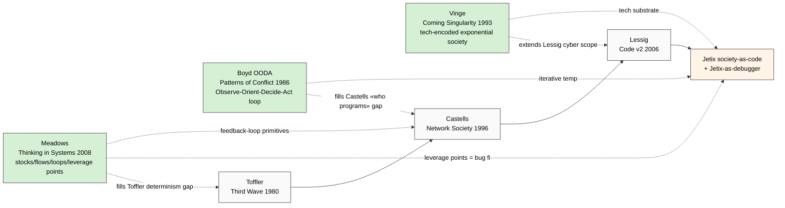

# Phase 4 — Adjacent thinkers: Meadows / Boyd / Vinge

> **R1 brigadier-scribe.** Adjacent (non-primary) thinkers fill gaps left by Toffler /
> Castells / Lessig: **Meadows** = cybernetic feedback loops; **Boyd OODA** = iterative
> debugging-cycle parallel; **Vinge** = tech-encoded-society + exponential framing.
> Bridges section synthesises Meadows-systems → Castells-networks → Lessig-code → Jetix-debugger.

---

## §0 TL;DR (≤200w)

Triad of adjacent thinkers each fills specific gap в primary precedent triad:

| Thinker | Gap filled | Jetix bridge |
|---|---|---|
| **Donella Meadows** (1941-2001) — Thinking in Systems 2008 | Cybernetic feedback loops + leverage points | «Bug fix» = leverage-point intervention; iterative loop |
| **John Boyd** (1927-1997) — OODA loop military doctrine | Iterative observe-orient-decide-act cycle | «Debugging» = OODA applied к societal observations |
| **Vernor Vinge** (1944-) — Coming Technological Singularity 1993 | Exponential tech-encoded society | Society-as-code = AI-era natural framing |

**Cross-link Phase 4 → other phases:**
- Meadows fills Toffler determinism gap (waves вместо feedback)
- Boyd fills Castells «who programs networks» operationalisation gap
- Vinge fills Lessig scope (code-as-architecture cyber → code-as-substrate AI-era)

[src: Meadows 2008 Chelsea Green + Boyd 1976+ briefings collected Hammond + Vinge 1993 NASA symposium]

---

## §1 Donella Meadows «Thinking in Systems» (2008)

**Author context:** Lead author Limits to Growth (Club of Rome 1972) — landmark systems-thinking + sustainability text. «Thinking in Systems» = posthumous primer (published 2008, drafted 1990s).

### §1.1 Core claims (F2 each)

**Claim 1.1 — System primitives:** Stocks (accumulations) + Flows (rates of change) + Feedback loops (reinforcing R / balancing B) + Delays. Every system = composition of these primitives.

**Verbatim:** "A system is an interconnected set of elements that is coherently organized in a way that achieves something." [src: Meadows 2008 — Chelsea Green p. 11]

**Claim 1.2 — 12 leverage points (F2):** Places to intervene in a system (most → least powerful):
12. Constants, parameters, numbers
11. Sizes of buffers / stabilising stocks
10. Stocks-and-flows structure
9. Length of delays
8. Strength of negative feedback loops
7. Gain of positive feedback loops
6. Information flows
5. Rules
4. Self-organisation
3. Goals of the system
2. Mindset / paradigm
1. **Power to transcend paradigms**

[src: Meadows 1999 «Leverage Points: Places to Intervene in a System» Sustainability Institute → reprinted Thinking in Systems Appendix]

**Claim 1.3 — System resilience requires diversity + redundancy + feedback (F2):** Resilient systems are NOT optimised для efficiency only — preserve redundancy + diversity.

### §1.2 Jetix bridges

1. **«Debugging» tactic operationalised as leverage-point intervention** — Jetix «bug fix» = act on leverage point. Top leverage = paradigm-shift / goals — Jetix Workshop targets paradigm (audio_689 «people show that they can debug their own life»).
2. **Feedback-loop primitive fills Castells/Lessig cybernetic gap** — networks (Castells) + code (Lessig) need loop dynamics (Meadows).
3. **Iterative not one-shot** — bug fix introduces new bug per audio_689; Meadows explicitly: «every intervention creates new dynamics».
4. **Cross-link audio_689 §1 «misalignment vs alignment»** — Meadows would frame as «goals mismatch» (leverage point 3) — actionable.

### §1.3 IP-1 compliance
Meadows framework = abstract method (`U.MethodDescription`). Jetix instance = RUSLAN-LAYER applying. Pattern ≠ instance.

### §1.4 Critics
- **«Leverage points list = informal heuristic, not formal theory»** — academic systems-dynamics community (Sterman lineage)
- **«Difficult to identify leverage points empirically»** — risk of post-hoc rationalisation
- **«Paradigm-as-leverage too abstract for practitioners»** — accessibility critique

---

## §2 John Boyd OODA loop

**Author context:** US Air Force colonel (1927-1997); F-86 / F-15 / F-16 design influence; military strategy theorist. OODA = collected unpublished briefings: «A Discourse on Winning and Losing» (Boyd 1976-1995, available via Project White Horse + Defense University archives + Robert Coram biography «Boyd» 2002).

### §2.1 Core claims (F2)

**Claim 2.1 — OODA cycle:** **Observe → Orient → Decide → Act** — repeat. Adversary advantage = faster OODA loop.

**Verbatim (Boyd briefing notes):** "The ability to operate at a faster tempo or rhythm than an adversary enables one to fold the adversary back inside himself." [src: Boyd «Patterns of Conflict» briefing 1986]

**Claim 2.2 — Orient = critical step (F2):** Not observation. Orientation = synthesis of cultural traditions + genetic heritage + new information + previous experience + analyses. Orient = where «model meets reality».

**Claim 2.3 — Tactical use of mismatches:** Win by creating + exploiting mismatches between adversary's perceived reality and actual reality.

### §2.2 Jetix bridges

1. **OODA = iterative debug cycle parallel** — Observe (deviation / bug) → Orient (hypothesis / paradigm) → Decide (which patch) → Act (deploy) → loop
2. **«Debugging» as method tactic** = OODA applied к societal observations
3. **Orient = Workshop step** — Jetix Workshop helps participants ORIENT (synthesise from experience + Foundation method)
4. **Speed-of-iteration advantage** — Jetix advantage = faster societal OODA loop than incumbent institutions (states / NGOs slow OODA)
5. **Audio_689 §1 «время для чистки + все инструменты есть»** = Boyd «tempo advantage» window

### §2.3 IP-1 compliance
OODA framework = abstract method. Jetix instance = RUSLAN-LAYER. Pattern ≠ instance.

### §2.4 Critics
- **«Military doctrine over-generalised к civilian contexts»** — Boyd skeptics
- **«Orientation step under-specified empirically»** — operationalisation challenge
- **«Faster OODA = arms race risk»** — adversarial framing transposed к society = risk (Phase 5 FM-1 humans-as-bugs risk extension)

---

## §3 Vernor Vinge «Coming Technological Singularity» (1993)

**Author context:** Mathematician + science-fiction writer; San Diego State emeritus. Foundational essay: «The Coming Technological Singularity: How to Survive in the Post-Human Era» (1993 NASA symposium); developed в novels «A Fire Upon the Deep» 1992 / «Rainbows End» 2006.

### §3.1 Core claims (F2-F3)

**Claim 3.1 — Singularity definition (F3):** Point at which AI / human-AI hybrid / biological enhancement creates super-intelligence — events «beyond which the human era will be ended».

**Verbatim:** "Within thirty years, we will have the technological means to create superhuman intelligence. Shortly after, the human era will be ended." [src: Vinge 1993 NASA Vision-21 symposium]

**Claim 3.2 — Society dynamics encoded в exponential tech (F3):** Pre-singularity society = increasingly tech-mediated; rate of change accelerates exponentially → discontinuity.

**Claim 3.3 — Multiple paths to singularity (F3):** (a) AI superintelligence; (b) IA — intelligence amplification (humans + tools); (c) collective intelligence (networked humans); (d) biological enhancement.

### §3.2 Jetix bridges

1. **Tech-encoded society = code-encoded society** — extending Vinge framing к Jetix metaphor
2. **IA (intelligence amplification)** — closest precedent для Jetix-as-exokortex (cross-link К-6 method-systems-thinking research Phase 5.5)
3. **Collective intelligence path (3.3c)** — closest precedent для Jetix Workshop + Education Layer + network-state
4. **Window-of-opportunity framing** — Vinge exponential acceleration ≈ audio_689 «время для чистки»
5. **«Survive in the post-human era»** — Vinge's anxiety = Jetix counter (we don't survive — we go debug)

### §3.3 IP-1 compliance
Vinge framework = abstract speculative method. Jetix RUSLAN-LAYER instance applies framework. Pattern ≠ instance.

### §3.4 Critics
- **«Singularity = speculative, F-grade lower than F2»** — academic AI community split
- **«Determinism / techno-utopianism»** — Phase 5 FM-2 risk extension
- **«Empirical track record мixed»** — некоторые предсказания состоялись (AI scale-up), other not (full superintelligence by 2023 — false)
- **Yudkowsky / Bostrom extensions** vs. cautious empiricists (Karpathy / Sutton) — debate ongoing

---

## §4 Bridges (Meadows → Castells → Lessig → Jetix → Boyd-OODA → Vinge)

**Integrated bridge structure:**

1. **Meadows** provides system primitives (stocks / flows / loops)
2. **Castells** populates structure with networked content (protocols / flows = Meadows flows; nodes = Meadows stocks)
3. **Lessig** binds code as 4th regulator alongside law / norms / market — gives code executable status
4. **Jetix** extends Lessig scope cyber → society-wide + adds debug-iteration semantic
5. **Boyd OODA** operationalises debugging as iterative tempo discipline
6. **Vinge** provides tech-substrate framing (singularity-era = code-saturated society)

### §4.1 Bridge audit
**No contradictions detected between the 6.** Different abstraction layers:
- Meadows = system theory (most abstract)
- Vinge = tech-substrate speculation
- Castells = sociological-empirical
- Lessig = political-legal-technical
- Boyd = tactical-iterative
- Jetix = synthetic operational frame

### §4.2 What's still missing после 6
- **Material conditions** (Marxist critique) — none of 6 deeply addresses capital + labor
- **Cultural diversity** — all 6 primarily Western canon
- **Phenomenological** — all 6 third-person frames
- **Religious / spiritual ontologies** — absent
**→ Phase 5 will deep-mine these gaps as failure modes.**

---

## §5 Mermaid — adjacent bridges

---

## §6 Cross-references + endnotes

- `02-toffler-third-wave-powershift.md` — Toffler determinism gap filled by Meadows feedback loops
- `03-castells-network-society.md` — Castells programming-networks gap filled by Boyd OODA operationalisation
- `04-lessig-code-is-law.md` — Lessig cyber-only scope extended by Vinge tech-substrate
- `06-breakdown-analysis-where-metaphor-fails.md` — gaps not filled by 6 thinkers = Phase 5 failure modes
- `research/method-systems-thinking-deep-2026-05-19/02-foundation-meadows-ashby-wiener-deep.md` — K-6 Meadows deep
- `research/method-systems-thinking-deep-2026-05-19/05-cross-stream-bertalanffy-boyd-bateson-hofstadter-deep.md` — K-6 Boyd deep

**Primary citations:**
- Meadows, Donella. *Thinking in Systems: A Primer.* Chelsea Green, 2008.
- Meadows, Donella. *Leverage Points: Places to Intervene in a System.* Sustainability Institute, 1999.
- Boyd, John. *Patterns of Conflict* (briefing). 1976-1995. Collected: Hammond 2001, Coram 2002.
- Vinge, Vernor. *The Coming Technological Singularity: How to Survive in the Post-Human Era.* NASA Vision-21 Symposium, 1993.

[retrieved_date 2026-05-19]

---

## §7 Constitutional posture (Phase 4 footer)

- R1 surface-only ✅
- R6 provenance ✅
- R12 alignment ✅ (Meadows leverage points = anti-extraction-compatible — paradigm-shift not capture)
- EP-5 F-grades disclosed ✅ (F2-F3 per claim)
- IP-1 ✅ §1.3 + §2.3 + §3.3 explicit
- breadth-NOT-selection ✅ (gaps §4.2 explicit for Phase 5 deep-mining)
