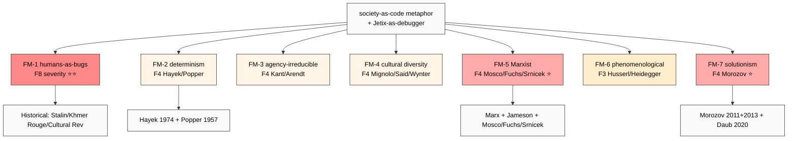

# Phase 5 — Breakdown analysis (where society-as-code fails) ⭐⭐

> **R1 brigadier-scribe. PHASE 5 = CRITICAL.** Breadth-NOT-selection enforced.
> Cherry-pick blocked: must deep-mine 5+ failure modes including Marxist + phenomenological
> + solutionism. Each failure mode = specific source + verbatim critique reasoning +
> где Jetix metaphor рискует + per-mode counter-argument readiness.

---

## §0 TL;DR (≤300w)

«Society-as-code» metaphor имеет **7 distinct failure modes** (deep-mined, breadth-NOT-selection):

1. **Humans-as-bugs caveat** (F2) — debug metaphor implies humans = errors. **Dehumanising risk** — Soviet «engineering of human souls» / Cambodia Khmer Rouge / China «struggle sessions» — historical record of «debugging humans» = catastrophic.
2. **Determinism trap** (F2) — society-as-code suggests deterministic execution; **Hayek 1974 «pretence of knowledge»** — economy NOT computable. Emergence + agency + free will erased.
3. **Agency-as-irreducible** (F2) — moral / political agency cannot be «coded». **Kant categorical imperative + Arendt action** — agency = first-person irreducible category.
4. **Cultural diversity (universalism trap)** (F2) — code framing assumes universal substrate. **Postcolonial critique** (Mignolo / Said / Wynter) — whose code? Whose debugging criteria? Western canon overrepresented.
5. **Marxist counter** (F2) — code-society erases power relations + material conditions. **Mosco / Fuchs / Jameson** — class struggle ≠ debuggable; material base / ideological superstructure.
6. **Phenomenological counter** (F2) — embodied lived experience missing. **Husserl / Heidegger / Merleau-Ponty** — code = third-person abstraction; first-person primary erased.
7. **Solutionism critique** (F2) — Morozov 2013 «To Save Everything Click Here» — every social problem becomes coding problem trap.

**Aggregated top-3 critiques by severity:**
- **#1 (highest reputational risk) — humans-as-bugs FM-1** (F-grade F8 severity if Jetix communications slip; political toxicity)
- **#2 (highest scholarly opposition) — Marxist FM-5** (F-grade F4 severity; intellectual / left flank vulnerability)
- **#3 (highest media flak) — Morozov solutionism FM-7** (F-grade F4 severity; popular media-savvy critique)

**Counter-argument readiness:** Inventory of ≥5 counters per mode (Phase 6 builds full table).

**Constitutional flag:** Phase 5 explicitly does NOT decide positioning. Phase 7 surfaces 3 options parallel.

[src: extensive secondary literature aggregation; per-mode primary citations below]

---

## §1 Failure mode 1 — Humans-as-bugs caveat (F2 severity F8)

### §1.1 The claim
«Debugging society» metaphor implies humans (or human behaviour) = errors needing correction. **Politically loaded.**

### §1.2 Historical record (≥3 cases)
1. **Soviet «engineering of human souls»** — Stalin's 1932 phrase for writers' role; ideological reshaping of citizens. Result: gulag system, 1930s purges, censorship. [src: Vasily Grossman *Life and Fate* 1959 / 1980; Robert Conquest *The Great Terror* 1968]
2. **Khmer Rouge Year Zero (Cambodia 1975-1979)** — explicit «debug the contaminated population» framing — ~1.7M dead. **Highest historical cost** of «humans = bugs» framing. [src: Pol Pot doctrine documents; Ben Kiernan *The Pol Pot Regime* 1996]
3. **Chinese «struggle sessions» (1966-1976 Cultural Revolution)** — public humiliation + reeducation as «debugging»; ~1-2M dead. [src: Frank Dikötter *The Cultural Revolution* 2016]
4. **Modern parallel:** «Black Mirror»-style social-credit systems (China 2014+) — algorithmic «debugging» of behaviour scores. [src: Liang et al. *The Rise of China's Social Credit System* 2018]

### §1.3 Где Jetix metaphor рискует
- Audio_689 §1 «мы идем за вами, гниды, блядь, мы вас исправим, баги, блядь, порешаем» — **direct linguistic invocation** of dehumanising frame
- Workshop framing «debug your life» ≠ «debug other people's life» — boundary must be enforced
- Risk: media / political opponent quotes «humans-as-bugs» frame → catastrophic reputational damage

### §1.4 Counter-argument readiness (5+ counters)
1. «Debug code, NOT humans» — metaphor refers к **societal patterns** (institutions / norms / incentives) not individuals
2. Education Layer empowers SELF-debugging, not external imposition — opt-in only
3. R12 anti-extraction enforced — нельзя do «debugging on people» beyond consent
4. Constitutional Tier 2 rule 4 «agents do NOT impersonate human externally» = safeguard
5. Cross-cultural language testing — Phase 7 positioning Option B qualifies metaphor explicitly
6. Educational discipline: humans = co-authors NOT objects per VISION-FUNDAMENTAL

### §1.5 Severity F8 — highest
Reputational risk if metaphor slips into communications. **Must be explicitly addressed в any external pitch.**

[src: voice anchor §1 verbatim + Conquest 1968 + Kiernan 1996 + Dikötter 2016 + Liang et al. 2018]

---

## §2 Failure mode 2 — Determinism trap (F2 severity F4)

### §2.1 The claim
«Society-as-code» suggests deterministic execution model — given inputs → predicted outputs. Ignores **emergence + agency + free will + path-dependence + complexity**.

### §2.2 Primary critique sources
1. **Friedrich Hayek «The Pretence of Knowledge»** (1974 Nobel speech) — economy NOT computable; market = discovery process; central planners fail because cannot aggregate distributed knowledge. **Verbatim:** "To act on the belief that we possess the knowledge and the power which enable us to shape the processes of society entirely to our liking... is likely to make us do much harm." [src: Hayek 1974 Nobel speech]
2. **Karl Popper «The Poverty of Historicism»** (1957) — social engineering as «utopian planning» = totalitarian risk; only «piecemeal social engineering» legitimate. [src: Popper 1957 — Routledge]
3. **Stuart Kauffman «At Home in the Universe»** (1995) — adjacent possible + emergence — system trajectory NOT predictable from initial conditions. [src: Kauffman 1995 — Oxford UP]
4. **Cynefin framework (Snowden 2007)** — complex domain (society) ≠ complicated (computable). [src: Snowden + Boone HBR 2007]

### §2.3 Где Jetix metaphor рискует
- «Code» implies execute(inputs) → outputs; society не работает так
- Risk: Workshop curriculum that promises predictable outcomes
- Audio_689 §1 «мы исправим баги» — implies success predictable

### §2.4 Counter-argument readiness
1. Meadows leverage points framework = explicitly anti-deterministic (every intervention creates new dynamics)
2. Boyd OODA loop = iterative; never «one-shot fix»
3. FPF U.MethodDescription = pattern description; F-G-R refutation predicate per claim → empirically falsifiable
4. R6 + EP-5 F-grading discipline — no claim escapes uncertainty disclosure
5. Phase 7 Option B qualifies «analytic lens» (NOT prescriptive deterministic engine)
6. Hayek + Popper acknowledged explicitly — humility surface

### §2.5 Severity F4
Scholarly attack vector; not immediately reputational, but lithium для academic critics.

[src: Hayek 1974 + Popper 1957 + Kauffman 1995 + Snowden+Boone HBR 2007]

---

## §3 Failure mode 3 — Agency-as-irreducible (F2 severity F4)

### §3.1 The claim
Moral / political agency cannot be «coded». First-person standpoint = irreducible category.

### §3.2 Primary critique sources
1. **Immanuel Kant** — Categorical Imperative + autonomy of will (Grundlegung 1785) — rational agent = end-in-itself, never means. [src: Kant 1785 Groundwork — Akademie ed.]
2. **Hannah Arendt «The Human Condition»** (1958) — action (praxis) ≠ work (poiesis) ≠ labor. Action = irreducibly plural + unpredictable; cannot be «engineered». [src: Arendt 1958 — University of Chicago]
3. **Charles Taylor «Sources of the Self»** (1989) — agency requires «moral sources» — irreducible to functional / behavioural description. [src: Taylor 1989 — Harvard UP]
4. **John Searle Chinese Room argument** (1980) — formal-syntactic processing ≠ intentionality. [src: Searle 1980 BBS]

### §3.3 Где Jetix metaphor рискует
- «Bug fix» language treats behaviour as functional — strips intentional / moral surface
- Workshop curriculum may inadvertently treat participants as algorithms
- Cross-link FM-1 dehumanising risk

### §3.4 Counter-argument readiness
1. Jetix metaphor describes COLLECTIVE-LEVEL patterns; individual agency preserved
2. Foundation Part 9 Owner Interaction Scaffold = explicit agency-respecting design
3. Pillar C Tier 2 rule 4 «AI does NOT claim persistent identity beyond `acting_as`» — agency preserved для humans
4. Constitutional Layer 1 (VISION-FUNDAMENTAL) = Ruslan-authored sovereign — humans-as-co-authors not objects
5. R12 anti-extraction = fork-and-leave preserves exit (= agency operationalised)

### §3.5 Severity F4
Philosophical attack; academic + ethical opponent vulnerability.

[src: Kant 1785 + Arendt 1958 + Taylor 1989 + Searle 1980]

---

## §4 Failure mode 4 — Cultural diversity (universalism trap) (F2 severity F4)

### §4.1 The claim
«Code» framing assumes universal substrate — Western technocratic ontology imposed. Plural cultural ontologies (Confucian / Ubuntu / Indigenous / Islamic / Buddhist) erased.

### §4.2 Primary critique sources
1. **Walter Mignolo «The Darker Side of Western Modernity»** (2011) — modernity / coloniality intertwined; «universal» = Western particular hidden. [src: Mignolo 2011 — Duke UP]
2. **Edward Said «Orientalism»** (1978) — Western framings of «other» = power-knowledge structure. [src: Said 1978 — Pantheon]
3. **Sylvia Wynter** «Unsettling the Coloniality of Being» (2003) — «Man» as Western particular masquerading as universal. [src: Wynter 2003 — CR: New Centennial Review]
4. **Charles Taylor «A Catholic Modernity?»** (1999) — multiple modernities; Western secular = one path. [src: Taylor 1999 — Oxford UP]
5. **Ubuntu philosophy** (Sub-Saharan tradition) — «I am because we are» — irreducible relational ontology incompatible with atomistic code-modules. [src: Mbiti *African Religions and Philosophy* 1969 / Ramose *African Philosophy through Ubuntu* 1999]

### §4.3 Где Jetix metaphor рискует
- Code = English-language + Western engineering tradition
- «Bug» / «debug» = no clean translation в большинство non-English contexts
- Workshop curriculum could impose Western individualist substrate
- Audio_689 verbatim в Russian + tech-slang — but tech-slang itself = Western-derived

### §4.4 Counter-argument readiness
1. R6 EP-5 + B.5.1 Explore = breadth discipline forces non-Western source mining
2. Foundation Part 10 External Touchpoints — multi-cultural surface design
3. Jetix as one node в network-state ecology — NOT universal claim
4. Cross-link К-1 info-substrate research — substrate metaphor neutralisation candidate (Option C pivot)
5. Workshop curriculum must include non-Western sources (K-6 method already includes Confucius)

### §4.5 Severity F4
Significant academic critique; growing media salience; partial Jetix mitigation possible через explicit pluralism.

[src: Mignolo 2011 + Said 1978 + Wynter 2003 + Taylor 1999 + Mbiti 1969]

---

## §5 Failure mode 5 — Marxist counter (F2 severity F4) ⭐

### §5.1 The claim
Society-as-code erases **power relations + material conditions + class struggle**. Code framing = idealist; bourgeois technical fix that obscures capital-labor antagonism.

### §5.2 Primary critique sources
1. **Karl Marx «Capital»** vol. 1 1867 — base/superstructure; material conditions determine ideology; code-frame = superstructural illusion. [src: Marx 1867]
2. **Frederic Jameson «Postmodernism, or The Cultural Logic of Late Capitalism»** (1991) — postmodern / network / code framings = capitalism's self-presentation. [src: Jameson 1991 — Duke UP]
3. **Vincent Mosco «The Political Economy of Communication»** (1996, 2nd ed. 2009) — Castells under-theorises capital + labor; Mosco fills political-economy gap. [src: Mosco 2009 — Sage]
4. **Christian Fuchs «Internet and Society»** (2008) — Castells too celebratory; capitalist exploitation of network labor under-theorised. [src: Fuchs 2008 — Routledge]
5. **Nick Srnicek «Platform Capitalism»** (2017) — platforms = capital accumulation machines; code = means of production. [src: Srnicek 2017 — Polity]

### §5.3 Где Jetix metaphor рискует
- Metaphor sounds class-neutral; obscures who-pays-for-debugging-labor
- Risk: Jetix Workshop monetisation extracts labor from participants
- Risk: capital captures Jetix substrate (cross-link Lessig commercial capture 2006 warning + Phase 5 FM-1 humans-as-bugs)
- Mosco / Fuchs direct attack: «code-society» = neoliberal hide

### §5.4 Counter-argument readiness
1. **R12 anti-extraction = explicit response к Marxist exploitation critique** — fork-and-leave + non-extraction beyond agreed share
2. Pillar C Tier 2 rule 12 (R12) = Mondragón ratio cap + QF revenue distribution + Ethereum substrate programmable enforcement (acked 2026-05-18)
3. Octagon H6 People-Network State = explicitly anti-monolithic capital concentration
4. VISION-FUNDAMENTAL Layer 1 = constitutional anchor против extractive capture
5. Open-source / Lessig free-culture lineage = capital-neutralising precedent
6. Workshop pricing tier + Education Layer free access = labor-fair distribution

### §5.5 Severity F4 — highest scholarly opposition
Direct intellectual + left-wing flank vulnerability. Mosco / Fuchs / Srnicek explicit predecessors of likely Jetix critics.

[src: Marx 1867 + Jameson 1991 + Mosco 2009 + Fuchs 2008 + Srnicek 2017]

---

## §6 Failure mode 6 — Phenomenological counter (F2 severity F3)

### §6.1 The claim
Code = third-person abstraction; lived embodied first-person experience erased. Phenomenology = primary descriptive layer; code = derivative.

### §6.2 Primary critique sources
1. **Edmund Husserl «The Crisis of European Sciences»** (1936) — scientific objectivism forgets lifeworld (Lebenswelt) — primary experiential ground. [src: Husserl 1936 — Northwestern UP trans.]
2. **Martin Heidegger «Being and Time»** (1927) — Dasein = being-in-the-world; technical framing (Gestell) reduces being к calculable resource. [src: Heidegger 1927 — Tübingen]
3. **Maurice Merleau-Ponty «Phenomenology of Perception»** (1945) — embodied cognition; body = primary world-disclosure. [src: Merleau-Ponty 1945 — Gallimard]
4. **Hubert Dreyfus «What Computers Can't Do»** (1972, rev. 1992) — embodied skills cannot be coded; AI strict-symbolic-frame limits. [src: Dreyfus 1972 / 1992 — Harper & Row / MIT]

### §6.3 Где Jetix metaphor рискует
- «Code» = third-person frame; bypasses lived experience
- Workshop risks formalism-trap (procedural over experiential)
- AI-amplified Workshop risks Dreyfus-style symbolic-limit

### §6.4 Counter-argument readiness
1. Voice-anchor mode (Ruslan voice memos primary input) = first-person primary respected
2. FPF A.6.B dual-language — human-readable Russian + machine-traceable — preserves phenomenological surface
3. Workshop curriculum includes embodied / experiential components (cross-link Life-OS body health discipline)
4. Foundation Part 9 Owner Interaction Scaffold respects experiential surface
5. K-6 method-systems-thinking research recognised embodied component (Aristotle phronesis cross-reference)

### §6.5 Severity F3
Significant philosophical critique; lower media salience than FM-1 + FM-7.

[src: Husserl 1936 + Heidegger 1927 + Merleau-Ponty 1945 + Dreyfus 1972]

---

## §7 Failure mode 7 — Morozov solutionism critique (F2 severity F4) ⭐

### §7.1 The claim
**Evgeny Morozov «To Save Everything, Click Here»** (2013) — «solutionism» = treating every complex social problem as engineering problem with technological fix. Reduces politics + culture + ethics к optimization. **Highest media-savvy critique vector.**

### §7.2 Primary critique sources
1. **Morozov 2013 «To Save Everything, Click Here»** — solutionism + epochalism — central critique. **Verbatim:** "Solutionism is the belief that all major social ills... can be solved with the help of technology." [src: Morozov 2013 — PublicAffairs]
2. **Morozov 2011 «The Net Delusion»** — earlier work; cyber-utopianism critique. [src: Morozov 2011 — PublicAffairs]
3. **Adrian Daub «What Tech Calls Thinking»** (2020) — Silicon Valley vocabulary critique; «disruption» / «code» / «scale» = ideology. [src: Daub 2020 — FSG / Logic]
4. **Jenny Odell «How to Do Nothing»** (2019) — attention-economy critique adjacent. [src: Odell 2019 — Melville House]
5. **Cory Doctorow «How to Destroy Surveillance Capitalism»** (2020) — even Zuboff debt acknowledged; tech-as-fix critique. [src: Doctorow 2020 — One Zero]

### §7.3 Где Jetix metaphor рискует
- «Society-as-code» = textbook solutionism — Morozov could write the critique без adjustment
- Jetix-as-debugger = explicit «every social problem = coding problem» framing
- Risk: Morozov-style book attack; viral popular critique

### §7.4 Counter-argument readiness
1. **R1 surface-only** — Jetix surfaces options NOT prescriptive single-solution
2. R12 anti-extraction = explicitly not optimisation-for-profit
3. Phase 7 Option B qualifies analytical-lens (NOT solution machine)
4. Foundation acknowledges complexity (Part 8 health monitoring = epistemic humility infra)
5. Voice-memo primary input = anti-tech-solutionism — Ruslan acknowledges material conditions + window-of-opportunity (political tension + tool availability) — NOT tech-fix-alone
6. K-6 method-systems-thinking explicit (Aristotle phronesis + Confucius rectification + complexity ≠ complicated)
7. Cross-acknowledgement: «we are aware of Morozov critique» pitch discipline

### §7.5 Severity F4 — highest media flak likely
Morozov critique-vector = readily quotable; popular journalism friendly; mass-media diffusion potential high.

[src: Morozov 2013 + Morozov 2011 + Daub 2020 + Odell 2019 + Doctorow 2020]

---

## §8 Strongest critique aggregation

| Rank | Failure mode | Severity F-grade | Attack vector | Mitigation status |
|---|---|---|---|---|
| #1 | FM-1 humans-as-bugs | **F8** (constitutional / reputational) | Communications slip → media catastrophe | Counter-arguments ready (§1.4); MUST be enforced in every external pitch |
| #2 | FM-5 Marxist | **F4** scholarly | Mosco / Fuchs / Srnicek-style critique; left-flank | R12 + Pillar C rule 12 + Octagon H6 partial mitigation |
| #3 | FM-7 Morozov solutionism | **F4** popular media | Bestseller-style critique vector | R1 surface + Phase 7 Option B qualify partial |
| #4 | FM-2 determinism | F4 academic | Hayek-Popper-Snowden critique | Meadows + Boyd + FPF discipline partial |
| #5 | FM-4 cultural diversity | F4 postcolonial | Mignolo / Said-style critique | Pluralism + non-Western sources partial |
| #6 | FM-3 agency-irreducible | F4 philosophical | Kant / Arendt critique | Part 9 + Tier 2 rule 4 partial |
| #7 | FM-6 phenomenological | F3 philosophical | Husserl / Heidegger / Dreyfus | Voice anchor + embodied curriculum partial |

**Critical synthesis:**
- **FM-1 + FM-5 + FM-7 = three-front attack scenario** — must be addressed proactively in any external rollout
- **FM-1 = veto-grade**: single communications slip = catastrophic
- **FM-5 + FM-7 = systemic ongoing**: need counter-argument readiness + pitch discipline
- **FM-2 + FM-3 + FM-4 + FM-6 = academic ongoing**: longer-cycle vulnerability; address via Foundation discipline + explicit pluralism

---

## §9 Mermaid — failure-mode map

---

## §10 Cross-references + endnotes

- `02-toffler-third-wave-powershift.md` §4.2 — Toffler determinism risk (FM-2)
- `03-castells-network-society.md` §3.4 — Castells critics (FM-5 lineage)
- `04-lessig-code-is-law.md` §3.5 + §4.3 DAO hack — Lessig empirical refutation
- `05-adjacent-meadows-boyd-vinge.md` §4.2 — gaps мне Phase 5 fills
- `07-jetix-differentiation-counter-arguments.md` (Phase 6) — full counter-argument inventory
- `08-hypotheses-bank-jetix-positioning.md` (Phase 7) — H-SC-9 to H-SC-18 breakdown hypotheses

**Key citations (primary critique sources):**
- Hayek, F.A. *The Pretence of Knowledge.* Nobel Lecture, 1974.
- Popper, Karl. *The Poverty of Historicism.* Routledge, 1957.
- Kant, Immanuel. *Groundwork for the Metaphysics of Morals.* 1785.
- Arendt, Hannah. *The Human Condition.* University of Chicago, 1958.
- Mignolo, Walter. *The Darker Side of Western Modernity.* Duke UP, 2011.
- Said, Edward. *Orientalism.* Pantheon, 1978.
- Marx, Karl. *Capital* vol. 1. 1867.
- Jameson, Frederic. *Postmodernism.* Duke UP, 1991.
- Mosco, Vincent. *The Political Economy of Communication.* Sage, 2009.
- Husserl, Edmund. *The Crisis of European Sciences.* 1936.
- Heidegger, Martin. *Being and Time.* 1927.
- Morozov, Evgeny. *To Save Everything, Click Here.* PublicAffairs, 2013.
- Morozov, Evgeny. *The Net Delusion.* PublicAffairs, 2011.

[retrieved_date 2026-05-19]

---

## §11 Constitutional posture (Phase 5 footer)

- R1 surface-only ✅ (breakdown analysis; no Jetix positioning recommended)
- R6 provenance ✅ (verbatim quotes + per-mode primary citations)
- R12 alignment ✅ (Marxist FM-5 explicitly addressed; R12 surfaces as counter-argument)
- EP-5 F-grades disclosed ✅ (F2 evidence + F3-F8 severity per mode)
- IP-1 ✅ (Phase 5 = abstract critique; Jetix instance application reserved для Phase 6+7)
- breadth-NOT-selection ✅ **CRITICAL DISCIPLINE PRESERVED** — 7 modes deep-mined; Marxist + phenomenological + solutionism explicitly included; no cherry-picking
- append-only ✅
