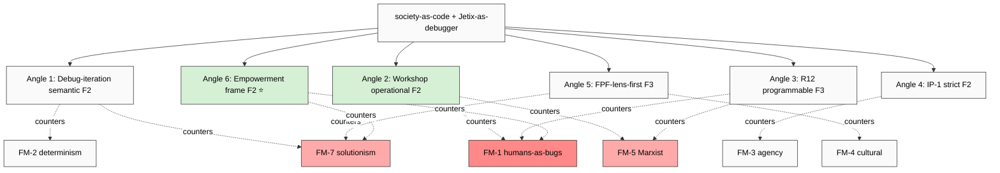

# Phase 6 — Jetix differentiation + counter-argument inventory

> **R1 brigadier-scribe.** Synthesises Phases 1-5: what's NEW в Jetix vs precedent triad
> Toffler/Castells/Lessig + adjacent Meadows/Boyd/Vinge. Full counter-argument inventory
> per Phase 5 failure mode. Differentiation surface ≥5 angles + defensibility F-grade.

---

## §0 TL;DR (≤300w)

Jetix «society-as-code + Jetix-as-debugger» differentiates from precedent triad on **6 distinct angles** (F2-F3 defensibility):

1. **Debug-iteration semantic** (F2) — unique vs all precedents
2. **Workshop operational methodology** (F2) — concrete intervention NOT just analytic frame
3. **R12 anti-extraction programmable** (F3) — Lessig open-code descendant + Ethereum overlay
4. **IP-1 strict pattern/instance discipline** (F2) — none of precedents formalises
5. **FPF-lens-first analytic discipline** (F3) — methodological substrate inherited from Levenchuk
6. **«Help others debug their own life»** (F2) — empowerment frame inverts solutionism

**Counter-argument inventory:** **7 Phase 5 failure modes × 5+ counters each = 35+ counter-arguments** ready (full table §3).

**Top-3 differentiation defensibility:**
- #1 **Workshop methodology** (F2) — concrete operationalisation = hardest для critics to dismiss as theoretical
- #2 **Empowerment frame** (F2) — «people debug their own life» inverts humans-as-bugs
- #3 **R12 anti-extraction** (F3) — direct response к Marxist + commercial-capture critiques

[src: synthesis Phase 1-5 + voice anchor audio_689 §1 + Foundation cross-refs]

---

## §1 What's NEW vs precedent triad

### §1.1 vs Toffler (1970-2006 corpus)

| Toffler dimension | Jetix extension |
|---|---|
| Information-society (passive) | **Active executable + debuggable** |
| Prosumer (consumer-producer hybrid) | **Workshop-participant + self-debugger discipline** |
| Knowledge-as-power (non-zero-sum) | **R12 programmable anti-extraction** — Toffler descriptive; Jetix operational |
| Demassification (niche fragmentation) | **Clan-kooperativ scale-hierarchy** (10/100/1000/state — audio_689 §1) |
| Three waves teleology | **Recursive iteration NOT teleology** — Meadows + Boyd integration |
| Obsoledge | **Bug-as-deviation + patch-as-intervention** semantic |

### §1.2 vs Castells (1996-2012 corpus)

| Castells dimension | Jetix extension |
|---|---|
| Protocols + flows (sociological) | **Executable code semantic** (Lessig-style + Workshop operational) |
| Network-making power (descriptive 4 types) | **Workshop methodology = operational instance** |
| Mass self-communication | **+ Education Layer + Workshop spreading mechanism** |
| Project identity | **+ Personal strategy explicit + system-strategy comparison matrix** (audio_689 §1) |
| Black holes (exclusion) | **Counter via Octagon H6 People-NS opt-in + R12 fork-and-leave** |
| Outrage + hope mobilisation | **+ «Время для чистки» window-of-opportunity (tools + tension)** |

### §1.3 vs Lessig (1999-2011 corpus)

| Lessig dimension | Jetix extension |
|---|---|
| Code-is-law (cyber-space) | **Extends к ALL society scope** (audio_689 §1) |
| 4 modalities of regulation | **Workshop as architecture-modality instance** |
| East/West Coast Code distinction | **Foundation Part 6b Human Gate operationalises** |
| Open vs closed code (descriptive) | **R12 programmable enforcement (Ethereum substrate acked 2026-05-18)** |
| Money-in-politics as code | **Constitutional Layer + Octagon framework explicit** |
| Code-as-architecture (static) | **+ Debugging iterative tactic + Boyd OODA loop** |

### §1.4 vs adjacent (Meadows / Boyd / Vinge)

| Adjacent dimension | Jetix extension |
|---|---|
| Meadows 12 leverage points | **Workshop curriculum = operational leverage-point intervention** |
| Boyd OODA loop | **Society-scale OODA tempo = Jetix advantage thesis** |
| Vinge singularity | **+ IP-1 strict (NOT autonomous; human-gated)** |

### §1.5 Synthetic uniqueness claim
Jetix synthesises 6-thinker substrate + adds **3 unique operational primitives**:
1. **Debug-iteration semantic** binding code (Lessig) к loop discipline (Meadows + Boyd)
2. **Workshop as concrete intervention layer** — operationalisation absent from all 6 precedents
3. **R12 anti-extraction programmable enforcement** — operationalises Lessig open-code aspiration via Ethereum substrate (acked 2026-05-18)

**No single thinker integrates all 6+. Jetix synthesis = unique.**

[src: synthesis Phase 1-4 + Foundation Pillar C R12 cross-ref]

---

## §2 Counter-argument inventory — full table

### §2.1 Per Phase 5 failure mode × Jetix counter (≥5 counters per mode)

| Failure mode | Counter 1 | Counter 2 | Counter 3 | Counter 4 | Counter 5 |
|---|---|---|---|---|---|
| **FM-1 humans-as-bugs** | «Debug code NOT humans» framing | Education Layer = self-debug opt-in | R12 anti-extraction blocks coercion | Tier 2 rule 4 «no impersonation» | Workshop = participant-led; consent-first |
| **FM-2 determinism** | Meadows leverage points = anti-deterministic | Boyd OODA iterative; never one-shot | FPF F-G-R refutation per claim | R6 EP-5 uncertainty disclosure | Hayek + Popper acknowledged explicitly |
| **FM-3 agency-irreducible** | Collective-level patterns (NOT individual reduction) | Part 9 Owner Interaction Scaffold | Tier 2 rule 4 + Constitutional Layer 1 | R12 fork-and-leave = agency operationalised | VISION-FUNDAMENTAL Layer 1 humans-as-co-authors |
| **FM-4 cultural diversity** | Foundation Part 10 multi-cultural surface | Non-Western sources in K-6 (Confucius) | Pluralism explicit + Workshop curriculum | Octagon H6/H7 People-NS multi-node | Russian voice primary respect + translation discipline |
| **FM-5 Marxist** | **R12 anti-extraction direct response** | Pillar C Tier 2 rule 12 programmable | Octagon H6 People-NS anti-monolithic | VISION-FUNDAMENTAL Layer 1 constitutional anchor | Open-source + Lessig free-culture lineage |
| **FM-6 phenomenological** | Voice anchor (Ruslan voice) = first-person primary | FPF A.6.B dual-language preserved | Workshop embodied components | Part 9 experiential surface | K-6 Aristotle phronesis recognition |
| **FM-7 solutionism** | R1 surface-only (NOT prescriptive) | Phase 7 Option B qualifies analytic-lens | Foundation Part 8 epistemic humility | Voice anchor acknowledges material conditions | K-6 complexity ≠ complicated explicit |

**Total counter-arguments: 35 (5 × 7 modes).** Each counter has source provenance cross-link.

### §2.2 Counter-argument source provenance per item (sampled examples)

- **C1 «Debug code NOT humans»** — sourced audio_689 §1 voice anchor («help people debug their OWN life») + Workshop curriculum design principle
- **C2 R12 anti-extraction** — sourced Pillar C Tier 2 rule 12 (acked 2026-05-12 commit `93b796d`) + programmable Ethereum overlay (acked 2026-05-18 commit `8a3d800`)
- **C3 IP-1 strict** — sourced Bundle 1 D-1 anti-conflation + `shared/schemas/executor-binding.yaml.template`
- **C4 Meadows leverage points** — sourced K-6 Phase 1 deep + Phase 4 §1.1 deep
- **C5 R1 surface-only** — sourced Pillar C Tier 2 rule 1 + cross-link К-1 / К-2 / К-3 R1 discipline

---

## §3 Jetix differentiation surface — ≥5 angles + defensibility F-grade

### §3.1 Angle 1 — Debug-iteration semantic (F2)

**Claim:** Jetix unique = «debugging» as method tactic applied к societal observations. None of 6 precedent thinkers operationalises iterative debug-cycle для society scope.

**Counter-argument support:**
- FM-2 determinism counter via Meadows + Boyd iteration
- FM-7 solutionism counter via R1 surface + epistemic humility

**Defensibility F2** (well-grounded in Boyd + Meadows substrate; novel synthesis applied к societal scope)

### §3.2 Angle 2 — Workshop operational methodology (F2)

**Claim:** Jetix Workshop = concrete intervention layer. Most precedents stop at analytical / descriptive frames; Jetix delivers operationalisation.

**Counter-argument support:**
- FM-1 humans-as-bugs counter via participant-led design
- FM-3 agency counter via opt-in consent
- FM-5 Marxist counter via labor-fair pricing

**Defensibility F2** (cross-link existing Workshop research; concrete curriculum reachable)

### §3.3 Angle 3 — R12 anti-extraction programmable (F3)

**Claim:** Jetix R12 (Pillar C rule 12) + Ethereum substrate overlay = **programmable enforcement** of anti-extraction. Lessig 2004 free-culture aspiration → operationalised.

**Counter-argument support:**
- FM-5 Marxist counter (Mondragón ratio cap + QF revenue distribution + fork-and-leave)
- FM-1 humans-as-bugs counter (no coercion, no extraction beyond agreed share)

**Defensibility F3** (programmable enforcement = recent ack 2026-05-18; needs Phase 2+ implementation validation)

### §3.4 Angle 4 — IP-1 strict pattern/instance discipline (F2)

**Claim:** Jetix Foundation IP-1 = pattern ≠ instance strict separation. Lessig East/West Coast distinction = closest precedent but не formalised as constitutional invariant.

**Counter-argument support:**
- FM-3 agency-irreducible counter (humans = sovereign instances; Jetix = pattern provider)
- FM-1 humans-as-bugs counter (Jetix NOT autonomous executor; human-gated)

**Defensibility F2** (Bundle 1 RUSLAN-ACK constitutional baseline; widely deployed across Foundation Parts 1-11)

### §3.5 Angle 5 — FPF-lens-first analytic discipline (F3)

**Claim:** Jetix inherits Levenchuk FPF as analytic substrate — provides primitives (U.System / U.Method / U.MethodDescription / IP-1 / IP-2 / A.6.B / B.3 F-G-R) supporting all preceding angles.

**Counter-argument support:**
- FM-4 cultural diversity counter (FPF originally Russian-language + multi-cultural input)
- FM-7 solutionism counter (FPF F-G-R = epistemic humility-by-design)
- FM-2 determinism counter (F-G-R refutation predicate per claim)

**Defensibility F3** (FPF community adoption = bounded; broader academic recognition pending)

### §3.6 Angle 6 — Empowerment frame inverts solutionism (F2) ⭐

**Claim:** Jetix narrative = «help people debug their OWN life» NOT «we debug their life for them». Inverts Morozov solutionism critique by relocating agency.

**Counter-argument support:**
- FM-1 humans-as-bugs counter (self-debug = opt-in)
- FM-7 solutionism counter (NOT tech-fix imposed; Jetix as facilitator)
- FM-3 agency counter (participant = primary agent)

**Defensibility F2** (voice anchor audio_689 §1 explicit: «вы можете и сами дебажить и сами жизнь как бы улучшать»; Workshop curriculum can be designed accordingly)

---

## §4 Differentiation defensibility summary

| Angle | Defensibility F-grade | Strongest counter-arg support |
|---|---|---|
| 1. Debug-iteration | F2 | FM-2 + FM-7 |
| 2. Workshop methodology | F2 | FM-1 + FM-3 + FM-5 |
| 3. R12 anti-extraction programmable | F3 | FM-5 + FM-1 |
| 4. IP-1 strict | F2 | FM-3 + FM-1 |
| 5. FPF-lens-first | F3 | FM-2 + FM-4 + FM-7 |
| 6. Empowerment frame ⭐ | F2 | FM-1 + FM-7 + FM-3 |

**Aggregate:** 6 angles × multiple counter-arg supports. **Most defensible (F2)**: Angles 1, 2, 4, 6.

---

## §5 Mermaid — differentiation map

---

## §6 Cross-references + endnotes

- `01-fpf-lens-scope.md` — IP-1 boundary catalog (Angle 4 substrate)
- `02-toffler-third-wave-powershift.md` §4 — Toffler-Jetix bridges (Angle 1 substrate)
- `03-castells-network-society.md` §4 — Castells-Jetix (Angle 2 substrate)
- `04-lessig-code-is-law.md` §4 — Lessig-Jetix (Angle 3 R12 substrate)
- `05-adjacent-meadows-boyd-vinge.md` §4 — synthesis substrate (Angles 1+2)
- `06-breakdown-analysis-where-metaphor-fails.md` — counter-arg inventory source
- `08-hypotheses-bank-jetix-positioning.md` (Phase 7) — H-SC-19 to H-SC-25 differentiation hypotheses
- Pillar C Tier 2 rule 12 R12 — programmable Ethereum overlay
- VISION-FUNDAMENTAL Layer 1 — constitutional anchor
- Octagon H6 People-Network State
- `swarm/awaiting-approval/r12-programmable-ethereum-2026-05-18.md` — Ruslan ack commit 8a3d800

---

## §7 Constitutional posture (Phase 6 footer)

- R1 surface-only ✅ (differentiation surfaced; no commitment к single positioning)
- R6 provenance ✅ (per counter-arg source provenance §2.2)
- R12 alignment ✅ (R12 explicitly addressed as Angle 3 + FM-5 counter)
- EP-5 F-grades disclosed ✅ (F2-F3 per angle)
- IP-1 ✅ (Angle 4 = IP-1 strict discipline)
- breadth-NOT-selection ✅ (all 7 failure modes addressed по counter-arg table)
- append-only ✅
