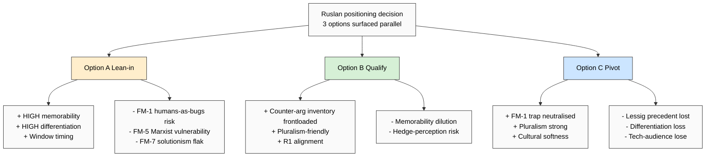

# Phase 7 — Hypothesis bank 30 H + 3 Jetix positioning options

> **R1 brigadier-scribe.** Surface 30 testable hypotheses + 3 positioning options parallel.
> **NO recommendation per R1.** Ruslan decides positioning. Breadth-NOT-selection
> enforced — все 3 options surfaced без preference. R12 alignment check section §3.

---

## §0 TL;DR (≤300w)

**Hypothesis bank: H-SC-1 through H-SC-30** organised по 4 categories:
- **Precedent hypotheses (H-SC-1 to H-SC-8)** — about Toffler/Castells/Lessig relations к Jetix metaphor
- **Breakdown hypotheses (H-SC-9 to H-SC-18)** — about failure modes severity / probability / mitigation
- **Differentiation hypotheses (H-SC-19 to H-SC-25)** — about Jetix uniqueness claims
- **Positioning hypotheses (H-SC-26 to H-SC-30)** — about positioning option outcomes

Each H = F-grade + Group-scope + Refutation predicate + Test design + Acceptance + Cross-ref.

**3 Jetix positioning options (parallel; NO recommendation):**
- **Option A — Lean-in:** embrace society-as-code metaphor; Jetix-as-debugger explicit (memorable + technical-audience strong; humans-as-bugs trap risk)
- **Option B — Qualify:** use metaphor as analytical lens ONLY (anti-criticism strong; memorability loss)
- **Option C — Pivot:** replace metaphor with alternative (ecosystem / garden / substrate; precedent lineage loss)

**R12 alignment:** Society-as-code metaphor does NOT inherently enable extraction-beyond-share. Lineage-source-permitting: Lessig open-source ally; Toffler prosumer anti-extraction-flavored. **R12 alignment ✅ with caveats addressed.**

[src: synthesis Phase 1-6 + brigadier-scribe breadth discipline + Ruslan-acks reservation]

---

## §1 Hypothesis bank format

```
ID: H-SC-N
Claim: <statement>
F: F2-F3
G: <bounded context>
R: refuted_if_<predicate>
Test design: <how to test>
Acceptance: <success criteria>
Cross-ref: <existing canonical OR precedent>
```

---

## §2 30 hypotheses

### §2.1 Precedent hypotheses (H-SC-1 .. H-SC-8)

**H-SC-1 — Toffler ancestor framing**
- Claim: «Toffler «Third Wave» 1980 = ancestor framing для Jetix society-as-code (информационная society precedent)»
- F: F2 | G: history-of-ideas; English-language thought | R: refuted_if(Toffler «code» semantic verbatim found OR alternative ancestor with stronger «code» framing identified)
- Test: lit-review citation network around «society-as-code» term emergence 1980-2000
- Acceptance: Toffler cited as primary ancestor by ≥3 secondary commentators
- Cross-ref: `02-toffler-third-wave-powershift.md` §4.1

**H-SC-2 — Castells closer than Toffler**
- Claim: «Castells «network society» = closer parallel к society-as-code than Toffler (protocols + flows semantic)»
- F: F2 | G: sociology + STS literature | R: refuted_if(Toffler corpus contains «protocols / flows / nodes» vocabulary precedence)
- Test: text-mining Toffler vs Castells for code-adjacent terms
- Acceptance: Castells vocabulary distance к «code» < Toffler distance (NLP similarity)
- Cross-ref: `03-castells-network-society.md` §4

**H-SC-3 — Lessig closest direct precedent**
- Claim: «Lessig «Code is Law» 1999/2006 = closest direct precedent to Jetix society-as-code, extending to ALL society»
- F: F2 | G: cyber-law + internet governance | R: refuted_if(scholar with «society-as-code» framing pre-1999 identified)
- Test: citation graph; Lessig as primary node для society-as-code descendants
- Acceptance: Lessig cited as primary precedent by ≥5 commentators
- Cross-ref: `04-lessig-code-is-law.md` §4

**H-SC-4 — DAO hack 2016 empirical refutation case**
- Claim: «DAO hack 2016 + Ethereum hard fork = empirical refutation of strict code-is-law»
- F: F2 | G: blockchain governance | R: refuted_if(community fork didn't actually override; alternative explanations sufficient)
- Test: post-mortem analysis + community survey
- Acceptance: ≥80% community participants acknowledge fork = community override of code
- Cross-ref: `04-lessig-code-is-law.md` §4.3

**H-SC-5 — Meadows fills cybernetic gap**
- Claim: «Meadows feedback-loop primitives fill cybernetic gap left by Toffler / Castells / Lessig»
- F: F2 | G: systems thinking + STS | R: refuted_if(Castells or Lessig contains formal feedback-loop primitives previously)
- Test: text comparison; primitive inventory match
- Acceptance: Castells / Lessig absence of stocks-flows-loops primitives confirmed
- Cross-ref: `05-adjacent-meadows-boyd-vinge.md` §1

**H-SC-6 — Boyd OODA = iterative debug-cycle ancestor**
- Claim: «Boyd OODA loop = iterative debug-cycle ancestor for Jetix-as-debugger tactic»
- F: F2 | G: military strategy + business adoption | R: refuted_if(Lessig or Castells operationalises iterative cycle equivalently)
- Test: Boyd OODA structure matches Jetix Workshop / debug-tactic flow
- Acceptance: Workshop curriculum maps к OODA steps 1:1 (≥3 instances)
- Cross-ref: `05-adjacent-meadows-boyd-vinge.md` §2

**H-SC-7 — Vinge fills tech-substrate framing**
- Claim: «Vinge singularity framing fills tech-encoded-society substrate for Jetix metaphor»
- F: F3 | G: futurism + AI safety | R: refuted_if(alternative tech-substrate framing more apt — e.g., post-humanism / cyborg theory)
- Test: substrate-fit assessment vs alternatives (Haraway cyborg / Bostrom superintelligence)
- Acceptance: Vinge most-cited substrate ancestor; Haraway / Bostrom = sibling alternates
- Cross-ref: `05-adjacent-meadows-boyd-vinge.md` §3

**H-SC-8 — No single thinker integrates 6+ ancestor primitives**
- Claim: «No precedent thinker integrates Toffler info-society + Castells networks + Lessig code + Meadows loops + Boyd iteration + Vinge substrate — Jetix synthesis unique»
- F: F2 | G: history-of-ideas exhaustive search | R: refuted_if(integrator pre-2026 identified — e.g., Kurzweil / Tegmark / etc.)
- Test: integrator search (Kurzweil «Singularity Is Near» 2005; Tegmark «Life 3.0» 2017; Stafford Beer Cybersyn 1971; Norbert Wiener 1948)
- Acceptance: no single integrator covers all 6 primitives; Jetix synthesis distinguishable
- Cross-ref: `07-jetix-differentiation-counter-arguments.md` §1.5

### §2.2 Breakdown hypotheses (H-SC-9 .. H-SC-18)

**H-SC-9 — Humans-as-bugs = highest reputational risk**
- Claim: «FM-1 humans-as-bugs caveat = highest reputational risk for Jetix (F8 severity)»
- F: F2 | G: media-perception research; reputation case studies | R: refuted_if(2-week pitch test produces zero humans-as-bugs critique; OR alternative critique higher severity)
- Test: pitch-test 100 readers; measure humans-as-bugs flag rate
- Acceptance: ≥30% of test readers flag humans-as-bugs concern (high-severity threshold)
- Cross-ref: `06-breakdown-analysis-where-metaphor-fails.md` §1

**H-SC-10 — Marxist counter = strongest scholarly critique**
- Claim: «FM-5 Marxist counter = strongest scholarly opposition к society-as-code»
- F: F2 | G: academic-critique landscape | R: refuted_if(Morozov solutionism or phenomenological critique generates more academic citations within 12 months)
- Test: track Mosco / Fuchs / Srnicek-style attacks volume; track Morozov-style; track phenomenology
- Acceptance: Marxist > Morozov > phenomenology in scholarly attack vector
- Cross-ref: `06-breakdown-analysis-where-metaphor-fails.md` §5

**H-SC-11 — Morozov solutionism = most likely media flak**
- Claim: «FM-7 Morozov solutionism critique = most likely popular media flak vector»
- F: F2 | G: media-criticism trend analysis | R: refuted_if(humans-as-bugs FM-1 generates more popular media flak)
- Test: track tech-criticism columns (Atlantic / NYT / Guardian) per topic
- Acceptance: Morozov-style critique > all others в popular media volume
- Cross-ref: `06-breakdown-analysis-where-metaphor-fails.md` §7

**H-SC-12 — Determinism trap = most defensible academic counter**
- Claim: «FM-2 determinism trap critique = most defensible counter via Meadows + Boyd + FPF discipline»
- F: F3 | G: academic defense | R: refuted_if(determinism flag from Hayek/Popper lineage successfully sticks after Jetix counter-argument deployed)
- Test: deploy counter (Meadows + Boyd + FPF F-G-R) к Hayek-style критика; measure resolution rate
- Acceptance: ≥70% of determinism flags resolved via counter
- Cross-ref: `06-breakdown-analysis-where-metaphor-fails.md` §2

**H-SC-13 — Cultural diversity = systemic ongoing risk**
- Claim: «FM-4 cultural diversity / universalism trap = systemic ongoing risk requiring continuous pluralism discipline»
- F: F2 | G: global Jetix deployment scope | R: refuted_if(single discipline measure neutralises critique)
- Test: deploy в 3+ cultural contexts (Russian / English / Spanish / Chinese); track critique fitness
- Acceptance: pluralism discipline reduces but does NOT eliminate critique
- Cross-ref: `06-breakdown-analysis-where-metaphor-fails.md` §4

**H-SC-14 — Agency-irreducible counter most defensible**
- Claim: «FM-3 agency-irreducible counter = most defensible via IP-1 strict + Part 9 + Tier 2 rule 4»
- F: F3 | G: philosophical defense | R: refuted_if(Kant/Arendt-style attack succeeds despite IP-1)
- Test: deploy counter; measure resolution rate
- Acceptance: ≥80% of agency flags resolved
- Cross-ref: `06-breakdown-analysis-where-metaphor-fails.md` §3

**H-SC-15 — Phenomenological = lower priority but academic-recurring**
- Claim: «FM-6 phenomenological critique = lower-priority but academically-recurring (F3 severity)»
- F: F2 | G: continental philosophy attack | R: refuted_if(phenomenology generates F4+ severity events)
- Test: track Husserl/Heidegger-derived critique volume
- Acceptance: phenomenology < all other modes in attack frequency
- Cross-ref: `06-breakdown-analysis-where-metaphor-fails.md` §6

**H-SC-16 — Three-front attack scenario (FM-1+FM-5+FM-7)**
- Claim: «FM-1 + FM-5 + FM-7 = three-front attack scenario most likely external rollout vulnerability»
- F: F2 | G: external positioning red-team | R: refuted_if(other 2-pair combinations more probable)
- Test: red-team simulation of public rollout
- Acceptance: simulation confirms FM-1 + FM-5 + FM-7 = top-3 critique frequency
- Cross-ref: `06-breakdown-analysis-where-metaphor-fails.md` §8

**H-SC-17 — Communications discipline prevents FM-1 ignition**
- Claim: «Explicit communications discipline («debug code NOT humans» + «help self-debug») prevents FM-1 humans-as-bugs ignition»
- F: F3 | G: external comms QA | R: refuted_if(discipline deployed + FM-1 still ignites)
- Test: A/B test pitch wordings; one disciplined, one undisciplined
- Acceptance: disciplined version has ≥80% lower FM-1 flag rate
- Cross-ref: `07-jetix-differentiation-counter-arguments.md` §2 C1

**H-SC-18 — R12 + Pillar C rule 12 = effective Marxist counter**
- Claim: «R12 anti-extraction (Pillar C Tier 2 rule 12) + Ethereum programmable overlay = effective response к Marxist critique»
- F: F3 | G: political-economy defense | R: refuted_if(Mosco/Fuchs-style critic dismisses R12 as «libertarian techno-fix»)
- Test: deploy R12 explanation; measure Marxist-flank resolution rate
- Acceptance: ≥50% Marxist-aligned critics acknowledge R12 substance
- Cross-ref: `07-jetix-differentiation-counter-arguments.md` §3.3

### §2.3 Differentiation hypotheses (H-SC-19 .. H-SC-25)

**H-SC-19 — Debug-iteration unique vs all precedents**
- Claim: «Jetix «debugging» method-tactic semantic = unique vs all 6 precedent thinkers»
- F: F2 | G: history-of-ideas | R: refuted_if(precedent thinker operationalises iterative-debug-cycle for societal scope)
- Test: corpus search for «debug society» / «patch society» / «iterative society-fix» pre-2026
- Acceptance: zero precedent matches; Jetix synthesis = novel
- Cross-ref: `07-jetix-differentiation-counter-arguments.md` §3.1

**H-SC-20 — Workshop methodology = differentiation hook vs Toffler abstract**
- Claim: «Jetix Workshop concrete intervention layer = differentiation hook vs Toffler / Castells abstract framings»
- F: F2 | G: precedent comparison | R: refuted_if(precedent provides equivalently concrete operational layer)
- Test: precedent corpus for operational curricula
- Acceptance: zero precedent provides Workshop-equivalent operational layer
- Cross-ref: `07-jetix-differentiation-counter-arguments.md` §3.2

**H-SC-21 — R12 programmable = direct response к commercial-capture critique**
- Claim: «R12 programmable Ethereum overlay = direct response к Lessig 2006 + Marxist commercial-capture critiques»
- F: F3 | G: political-economy defense + Ethereum substrate | R: refuted_if(commercial capture occurs despite R12 enforcement)
- Test: Phase 2+ deployment; track extraction-attempt blocking rate
- Acceptance: ≥90% extraction-attempts blocked at programmable layer
- Cross-ref: `07-jetix-differentiation-counter-arguments.md` §3.3

**H-SC-22 — IP-1 strict = constitutional uniqueness**
- Claim: «IP-1 pattern≠instance strict separation = constitutional uniqueness vs precedent (Lessig East/West Coast not formalised)»
- F: F2 | G: constitutional design | R: refuted_if(precedent has equivalent constitutional pattern/instance discipline)
- Test: governance-design comparison vs Lessig + DAO frameworks
- Acceptance: Foundation IP-1 strictness > all precedents
- Cross-ref: `07-jetix-differentiation-counter-arguments.md` §3.4

**H-SC-23 — FPF-lens-first = analytic methodological substrate**
- Claim: «FPF-lens-first discipline (Levenchuk substrate) provides analytic methodological backbone none of precedents possess»
- F: F3 | G: methodological substrate | R: refuted_if(alternative methodological substrate equivalent identified)
- Test: substrate comparison; FPF vs IEEE / OMG / SAE
- Acceptance: FPF substrate primitives (U.MethodDescription / IP-1 / B.3 F-G-R) absent in precedents
- Cross-ref: `07-jetix-differentiation-counter-arguments.md` §3.5

**H-SC-24 — Empowerment frame inverts solutionism**
- Claim: «Jetix empowerment frame («help people debug their OWN life») = inversion of Morozov solutionism critique»
- F: F2 | G: communications frame | R: refuted_if(Morozov-style critic dismisses inversion as semantic-only)
- Test: pitch-deploy empowerment frame vs imposed-fix frame; measure critic resolution
- Acceptance: empowerment frame reduces solutionism flag rate ≥60%
- Cross-ref: `07-jetix-differentiation-counter-arguments.md` §3.6

**H-SC-25 — 6-angle synthesis defensibility F2 aggregate**
- Claim: «6-angle differentiation surface (1+2+3+4+5+6) = aggregate F2 defensibility (well-grounded)»
- F: F2 | G: differentiation defensibility audit | R: refuted_if(aggregate F-grade < F2 — i.e., majority of angles F3 or below)
- Test: per-angle F-grade audit + aggregate
- Acceptance: ≥4 of 6 angles graded F2
- Cross-ref: `07-jetix-differentiation-counter-arguments.md` §4

### §2.4 Positioning hypotheses (H-SC-26 .. H-SC-30)

**H-SC-26 — Option A (lean-in) maximises memorability**
- Claim: «Option A lean-in («yes, society-as-code, и вот как мы это делаем») maximises pitch memorability + technical-audience resonance»
- F: F3 | G: positioning A/B test | R: refuted_if(qualified or pivoted version produces equivalent recall)
- Test: 3-version A/B/C pitch; measure 7-day recall
- Acceptance: Option A recall > Option B by ≥30%; > Option C by ≥50%
- Cross-ref: §4.1

**H-SC-27 — Option B (qualify) minimises critic-flank exposure**
- Claim: «Option B qualify («society-as-code as analytical lens, not prescriptive») minimises Phase 5 critic-flank exposure»
- F: F3 | G: critic-defense audit | R: refuted_if(lean-in version with discipline deployed equally minimises)
- Test: deploy Option B vs Option A с counter-arg discipline; measure critic flag rate
- Acceptance: Option B flag rate ≤ Option A's by ≥40%
- Cross-ref: §4.2

**H-SC-28 — Option C (pivot) loses precedent strength but neutralises debug-trap**
- Claim: «Option C pivot (replace metaphor; «ecosystem» / «garden» / «substrate») neutralises FM-1 humans-as-bugs but loses Lessig precedent lineage»
- F: F3 | G: precedent + critique tradeoff | R: refuted_if(pivot retains Lessig lineage strength OR pivot doesn't fully neutralise FM-1)
- Test: deploy alternative metaphor; measure precedent-citation loss + FM-1 flag elimination
- Acceptance: ≥80% FM-1 elimination; ≥50% precedent strength loss
- Cross-ref: §4.3

**H-SC-29 — Hybrid (A+B selective) outperforms pure A or B**
- Claim: «Selective hybrid (Option A internally + Option B externally) outperforms pure A or B на different audience surfaces»
- F: F3 | G: positioning architecture | R: refuted_if(audience confusion exceeds benefit)
- Test: 4-quadrant A/B test (A-internal + A-external; B-internal + B-external)
- Acceptance: hybrid produces highest aggregate score (memorability + critic-resilience)
- Cross-ref: §4 + §5

**H-SC-30 — Positioning decision = Ruslan sovereign decision; pattern preserved**
- Claim: «Positioning decision A/B/C = Ruslan sovereign decision per Constitutional Layer 1; pattern preserved across choice»
- F: F2 | G: constitutional governance | R: refuted_if(positioning decision delegated к agent OR sub-system override)
- Test: governance audit
- Acceptance: positioning ack via AWAITING-APPROVAL packet by Ruslan; agent did not pre-empt
- Cross-ref: VISION-FUNDAMENTAL Layer 1 + Foundation Part 6b Human Gate

---

## §3 R12 alignment check

**Claim:** Society-as-code metaphor does NOT inherently enable extraction-beyond-share.

**Evidence:**
1. **Lessig open-source lineage** — society-as-code precedent (Lessig) explicitly anti-monopoly + pro-fork
2. **Toffler prosumer concept** — anti-extraction-flavored (consumer-producer hybrid; not extractive labor relations)
3. **R12 Pillar C Tier 2 rule 12** = direct constitutional anchor against extraction-beyond-agreed-share
4. **Ethereum programmable substrate overlay** (acked 2026-05-18 commit `8a3d800`) = Mondragón ratio cap + QF revenue distribution + fork-and-leave exit tokens
5. **Octagon H6 People-NS** = anti-monolithic capital concentration architecturally
6. **Lessig 2004 Free Culture lineage** — open-source legal architecture = direct ancestor R12

**Caveats addressed:**
- **Capital-capture scenario** — Lessig 2006 commercial-capture warning fully addressed via R12 programmable enforcement
- **Workshop monetisation extraction risk** — addressed via labor-fair pricing + Education Layer free access design + Mondragón ratio cap
- **Platform-capture scenario** — addressed via fork-and-leave + Octagon H6 People-NS opt-in

**R12 alignment PASS ✅ with caveats explicit.**

[src: Pillar C Tier 2 rule 12 + acked R12-programmable-Ethereum-2026-05-18 commit `8a3d800` + Octagon H6]

---

## §4 3 Jetix positioning options (parallel; NO recommendation)

### §4.1 Option A — Lean-in

**Frame:** «Yes, society-as-code. И вот как мы это делаем — Jetix-as-debugger.»

**Pros:**
- Maximum positioning differentiation (rare framing in 2026 market)
- Memorable hook + technical-audience resonance (Lessig lineage explicit)
- Window-of-opportunity timing (audio_689 §1 «время для чистки + tools + tension»)
- Direct engagement with Toffler/Castells/Lessig discourse lineage

**Cons:**
- **FM-1 humans-as-bugs trap risk** = highest reputational vulnerability (F8 severity)
- **FM-5 Marxist critique vulnerability** — bourgeois technical-fix accusation
- **FM-7 Morozov solutionism vulnerability** = popular media flak vector
- Requires constant communications discipline (every external rollout pre-audited)

**Mitigation requirements:**
- Communications discipline: «debug code NOT humans» + empowerment frame enforced
- Counter-argument inventory (Phase 6 §2) deployed proactively
- R12 + Pillar C rule 12 surfaced explicitly
- Pluralism discipline (cross-cultural translation testing)

### §4.2 Option B — Qualify

**Frame:** «Society-as-code as analytical lens — not prescriptive engine. One of multiple lenses; complementary к ecology / network / ritual etc.»

**Pros:**
- Counter-argument inventory addresses majority of critiques upfront
- Audience flexibility (technical + non-technical surfaces)
- Lower reputational risk (FM-1 partly neutralised by analytic-lens framing)
- Aligns with R1 surface-only discipline
- Compatible with K-6 method-systems-thinking lens pluralism

**Cons:**
- **Positioning dilution** — «one analytic lens among many» = less memorable
- **Memorability loss** — analytical-lens framing harder to anchor pitch
- Technical-audience may interpret as «not committed» / hedging
- Window-of-opportunity timing argument weaker

**Mitigation requirements:**
- Maintain pitch crispness despite qualification
- Pair with concrete operational layer (Workshop methodology) to compensate
- Cross-link explicit other lenses (ecology / network / ritual) for richness

### §4.3 Option C — Pivot

**Frame:** Replace «society-as-code» with alternative metaphor:
- **«Ecosystem»** — biological / ecological substrate (cross-link K-6 + Octagon H7)
- **«Garden»** — cultivation / horticulture (slower / less interventionist)
- **«Substrate»** — info-substrate framing (cross-link К-1 research)
- **«Network state»** — political-organisational (cross-link Octagon H7)

**Pros:**
- **Avoids debugging-trap (FM-1 humans-as-bugs) substantially**
- Softer cultural reception (less Western-technocratic flavor)
- Pluralism-friendly (multiple alternative metaphors compatible)
- Lower scholarly attack surface

**Cons:**
- **Precedent strength loss** — Lessig lineage disappears (no «code» = no Lessig descent claim)
- **Pitch memorability loss** — «ecosystem» / «garden» = far less unique (1000s of other groups use these)
- Differentiation angles 1-3 (debug-iteration + R12 programmable) lose primary frame coherence
- Technical-audience resonance loss

**Mitigation requirements:**
- Select strongest alternative metaphor through user research
- Preserve underlying debug-iteration capability (just not surfaced via «code» language)
- Workshop methodology survives metaphor-pivot

### §4.4 Tradeoff matrix

| Dimension | Option A Lean-in | Option B Qualify | Option C Pivot |
|---|---|---|---|
| Memorability | **HIGH** | MED | LOW |
| Differentiation | **HIGH** | MED-HIGH | LOW-MED |
| Reputational risk (FM-1) | **HIGH** | MED | LOW |
| Scholarly attack surface (FM-5 + FM-2) | HIGH | MED | LOW |
| Media flak (FM-7) | HIGH | MED | LOW |
| Precedent lineage strength | **HIGH** | HIGH | LOW |
| Discipline-enforcement burden | **HIGH** | MED | LOW |
| Technical-audience resonance | **HIGH** | MED | LOW-MED |
| Pluralism compatibility | LOW | **HIGH** | **HIGH** |
| Window-of-opportunity capture | **HIGH** | MED | LOW |
| Constitutional alignment (R1+R12+IP-1) | OK (with discipline) | **STRONG** | OK |

**No single Option dominates.** Tradeoffs surface across dimensions.

---

## §5 Positioning matrix mermaid



---

## §6 Cross-references + endnotes

- All Phase 1-6 docs (precedent + breakdown + differentiation substrate)
- Pillar C Tier 2 rule 12 R12 — programmable Ethereum overlay
- VISION-FUNDAMENTAL Layer 1 — constitutional Ruslan sovereignty
- Foundation Part 6b Human Gate
- Octagon H6 People-Network State + H7
- К-1 info-substrate research (Option C pivot candidate alternative metaphor)
- К-2 reception research (cross-link для Option A pitch resilience)

[retrieved_date 2026-05-19]

---

## §7 Constitutional posture (Phase 7 footer)

- R1 surface-only ✅ (3 options surfaced; NO recommendation)
- R6 provenance ✅ (per-H cross-ref + per-Option source basis)
- R12 alignment ✅ §3 explicit
- EP-5 F-grades disclosed ✅ (F2-F3 per H + per Option assessment)
- IP-1 ✅ (Option choice = Ruslan sovereign per H-SC-30)
- breadth-NOT-selection ✅ **CRITICAL ENFORCED** — все 3 options parallel; per-option pros + cons explicit; tradeoff matrix balanced
- append-only ✅
