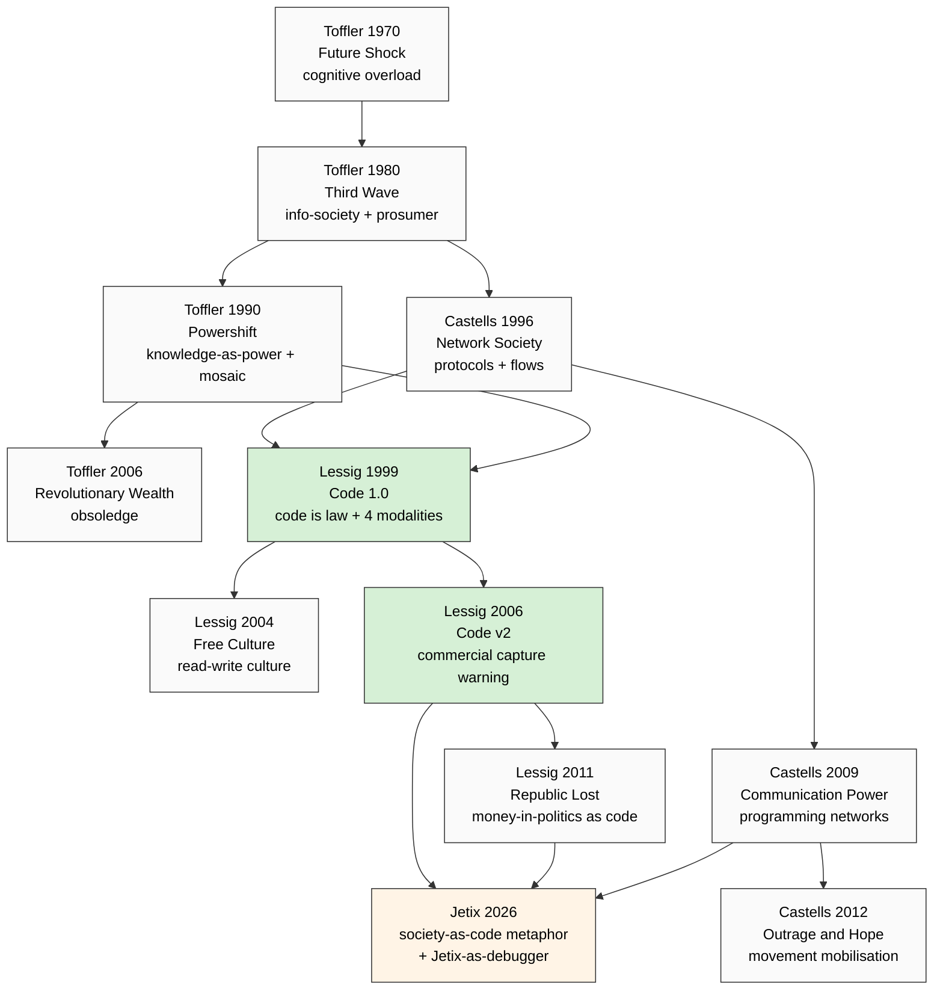

# Precedent lineage tree

```mermaid
%%{init: {'theme':'base', 'themeVariables': {'primaryTextColor':'#000','textColor':'#000','lineColor':'#333','primaryBorderColor':'#333','primaryColor':'#fafafa','noteTextColor':'#000','edgeLabelBackground':'#fff'}}}%%
graph TD
    T1[Toffler 1970<br/>Future Shock<br/>cognitive overload]
    T2[Toffler 1980<br/>Third Wave<br/>info-society + prosumer]
    T3[Toffler 1990<br/>Powershift<br/>knowledge-as-power + mosaic]
    T4[Toffler 2006<br/>Revolutionary Wealth<br/>obsoledge]

    C1[Castells 1996<br/>Network Society<br/>protocols + flows]
    C2[Castells 2009<br/>Communication Power<br/>programming networks]
    C3[Castells 2012<br/>Outrage and Hope<br/>movement mobilisation]

    L1[Lessig 1999<br/>Code 1.0<br/>code is law + 4 modalities]
    L2[Lessig 2004<br/>Free Culture<br/>read-write culture]
    L3[Lessig 2006<br/>Code v2<br/>commercial capture warning]
    L4[Lessig 2011<br/>Republic Lost<br/>money-in-politics as code]

    J[Jetix 2026<br/>society-as-code metaphor<br/>+ Jetix-as-debugger]

    T1 --> T2
    T2 --> T3
    T3 --> T4
    T2 --> C1
    C1 --> C2
    C2 --> C3
    C1 --> L1
    L1 --> L2
    L1 --> L3
    L3 --> L4
    T3 --> L1
    L3 --> J
    L4 --> J
    C2 --> J

    style J fill:#fff4e6
    style L1 fill:#d6f0d6
    style L3 fill:#d6f0d6
```
