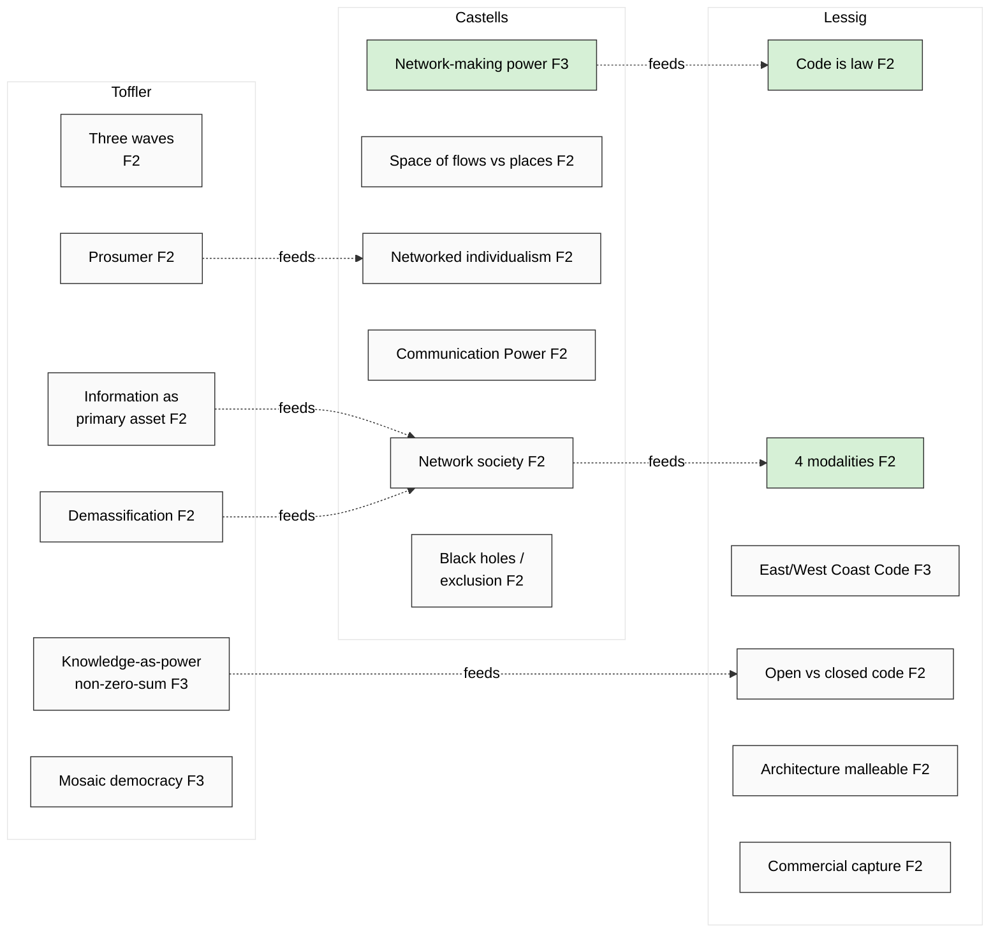

# Thinker × claim matrix

```mermaid
%%{init: {'theme':'base', 'themeVariables': {'primaryTextColor':'#000','textColor':'#000','lineColor':'#333','primaryBorderColor':'#333','primaryColor':'#fafafa','noteTextColor':'#000','edgeLabelBackground':'#fff'}}}%%
graph LR
    subgraph "Toffler"
        T_A[Three waves<br/>F2]
        T_B[Information as<br/>primary asset F2]
        T_C[Prosumer F2]
        T_D[Demassification F2]
        T_E[Knowledge-as-power<br/>non-zero-sum F3]
        T_F[Mosaic democracy F3]
    end

    subgraph "Castells"
        C_A[Network society F2]
        C_B[Space of flows vs places F2]
        C_C[Networked individualism F2]
        C_D[Communication Power F2]
        C_E[Network-making power F3]
        C_F[Black holes /<br/>exclusion F2]
    end

    subgraph "Lessig"
        L_A[Code is law F2]
        L_B[4 modalities F2]
        L_C[East/West Coast Code F3]
        L_D[Open vs closed code F2]
        L_E[Architecture malleable F2]
        L_F[Commercial capture F2]
    end

    T_B -.feeds.-> C_A
    T_D -.feeds.-> C_A
    T_C -.feeds.-> C_C
    T_E -.feeds.-> L_D
    C_E -.feeds.-> L_A
    C_A -.feeds.-> L_B

    style L_A fill:#d6f0d6
    style L_B fill:#d6f0d6
    style C_E fill:#d6f0d6
```
