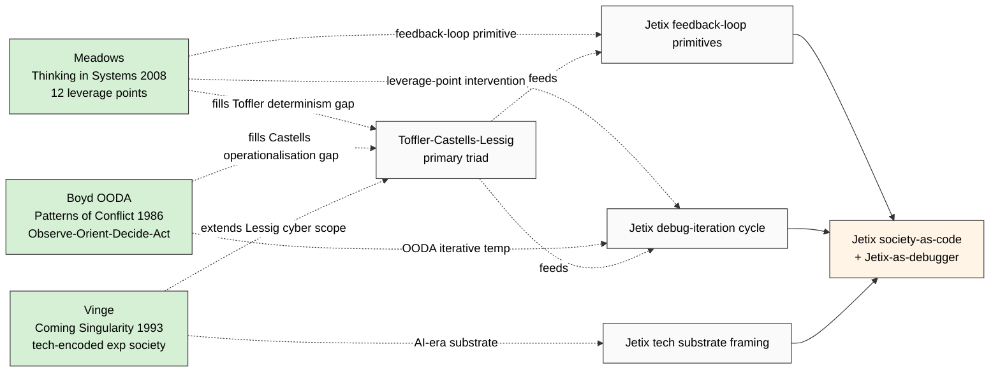

# Adjacent bridges

```mermaid
%%{init: {'theme':'base', 'themeVariables': {'primaryTextColor':'#000','textColor':'#000','lineColor':'#333','primaryBorderColor':'#333','primaryColor':'#fafafa','noteTextColor':'#000','edgeLabelBackground':'#fff'}}}%%
graph LR
    M[Meadows<br/>Thinking in Systems 2008<br/>12 leverage points]
    B[Boyd OODA<br/>Patterns of Conflict 1986<br/>Observe-Orient-Decide-Act]
    V[Vinge<br/>Coming Singularity 1993<br/>tech-encoded exp society]

    J_FB[Jetix feedback-loop primitives]
    J_DB[Jetix debug-iteration cycle]
    J_SUB[Jetix tech substrate framing]

    P_TCL[Toffler-Castells-Lessig<br/>primary triad]

    M -.feedback-loop primitive.-> J_FB
    M -.leverage-point intervention.-> J_DB
    B -.OODA iterative tempo.-> J_DB
    V -.AI-era substrate.-> J_SUB

    P_TCL -.feeds.-> J_FB
    P_TCL -.feeds.-> J_DB

    J_FB --> JETIX[Jetix society-as-code<br/>+ Jetix-as-debugger]
    J_DB --> JETIX
    J_SUB --> JETIX

    M -.fills Toffler determinism gap.-> P_TCL
    B -.fills Castells operationalisation gap.-> P_TCL
    V -.extends Lessig cyber scope.-> P_TCL

    style M fill:#d6f0d6
    style B fill:#d6f0d6
    style V fill:#d6f0d6
    style JETIX fill:#fff4e6
```
