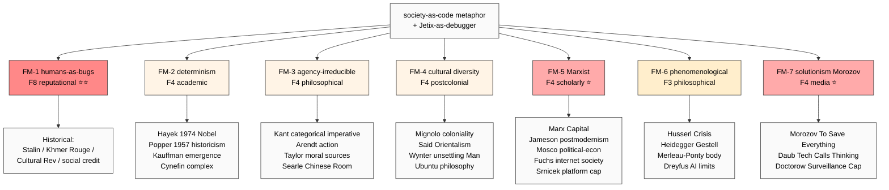

# Failure-mode map

```mermaid
%%{init: {'theme':'base', 'themeVariables': {'primaryTextColor':'#000','textColor':'#000','lineColor':'#333','primaryBorderColor':'#333','primaryColor':'#fafafa','noteTextColor':'#000','edgeLabelBackground':'#fff'}}}%%
graph TB
    SC[society-as-code metaphor<br/>+ Jetix-as-debugger]

    SC --> FM1[FM-1 humans-as-bugs<br/>F8 reputational ⭐⭐]
    SC --> FM2[FM-2 determinism<br/>F4 academic]
    SC --> FM3[FM-3 agency-irreducible<br/>F4 philosophical]
    SC --> FM4[FM-4 cultural diversity<br/>F4 postcolonial]
    SC --> FM5[FM-5 Marxist<br/>F4 scholarly ⭐]
    SC --> FM6[FM-6 phenomenological<br/>F3 philosophical]
    SC --> FM7[FM-7 solutionism Morozov<br/>F4 media ⭐]

    FM1 --> H1[Historical:<br/>Stalin / Khmer Rouge /<br/>Cultural Rev / social credit]
    FM2 --> H2[Hayek 1974 Nobel<br/>Popper 1957 historicism<br/>Kauffman emergence<br/>Cynefin complex]
    FM3 --> H3[Kant categorical imperative<br/>Arendt action<br/>Taylor moral sources<br/>Searle Chinese Room]
    FM4 --> H4[Mignolo coloniality<br/>Said Orientalism<br/>Wynter unsettling Man<br/>Ubuntu philosophy]
    FM5 --> H5[Marx Capital<br/>Jameson postmodernism<br/>Mosco political-econ<br/>Fuchs internet society<br/>Srnicek platform cap]
    FM6 --> H6[Husserl Crisis<br/>Heidegger Gestell<br/>Merleau-Ponty body<br/>Dreyfus AI limits]
    FM7 --> H7[Morozov To Save Everything<br/>Daub Tech Calls Thinking<br/>Doctorow Surveillance Cap]

    style FM1 fill:#ff8888
    style FM5 fill:#ffaaaa
    style FM7 fill:#ffaaaa
    style FM2 fill:#fff4e6
    style FM3 fill:#fff4e6
    style FM4 fill:#fff4e6
    style FM6 fill:#ffeecc
```

**Three-front attack scenario:** FM-1 + FM-5 + FM-7 — most likely external rollout opposition.
