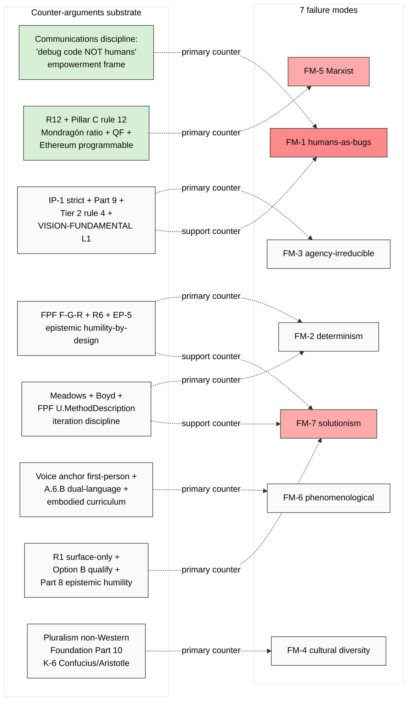

# Counter-argument inventory map (7 modes × 5 counters each = 35)

```mermaid
%%{init: {'theme':'base', 'themeVariables': {'primaryTextColor':'#000','textColor':'#000','lineColor':'#333','primaryBorderColor':'#333','primaryColor':'#fafafa','noteTextColor':'#000','edgeLabelBackground':'#fff'}}}%%
graph LR
    subgraph "Counter-arguments substrate"
        CA1["Communications discipline:<br/>'debug code NOT humans'<br/>empowerment frame"]
        CA2["R12 + Pillar C rule 12<br/>Mondragón ratio + QF +<br/>Ethereum programmable"]
        CA3["IP-1 strict + Part 9 +<br/>Tier 2 rule 4 +<br/>VISION-FUNDAMENTAL L1"]
        CA4["FPF F-G-R + R6 + EP-5<br/>epistemic humility-by-design"]
        CA5["Meadows + Boyd +<br/>FPF U.MethodDescription<br/>iteration discipline"]
        CA6["Voice anchor first-person +<br/>A.6.B dual-language +<br/>embodied curriculum"]
        CA7["R1 surface-only +<br/>Option B qualify +<br/>Part 8 epistemic humility"]
        CA8["Pluralism non-Western<br/>Foundation Part 10<br/>K-6 Confucius/Aristotle"]
    end

    subgraph "7 failure modes"
        FM1[FM-1 humans-as-bugs]
        FM2[FM-2 determinism]
        FM3[FM-3 agency-irreducible]
        FM4[FM-4 cultural diversity]
        FM5[FM-5 Marxist]
        FM6[FM-6 phenomenological]
        FM7[FM-7 solutionism]
    end

    CA1 -.primary counter.-> FM1
    CA2 -.primary counter.-> FM5
    CA3 -.primary counter.-> FM3
    CA3 -.support counter.-> FM1
    CA4 -.primary counter.-> FM2
    CA4 -.support counter.-> FM7
    CA5 -.primary counter.-> FM2
    CA5 -.support counter.-> FM7
    CA6 -.primary counter.-> FM6
    CA7 -.primary counter.-> FM7
    CA8 -.primary counter.-> FM4

    style CA1 fill:#d6f0d6
    style CA2 fill:#d6f0d6
    style FM1 fill:#ff8888
    style FM5 fill:#ffaaaa
    style FM7 fill:#ffaaaa
```

**Counter-argument inventory total: 35 (5 per mode × 7 modes). Operational pitch resilience asset.**
